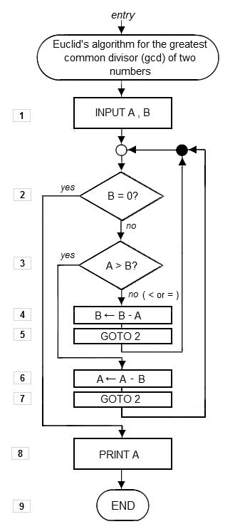
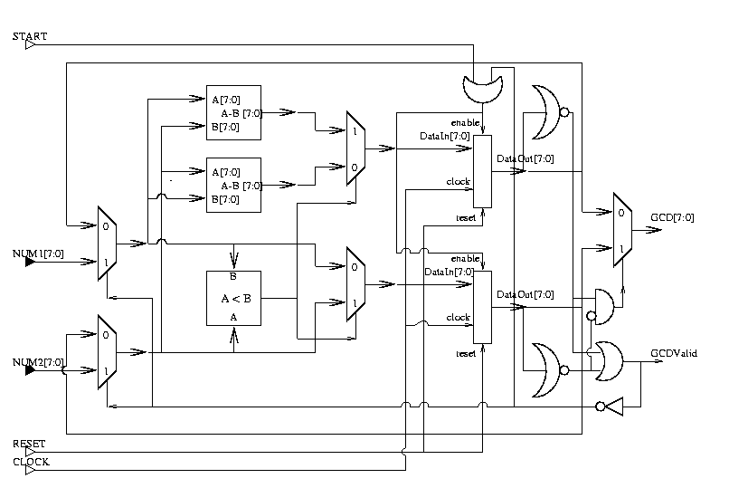

[Previous](Queue.md) | 回到[目錄](SUMMARY.md) |本文來源: [演算法筆記](http://www.csie.ntnu.edu.tw/~u91029/Algorithm.html) | [Next](Incremental Method.md)
_____________________
# Algorithm
_____________________
## 演算法是什麼？
演算法是資訊工程系非常重要的基礎科目。簡單來說，演算法就是用電腦算數學的學問（古代人用算盤算、現代人用電腦算），可以說是數學科目。

想要解決現實生活當中的各種問題，電腦科學家就把現實問題對應到數學問題，然後設計公式、把公式寫成程式，讓電腦執行程式計算答案──這些公式就叫做演算法了。

儘管這裡用了「公式」這個字眼來形容演算法，然而並不是各位印象中的數學公式。由於電腦能夠執行繁複的計算，所以公式可以設計成好幾十行、好幾百行，甚至用到很多數學理論。

因此呢，就算學習過演算法的人，也不見得懂得設計演算法；因為數學、程式的東西實在太複雜了。想把現實問題對應到數學問題，那就更複雜了。
_____________________
## 電腦只會算數字
回過頭來，電腦又是什麼？電腦是個很潮的中文翻譯，不過實際上電腦的原意是「計算機」。電腦的英文叫做 computer ，而計算的英文就叫做 compute 。

電腦是一臺計算機，只會計算、判斷、儲存數字。又快又準。

程式是一連串計算、判斷、儲存數字的步驟。

電腦只會處理數字（二進位數字）。電腦裡的每一個文字、每一種顏色、每一種聲音，其實都有相對應的數字。

打個比方，我們規定：用 1 代表「一」，用 2 代表「乙」，用 3 代表「人」， …… 。一個數字對應一個中文字。電腦裡面的所有中文字，都依循人為規定，變作了數字。

再打個比方，「人」這個字，呈現電腦螢幕上是個「人」樣。電腦螢幕的畫面，是由許多小光點組成的；電腦螢幕上的「人」也是由許多小光點組成的。我們以「人」的左下角為座標原點，橫向為 X 軸，直向為 Y 軸，那麼「人」其實是 (0,1) 、 (1,2) 、 (2,3) 、 ... 這些座標畫上黑點後所形成的。「人」這個字的的形狀，在電腦中變作了一連串的數字。

同樣的道理，呈現在電腦螢幕畫面上的文字、顏色、圖片、影像、聲音，全部都可以化作數字。一切事物在電腦裡面都是數字。

電腦並沒有想像中的那麼神奇。不過電腦最厲害的地方並不是電腦本身，而是在於電腦可以接上各式各樣的設備。接上攝影機與螢幕，就可以把色彩變成數字、把數字變成色彩；接上麥克風與耳機，就可以把聲音變成數字、把數字變成聲音。

電腦一旦接上了設備，就額外有用處。接上話機和基地台，就可以互通有無；接上數位相機和印表機，就可以製造回憶；接上重量儀和篩子，電腦也會揀土豆；接上車廂、接上警示燈、再雜七雜八接上一堆東西，就變成了大眾運輸系統。

若要用電腦解決現實問題，通常要考慮兩個方面：一、電腦應該接上那些設備？如何用電腦控制這些設備？二、現實問題如何對應到數學問題？如何設計演算法？
_____________________
## 程式用來比對數字、改變數字、儲存數字
舉個例子，我們希望把螢幕上的「人」變成斜體字。過程大略是這樣──首先呢，把「人」的形狀 (0,1) 、 (1,2) 、 (2,3) 、 ... 這些數字拿出來；然後呢，位置越高的座標，就往右移動多一點，如此一來就成為斜體字了。想讓座標往右移動，就是讓電腦做數字加法計算，然後把相加結果儲存起來。

再舉個例子，用滑鼠點選一個資料夾，資料夾的顏色會反白。過程大略是這樣──首先呢，電腦偵測到滑鼠點擊的座標之後，把座標轉換成數字；然後呢，再把螢幕畫面的資料拿出來，看看螢幕上每個東西的座標，是哪一個與滑鼠的座標相符合；噢，原來是一個資料夾的圖示，把資料夾的顯示顏色給反白過來。

再舉個例子，電腦據說會揀選土豆。過程大略是這樣──把每一顆土豆拿出來，利用特殊的儀器，把形狀、重量、色澤、氣味統統轉換成數字，儲存在電腦裡面；然後呢，用電腦比較這些數字，找出優良的土豆，如此一來就有綿綿鬆鬆的土豆了！

編寫程式，計算數字，這就是程式設計師的工作。
_____________________
## 數學和程式這麼複雜，為什麼要用電腦解決現實問題？
電腦的計算速度可說是非常的快，一秒鐘可以進行好幾千萬次。就算文字多麼的多，圖片多麼的大，電腦處理起來，也是輕鬆寫意，順暢無比。

打開電腦裡的任何一份文件，用滑鼠捲動一下文件畫面，眼睛都還沒眨一下，正確畫面馬上就呈現在螢幕上了。事實上在捲動畫面的時候，電腦已經經過幾千萬次的計算，僅使用了極短的時間，就把螢幕上應該呈現的資料全部計算好了。

人類會想要用電腦解決問題，正是仰賴電腦的計算速度、正確性，以及電腦會自動按照程式計算的特性。程式設計師只要花心思寫出一支好程式，接下來的工作就可以讓電腦代勞了。電腦做的比人類更快更好，電腦做得到人類做不到的事情；儘管數學和程式很複雜，還是有很多人選擇使用電腦解決問題。
_____________________
# Algorithm
_____________________
## 演算法是什麼？
[演算法](http://zh.wikipedia.org/wiki/演算法)由三個部分組成：輸入、計算步驟、輸出。介紹這件事情的時候，有人連結到[函數](http://zh.wikipedia.org/wiki/函數)的概念，也有人連結到[黑箱白箱](http://zh.wikipedia.org/wiki/黑箱)的概念。

	___________________________
	input --->| computational |
	| sequence      |---> output
	___________________________


輸出、輸入是一堆數字。實務上是將這些數字放在[資料結構](http://zh.wikipedia.org/wiki/資料結構)，例如 array 、 list 。輸入來源，通常是硬碟裡面儲存的檔案，或者是藉由硬體裝置擷取到的數字，例如數位相機、麥克風等等。輸出去處，通常是硬碟裡面儲存的檔案，或者是藉由硬體裝置轉換之後以其他型態呈現，例如數位電視、數位音響等等。

計算步驟是一連串處理數字的指令。指令有兩種類型，一類是運算，例如數學運算加減乘除、邏輯運算且或非、比較運算大於等於小於、位元運算左右反且或異或。另一類是讀寫，例如讀取某處的數字、儲存數字至某處，就跟[計算機](http://zh.wikipedia.org/wiki/計算器)的MR 、 M+按鍵的意義相似。

古人定義演算法，規定計算步驟的數量是必須是有限步，不是無限步。用程式語言的術語來說就是：演算法不能有無窮迴圈。

古人當初規定有限步，是為了方便統計總步數。但是實務上，很多電腦程式是開啟之後就保持執行狀態，直到當機、重開機，例如網路傳輸的演算法。因此實務上可以是無限步。
## 如何記載一個演算法？
_____________________
有人用[虛擬碼](https://zh.wikipedia.org/wiki/伪代码)來記載一個演算法。如要設計[電腦程式](http://zh.wikipedia.org/wiki/電腦程式)，虛擬碼是比較恰當的。

	_____________________________
	GREATEST_COMMON_DIVISOR(a, b)
	1   while a ≠ b do
	2       if a > b then
	3           a ← a - b
	4       else
	5           b ← b - a
	6   return a
	_____________________________


有人用[流程圖](http://zh.wikipedia.org/wiki/流程圖)來記載一個演算法。如要設計[電子電路](http://zh.wikipedia.org/wiki/電子電路)，流程圖是比較恰當的。



大多數時候，我們無法光從虛擬碼和流程圖徹底理解演算法，就如同我們無法光從數學公式徹底理解數學概念。想要理解演算法，通常還是得藉由文字、圖片的輔助說明。
_____________________
## 如何實作一個演算法？
實作的意思是：實際去操作、實際去運行。

對於資工系學生來說，自然就是把演算法撰寫成[電腦程式](http://zh.wikipedia.org/wiki/)電腦程式，例如C/C++或者Swift程式，然後在[個人電腦](http://zh.wikipedia.org/wiki/個人電腦)上面執行程式。
```swift
// Swift語言適用於整數型態類別的gcd函式
func gcd<T: IntegerType>(a: T, _ b: T) -> T {
	guard a > T.allZeros && b > T.allZeros else { fatalError("input should not be negatives") }
	var a_ = a, b_ = b
	while a_ != b_ {
		if a_ > b_ {
			a_ -= b_
		} else {
			b_ -= a_
		}
	}
	return a_
}

gcd(15, 21)  // 3
gcd(120,72)  // 24
```
對於電機系學生來說，自然就是把演算法設計成[電子電路](http://zh.wikipedia.org/wiki/電子電路)，在[麵包板](http://zh.wikipedia.org/wiki/麵包板)、[印刷電路板](http://zh.wikipedia.org/wiki/印刷電路板)、[PLD](http://zh.wikipedia.org/wiki/可程式邏輯裝置)上面執行。



電子電路也有加法器、減法器、AND邏輯閘、OR邏輯閘等等，所以也可以用電子電路實作演算法。例如電子錶、隨身聽、悠遊卡等等，都是直接將演算法做死在晶片上面。在個人電腦、智慧型手機還沒流行之前，以往都是用電子電路實作演算法。

電子電路的執行速度是飛快的，電腦程式的執行速度慢了一點。然而，製作電子電路的過程相當麻煩，需要精密的設備、複雜的製程、大量的人力和經費，而且製成之後就無法修改；相對地，寫程式就簡單輕鬆多了，在電腦上面很容易調整程式碼，又可以儲存很多程式碼，最主要的是家家戶戶都有電腦。
## 時間複雜度、空間複雜度
_____________________
要評斷一個演算法的好壞，最基本的指標是時間和空間。

最直覺的方式，就是測量程式的執行時間、程式的記憶體使用量。但是由於相同演算法於不同電腦的執行時間會有差異，又由於每個人實作演算法所採用的程式語言、程式設計技巧都不一樣，所以執行時間、記憶體使用量不是一個穩定的評斷標準。

數學家於是計算步驟數量。

	____________________________________
	BUBBLESORT(A)
	1 for i ← 0 to length(A)-1 do
	2     for j ← 0 to length(A)-i-1 do
	3         if A[j] < A[j+1] then
	4             swap A[j] and A[j+1]
	____________________________________


	-----------------------------------------------
	| pseudo code                      | step     |
	|---------------------------------------------|
	| BUBBLESORT(A, n)                 |          |
	| 1 for i ← 0 to n-1 do            | n        |
	| 2     for j ← 0 to n-i-1 do      | n(n-1)/2 |
	| 3         if A[j] < A[j+1] then  | n(n-1)/2 |
	| 4             temp ← A[j]        | n(n-1)/2 |
	| 5             A[j] ← A[j+1]      | n(n-1)/2 |
	| 6             A[j+1] ← temp      | n(n-1)/2 |
	-----------------------------------------------
	total = n + 5n(n-1)/2
	= n + 2.5n2 - 2.5n
	= 2.5n2 - 1.5n
	= O(n2)
```swift
func bubbleSort(inout array: [Int]) {
      for i in 0..<array.count {                      // n steps  i被賦予值n次
		for j in 0..<array.count - i - 1 {			// n * (n - 1) / 2  j被賦予值n * (n - 1) / 2次
			if array[j] < array[j + 1] {		      // n * (n - 1) / 2  判斷式執行n * (n - 1) / 2次
				swap(&array[j], &array[j + 1])		// n * (n - 1) / 2 * 3  (swap函式有3步驟)
			}										 // swap函式執行少於n * (n - 1) / 2次
		}
	}												 // Total steps = n + 5 * n * (n - 1) / 2 = 2.5n² - 1.5n
}													 // O(n2)
var a = [3, 6, 1, 9, 4, 0, 5]
bubbleSort(&a)
```
數學家把步驟數量寫成代數式子。例如當輸入資料有n = 1000個數字，步驟數量一共是2.5×1000² - 1.5×1000 = 2498500步。

有了步驟數量之後，還可以進一步粗估執行時間。假設一個步驟需要10個clock，而電腦中央處理器CPU的時脈是2GHz：每秒鐘執行2000000個clock，那麼程式執行時間大約12.4925秒。

但是這不是精準的步驟數量。由於實作的關係，係數很容易變動，所以係數的意義不大。因此數學家只取出代數式子的最高次方，並且規定n必須足夠大（類似微積分的趨近無限大）。儘管這是非常不精準的估算方式，不過還是可以對常見的演算法進行簡易分類，粗略地比較快慢。

	--------------------------------------
				   | time*       | space
	---------------+-------------+--------
	bubble sort    | O(n2)       | O(n)
	insertion sort | O(n2)       | O(n)
	merge sort     | O(n log(n)) | O(n)
	quicksort      | O(n2)       | O(n)
	heapsort       | O(n log(n)) | O(n)
	counting sort  | O(n+r)      | O(n+r)
	*worst case
	--------------------------------------

空間的計算方式與時間類似，就不多提了。

# **Big-O**演算法效率之表示法

要評斷一個演算法的好壞，最基本的指標是時間和空間。最直覺的方式，就是測量程式的執行時間、程式的記憶體使用量。但是由於相同演算法於不同電腦的執行時間會有差異，又由於每個人實作演算法所採用的程式語言、程式設計技巧不一，所以執行時間、記憶體使用量不是一個穩定的評斷標準。因此數學家採用大O表示法(**Big-O** notation)來表示演算法的時間與空間複雜度，用以衡量一個演算法之效率。

大O表示法(**Big-O**)提供一個演算法的運行時間和記憶體需求的粗略估計。當有人說，這種算法的最壞情況執行時間為**O(n²)**，以及使用的空間為**O(n)**，他們的意思是有點慢，但並不需要很多額外的記憶。

找出一種演算法的大O表示法(**Big-O**)通常是經由數學分析完成。此處，我們跳過了數學，僅提供一個方便的表。表中**n**是指你處理的數據中項的數量。例如，排序100個項目**n = 100**的陣列時。


_____________________

  | 大O表示 | 類別 | 描述 |
  |-- | -- | -- |
  | **O(1)** | 常數 |**這是最好的** 無論資料大小，這種演算法的運算時間都是相同的。例如：以元素索引值查找陣列中的元素。|
  | **O(log n)** | 對數 | **非常優異** 這些種算法每次迭代伴隨數據量減半。如果你有100個項目，大約需要7個步驟來找到答案。若是1000的項目，它需要10個步驟。 1,000,000項目只需要20個步驟。對大量數據這類的方法超快速。例如：二元搜尋演算法(binary search)。 |
  | **O(n)** | 線性 | **優異效能** 如果你有100個項目，就是做100個工作單位。資料量倍增所需的時間隨之倍增。例如：依序查找演算法(sequential search)。 |
  | **O(n log n)** | 線性對數 | **不俗的表現.** 略差於線性的表現卻也不差。例如：最快的通用台續演算法。|
  | **O(n²)** | 二次方 | **緩慢**  如果你有100個項目，就是做10,000個工作單位。資料量倍增，時間需求四倍。例如：使用巢狀迴圈的插入排序演算法(insertion sort)。|
  | **O(n³)** | 三次方 | **相當慢** 如果你有100個項目，就是做1,000,000個工作單位。資料量倍增，時間需求八倍。 例如：矩陣相乘。|
  | **O(2ⁿ)** | 指數型 | **效率很差** 必須避免的演算法，但有時沒有選擇。只是增加一筆資料，需要的時間便加倍。例如：旅行行程規劃的問題。 |
  | **O(n!)** | 階乘型 |**難以忍受的緩慢** 非常的慢.|

_____________________

通常情況下你不需要用數學去找出一種演算法的大O表示法(**Big-O**)，可以簡單地運用你的直覺。如果你的程式碼使用一個循環，所處理數據量有**n**個元素，該算法是**O(n)**。如果代碼具有兩層巢狀迴圈(nested loops)，它是**O(n²)**。三層巢狀迴圈則為**O(n³)**，依此類推。

需要注意的是大O表示法(**Big-O**)是一個估計值，僅對於**n**值很大時真的很有用。例如，插入排序演算法(insertion sort)之時間複雜度之最壞情況是**O(n²)**，從理論上講，插入排序演算法的效率應該比大O為**O(n log n)**的合併排序演算法(merge sort)差，但是對於少量數據，插入排序實際上要更快，尤其是當陣列部分已經排序好時！

如果你覺會受到混淆，不要讓這個大O干擾你太多。比較兩種算法時要弄清楚哪一個更好才是最有用的。最終你還是要在實踐中去檢驗哪一種演算法是最佳的。如果數據量是比較小的，那麼即使慢速算法亦將是在實際應用中足夠快的。

_____________________
## 解決問題的成效
要評斷一個演算法的好壞，除了時間和空間的用量以外，主要還是看演算法解決問題的成效如何。

數學問題，通常可以明定解答好壞，例如數字越大越好。通常這種情況，有多種演算法可以求得正解，那麼這些演算法的成效是一樣好的。

真實世界的問題，通常難以界定絕對的好壞優劣，例如美醜、樂音噪音、喜怒哀樂、是非對錯等等，此時演算法的成效，則由人類自行判斷，利用兩兩比較、投票表決等等方式來決定成效。

_____________________
# Algorithm
_____________________
## 學習程式語言
學習程式語言，有兩個層次：一、程式語言本身的語法；二、把想法轉換成程式碼。

第一個層次稱做「程式語言 Programming Language 」。目標是背熟規格書、靈活運用程式語言。讀者可以參[《C++ How to Program》](http://www.deitel.com/Books/C/CHowtoProgram9e/tabid/3644/Default.aspx)這本書。

第二個層次稱做「程式設計 Programming 」。目標是設計程式碼解決問題。然而現今世界上還沒有一套固定的流程。
_____________________
## 學習演算法
學習演算法，有兩個層次：一、演算法本身的運作過程；二、把想法轉換成演算法。

第一個層次稱做「演算法 Algorithm 」。目標是理解演算法、靈活運用演算法。讀者可以參考本站首頁的各大欄位，例如圖論、計算幾何、字串學等等。

第二個層次稱做「演算法設計 Algorithm Design 」。目標是設計計算步驟解決問題。讀者可以參考本站首頁的 Algorithm Design 欄位，以及從各種演算法當中汲取經驗、擷取靈感。
_____________________
## 學習函式庫、工具
很多現實問題及其計算步驟，已經成為標準流程 SOP ，沒有什麼改動的餘地，成為了演算法。因此科學家就把這些演算法編寫成函式庫（Library），接著把現實生活的常見需求編寫成工具（Toolkit），讓程式設計的過程更加迅速。

時間就是金錢。現今的軟體產業當中，絕大部分都是直接使用現成的函式庫、工具，只有從事研發才會從無到有設計程式碼、設計演算法。優秀的工程師，總是擅於活用函式庫、工具，快速實現自己想要的功能。網路上已經有許多現成的函式庫和工具，通常也附帶詳細的使用說明書，方便工程師運用。

由於大家看事情習慣只看表面，因此衍生了一種奇怪的現象：大家把使用工具稱做「使用技術」，大家把背熟使用說明書、依樣畫葫蘆稱做「學習技術」。大家常常自詡擁有許多「技術」，將「技術」奉為圭臬；但是卻很少人懂得背後的程式碼技巧、演算法原理，也很少人有能力研發、創新、解決目前尚未解決的現實問題。這是本末倒置的奇怪現象。
_____________________
## 演算法設計、演算法分析
演算法可以細分為兩個大方向。

演算法設計：製造演算法。演算法設計目前已經有一些經典手法，例如Dynamic Programming、Greedy Method等等。

演算法分析：針對特定演算法，精確計量時間複雜度和空間複雜度。演算法分析會用到很多數學知識。

接下來將分別介紹演算法設計與演算法分析。
_____________________
[Previous](Queue.md) | 回到[目錄](SUMMARY.md) |本文來源: [演算法筆記](http://www.csie.ntnu.edu.tw/~u91029/Algorithm.html) | [Next](Incremental Method.md)
