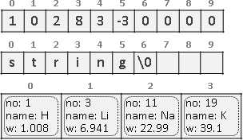
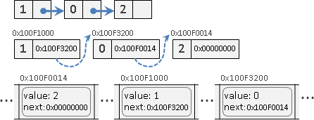
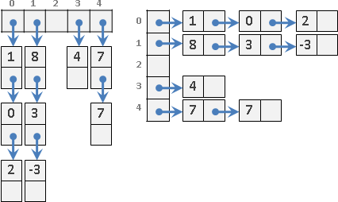

[Previous](Data.md) | 回到[目錄](SUMMARY.md) |本文來源: [演算法筆記](http://www.csie.ntnu.edu.tw/~u91029/Data.html#2) | [Next](Stack.md)
_____________________
# 大量Data資料結構：
#### Array / List
_____________________
## Array

繁中「陣列」，簡中「数组」。連續的記憶體。

一個格子放入一筆資料，資料可以是一個數字、一個字元（所有字元合起來變成字串）、一個物件等等。

搜尋、插入、刪除的時間複雜度都是**O(N)**。資料已排序，則支援二分搜尋。

可以直接使用STL的vector。

_____________________
UVa [[10370](http://uva.onlinejudge.org/external/103/10370.html)], UVa [[11991](http://uva.onlinejudge.org/external/119/11991.html)], UVa [[11716](http://uva.onlinejudge.org/external/117/11716.html)]
_____________________
## List (Linked List)

繁中「串列」，簡中「链表」。藉由指標得到下一塊記憶體。

搜尋的時間複雜度是**O(N)**。知道正確位置，插入與刪除的時間複雜度是 **O(1)**，否則必須先搜尋。無索引值，故不支援二分搜尋。

可以直接使用STL的list。

深究串列，其實串列是用陣列實作。一步一步釐清：

上圖：藉由指標得到下一塊記憶體。

中圖：指標是一個變數，儲存記憶體位址。

下圖：電腦記憶體是一條很長的陣列，串列其實是散落在陣列裡面。另外還需要一個變數紀錄串列的開頭，不過這邊沒畫上去。
_____________________
## 特殊的 List

尾串到頭，頭尾循環，稱作Circular List。特色是開頭可以隨便選、隨便動。

只串單向，稱作Singly Linked List。雙向都串，稱作Doubly Linked List，特色是雙向都能搜尋。

Doubly Linked List若用XOR實作，稱作XOR Linked List。

Doubly Linked List 若可以還原刪除動作，稱作Dancing Links，經常配合Backtracking一起使用。

_____________________
UVa [[11988](http://uva.onlinejudge.org/external/119/11988.html)], ICPC [[2659](https://icpcarchive.ecs.baylor.edu/external/26/2659.pdf)]
_____________________
## List裡面放入Array
_____________________

英文網路稱做Unrolled Linked List，中文網路稱作「鬆散鏈表」、「塊狀鏈表」。查無正式學術名稱。

N筆資料，分成A塊，每塊約B = N/A個元素。每塊各自紀錄元素數量。

索引：先數塊、再數元素，時間複雜度為**O(A)**。

搜尋：全找，時間複雜度為**O(N)**。資料已排序，則為**O(A + logB)**。

插入、刪除：一塊大於等於2B就拆開成兩塊，相鄰兩塊小於等於B就合併成一塊，避免一拆開就要合併、一合併就要拆開，時間複雜度為**O(A + 2B)**到**O(2A + B)**。

N筆資料，分成A = sqrtN塊，每塊約B = sqrtN個元素，是最均衡的，可令時間複雜度最低。索引、插入、刪除的時間複雜度為**O( sqrt(N) )**。競賽選手稱此技巧為sqrt decomposition。

上古時代的文字編輯器曾使用此資料結構。
_____________________
## Array裡面放入List

大致上就是圖論的Adjacency List。

大致上就是之後提到的Hash Table。
_____________________
[Previous](Data.md) | 回到[目錄](SUMMARY.md) |本文來源: [演算法筆記](http://www.csie.ntnu.edu.tw/~u91029/Data.html#2) | [Next](Stack.md)
