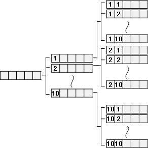

[Previous](Simulation.md) | 回到[目錄](Modeling.md) |本文來源: [演算法筆記](http://www.csie.ntnu.edu.tw/~u91029/Backtracking.html) | [Next](Enumerate Permutations.md)
_____________________
# Backtracking
#### 手把青秧插滿田，低頭便見水中天，
#### 六根清淨方為道，退步原來是向前。《插秧詩》
_____________________
## Backtracking

中文稱作「回溯法」，枚舉多維度數值（ n-tuple ）的方法。運用遞迴依序窮舉各個維度的數值，製作所有可能的多維度數值，並且在遞迴途中避免枚舉出不正確的多維度數值。

	backtrack( [v1,...,vn] ) {   // [v1,...,vn] 是多維度數值
		// 製作了一組多維度數值，並檢驗這組數據正不正確 //
		if ( [v1,...,vn] is well-generated ) {
			if ( [v1,...,vn] is a solution ) process solution;
			return;
		}
		// 窮舉這個維度的所有數值，並遞迴到下一個維度 //
		for ( x = possible values of vn+1 )
		backtrack( [v1,...,vn, x] );
	}
	call backtrack( [] );   // 從第一個維度開始依序枚舉

撰寫程式時，可以使用陣列儲存多維度數據。

	int solution[MAX_DIMENSION];    // 多維度數值
	void backtrack(int dimension) {
		// 製作了一組多維度數值，並檢驗這組數據正不正確 //
		if ( solution[] is well-generated ) {
			check and record solution;
		return;
		}
		// 窮舉這個維度的所有數值，並遞迴到下一個維度 //
		for ( x = each value of current dimension ) {
			solution[dimension] = x;
			backtrack( dimension + 1 );
		}
	}

	int main() {
		backtrack(0);   // 從第一個維度開始逐步枚舉
	}

當所需的多維度數值只有唯一一組時，可以讓程式提早結束。

	int solution[MAX_DIMENSION];
	bool finished = false;  // 如果為true表示已經找到數據，可以結束。
	void backtrack(int dimension) {
		if ( solution[] is well-generated ) {
			check and record solution;
			if ( solution is found ) finished = true;   // 找到數據了
			return;
		}
		for ( x = each value of current dimension ) {
			solution[dimension] = x;
			backtrack( dimension + 1 );
			if (finished) return;   // 提早結束，跳出遞迴
		}
	}

回溯法的特色是隨時避免枚舉不正確的數值。一旦發現不正確的數值，就不遞迴至下一層，而是回溯至上一層，節省時間。

另外還可以調整維度先後順序、一個維度之中枚舉值的順序。如果安排得宜，可以更快找到正確的多維度數值。

## © 2010 [tkcn](http://tkcnandy.blogspot.com/). All rights reserved.
_____________________

## 範例：枚舉「數字 1 到 10 選擇五次」全部可能的情形
_____________________

製作一個陣列，用來存放一組可能的情形。

	int solution[5];

例如 solution[0] = 4 表示第一個抓到的數字是 4 ， solution[4] = 9 表示第五個抓到的數字是 9 。陣列中不同的格子，就是不同的維度。

遞迴程式碼設計成這樣：

	int solution[5];    // 用來存放一組可能的數據
	void print_solution() {  // 印出一組可能的數據
		for (int i=0; i<5; i++)
			cout << i << ' ';
		cout << endl;
	}
	void backtrack(int n)  {  // n 為現在正在枚舉的維度
		// it's a solution
		if (n == 5) {
			print_solution();
			return;
		}
		// 逐步枚舉數字1到10，並且遞迴下去，繼續枚舉之後的維度。
		solution[n] = 1;
		backtrack(n+1);
		solution[n] = 2;
		backtrack(n+1);
		......
		solution[n] = 10;
		backtrack(n+1);
	}
	void enumerate_n_tuples(){
		backtrack(0);
	}

一般來說，重複很多次的程式碼，都會用迴圈進行簡化。

	void backtrack(int n) {  // n 為現在正在枚舉的維度
	// it's a solution
		if (n == 5) {
			print_solution();
			return;
		}
	// 逐步枚舉數字1到10，並且遞迴下去，繼續枚舉之後的維度。
		for (int i=1; i<=10; ++i) {
			solution[n] = i;
			backtrack(n+1);
		}
	}
*/
// 
import Foundation
var solution: [Int] = [Int](count: 5, repeatedValue: 0)
func backtrace(n: Int) {
	guard n < 5 else {
		print(solution)
		return
	}
	for i in 1...10 {
		solution[n] = i
		backtrace(n + 1)
	}
}

//backtrace(0)

/*:
## 結合其他技巧
_____________________
	int solution[MAX_DIMENSION];
	void backtrack(int dimension){
	// pruning：在遞迴途中避免枚舉出不正確的數據 //
		if ( solution[] will NOT be a solution in the future ) return;

		if ( solution[] is well-generated ) {
			check and record solution;
			return;
		}
		for ( x = each value of current dimension ) {
			solution[dimension] = x;
			backtrack( dimension + 1 );
		}
	}
*/
// 例如在求解各行各列與對角線總合均相等的九宮格(本例3 x 3)，欲找出相加後為某一數值(本例: 15)所有組合
func jiugongge_RowLists(n: Int) -> [[Int]] {
	let sum_of_row = n * n * (n * n + 1) / 2 / n
	var rows = [[Int]]()
	var solution: [Int] = [Int](count: n, repeatedValue: 0)
	func backtrace(x: Int, _ y: Int) {
		guard x < n else {
			if (solution.reduce(0){ $0 + $1 }) == sum_of_row {
				rows.append(solution)
			}
			return
		}
		for i in y + 1...n * (n - 1) + x + 1 {
			solution[x] = i
			backtrace(x + 1, i)
		}
	}
	backtrace(0, 0)
	return rows
}
var list_3x3 = jiugongge_RowLists(3)
list_3x3

/*:
	int solution[MAX_DIMENSION];
	void backtrack(int dimension) {
		if ( solution[] is well-generated ) {
			check and record solution;
			return;
		}
		// branch：製作適當的分支 //
		int c[MAX_CANDIDATE];   // candidates for next dimension
		int ncandidate;         // candidate counter
		construct_candidates(dimension, c, ncandidate);

		for (int i=0; i < ncandidate; i++) {
			solution[dimension] = c[i];
			backtrack( dimension + 1 );
		}
	}
*/
// 分類

func classification(condition: [Int:String] = [:]) -> [[String]] {
	var allPosibles = [[String]]()
	var  classification = [String](count: 3, repeatedValue: "")
	func backtrace(n: Int) {
		guard n < 3 else {
			var check: Bool = true
			for key in condition.keys {
				if classification[key] != condition[key] {
					check = false
				}
			}
			if check {
				allPosibles.append(classification)
			}
			return
		}
		var keys_for_row = [0:["男", "女"], 1:["O", "A", "B", "AB"], 2:["已婚", "未婚"]]
		for element in keys_for_row[n]! {
			classification[n] = element
			backtrace(n + 1)
		}
	}
	backtrace(0)
	return allPosibles
}
//classification()
//classification([0:"女"])
classification([0:"女", 2:"已婚"])
/*:
	int solution[MAX_DIMENSION];
	void backtrack(int dimension, int cost) {// 用一數值代表數據好壞
		// bound：數據太糟了，不可能成為正確數據，不必遞迴下去。 //
		if ( cost is worse than best_cost ) return;
		// bound：數據夠好了，可以成為正確數據，不必遞迴下去。 //
		if ( solution[] is well-generated ) {
			check and record solution;
			if ( solution is found ) best_cost = cost;  // 紀錄cost
			return;
		}
		for ( x = each value of current dimension ) {
			solution[dimension] = x;
			backtrack( dimension + 1 , cost + (cost of x) );
		}
	}
*/
// 分類

func classificationX(condition: [Int:String] = [:]) -> [[String]] {
	var allPosibles = [[String]]()
	var  classification = [String](count: 3, repeatedValue: "")
	func backtrace(n: Int) {
		if let a = condition[n-1] {
			guard n == 0 ? true : classification[n-1] == a else { return }
		}
		guard n < 3 else {
			allPosibles.append(classification)
			return
		}
		guard n < 3 else {
			var check: Bool = true
			for key in condition.keys {
				if classification[key] != condition[key] {
					check = false
				}
			}
			if check {
				allPosibles.append(classification)
			}
			return
		}
		var keys_for_row = [0:["男", "女"], 1:["O", "A", "B", "AB"], 2:["已婚", "未婚"]]
		for element in keys_for_row[n]! {
			classification[n] = element
			backtrace(n + 1)
		}
	}
	backtrace(0)
	return allPosibles
}
classificationX([0:"女", 2:"已婚"])

let a = timeElapsedInSecondsWhenRunningCode{ classification([0:"女", 2:"已婚"])  }
a
let b = timeElapsedInSecondsWhenRunningCode{ classificationX([0:"女", 2:"已婚"])  }
b
/*:
_____________________
UVa [140](http://uva.onlinejudge.org/external/1/140.html) [165](http://uva.onlinejudge.org/external/1/165.html) [193](http://uva.onlinejudge.org/external/1/193.html) [222](http://uva.onlinejudge.org/external/2/222.html) [259](http://uva.onlinejudge.org/external/2/259.html) [291](http://uva.onlinejudge.org/external/2/291.html) [301](http://uva.onlinejudge.org/external/3/301.html) [331](http://uva.onlinejudge.org/external/3/331.html) [399](http://uva.onlinejudge.org/external/3/399.html) [435](http://uva.onlinejudge.org/external/4/435.html) [524](http://uva.onlinejudge.org/external/5/524.html) [539](http://uva.onlinejudge.org/external/5/539.html) [565](http://uva.onlinejudge.org/external/5/565.html) [574](http://uva.onlinejudge.org/external/5/574.html) [598](http://uva.onlinejudge.org/external/5/598.html) [628](http://uva.onlinejudge.org/external/6/628.html) [656](http://uva.onlinejudge.org/external/6/656.html) [732](http://uva.onlinejudge.org/external/7/732.html) [10186](http://uva.onlinejudge.org/external/101/10186.html) [10344](http://uva.onlinejudge.org/external/103/10344.html) [10364](http://uva.onlinejudge.org/external/103/10364.html) [10400](http://uva.onlinejudge.org/external/104/10400.html) [10419](http://uva.onlinejudge.org/external/104/10419.html) [10447](http://uva.onlinejudge.org/external/104/10447.html) [10501](http://uva.onlinejudge.org/external/105/10501.html) [10503](http://uva.onlinejudge.org/external/105/10503.html) [10513](http://uva.onlinejudge.org/external/105/10513.html) [10582](http://uva.onlinejudge.org/external/105/10582.html) [10605](http://uva.onlinejudge.org/external/106/10605.html) [10624](http://uva.onlinejudge.org/external/106/10624.html) [10637](http://uva.onlinejudge.org/external/106/10637.html) [129](http://uva.onlinejudge.org/external/1/129.html) [10160](http://uva.onlinejudge.org/external/101/10160.html) [10802](http://uva.onlinejudge.org/external/108/10802.html)
_____________________
[Previous](Simulation.md) | 回到[目錄](Modeling.md) |本文來源: [演算法筆記](http://www.csie.ntnu.edu.tw/~u91029/Backtracking.html) | [Next](Enumerate Permutations.md)
