[Previous](Recursive Method.md) | 回到[目錄](SUMMARY.md) |本文來源: [演算法筆記](http://www.csie.ntnu.edu.tw/~u91029/AlgorithmDesign.html#6) | [Next](Dynamic Programming.md)
_____________________
# Divide and Conquer
### 凡治眾如治寡，分數是也。鬥眾如鬥寡，形名是也。《孫子》
_____________________
## Divide and Conquer
「分治法」，分割問題、各個擊破。將一個大問題，分割成許多小問題。如果小問題還是很難，就繼續分割成更小的問題，直到問題變得容易解決。

分割出來的小問題，稱作「子問題 subproblem 」。解決一個問題，等價於解決所有子問題。

用樹狀圖表達原問題與子問題的關係，最好不過！

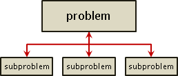

分治法著重分割問題的方式──要怎麼分割問題，使得子問題簡單又好算？各位讀者可以藉由本文的範例，體會分割問題的方式。

## 範例：分解動作
_____________________
想要學習「從中場帶球上籃」，我們可以將此動作分割為「跑步運球」、「跑步收球」、「單手將球放入籃框」等動作，分別學習。每一項動作都熟練之後，組合起來便是帶球上籃了。

如果覺得「跑步運球」還是太難，可以更細分成「原地運球」、「走動運球」、「運球時護球」等動作，克服了之後便能夠順利解決「跑步運球」的問題了。

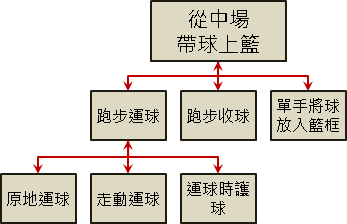

## 範例：方格法求面積

左邊為原問題，右邊放大並細分的圖是其中一個子問題。

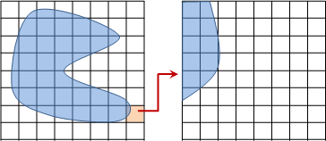

範例：分類數數

左邊最大的框框是原問題，將原問題的數字進行分類後再統計，分類後的每一個框框都是一個子問題。

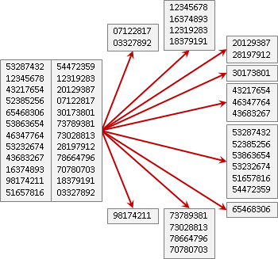

[11038]:http://uva.onlinejudge.org/external/110/11038.html ""
_____________________
UVa [11038]
_____________________
## Recursive Method
_____________________
在分治法當中，亦得遞迴地分割問題，其實就是遞歸法。

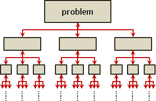

程式碼細分為三個階段： Divide 、 Conquer 、 Combine 。 Divide 階段是把原問題分割成小問題， Conquer 階段是解決小問題， Combine 階段是運用小問題的解答，整理出原問題的解答。

	divide_and_conquer(原問題) {
		// Divide //
		先將原問題分割成許多小問題;
		// Conquer //
		遞迴呼叫函式，求得子問題的解;
		解答1 = divide_and_conquer(子問題1);
		解答2 = divide_and_conquer(子問題2);
		......
		// Combine //
		用小問題的解答，算出原問題的解答;
		原問題解答 = 解答1 + 解答2 + ......;
		return 原問題解答;
	}

[620]:http://uva.onlinejudge.org/external/6/620.html ""
[10101]:http://uva.onlinejudge.org/external/101/10101.html ""
[10144]:http://uva.onlinejudge.org/external/101/10144.html ""
[10998]:http://uva.onlinejudge.org/external/109/10998.html ""

_____________________
UVa [620], UVa [10101], UVa [10144], UVa [10998]
_____________________
## 範例：合併排序法（ Merge Sort ）
_____________________

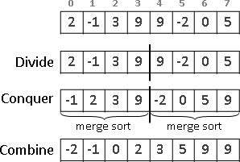

Divide 階段：資料分割成兩堆。

Conquer 階段：兩堆資料各自從事 Merge Sort 。
	
Combine 階段：兩堆已排序過的資料，合併成一堆。
*/
// ToDo Swift Code
/*
Swift's swap() doesn't like it if the items you're trying to swap refer to
the same memory location. This little wrapper simply ignores such swaps.
*/
public func swap<T>(inout a: [T], _ i: Int, _ j: Int) {
	if i != j {
		swap(&a[i], &a[j])
	}
}

func mergesort<T>(array: [T], isOrdered: (T,T) -> Bool) -> [T] {
	func slice<T>(array: [T]) -> [[T]] {
		guard array.count > 2 else { return [array] }
		let a = [T](array.dropLast(array.count / 2))
		let b = array.count % 2 == 0 ? [T](array.dropFirst(array.count / 2)) : [T](array.dropFirst(array.count / 2 + 1))
		return slice(a) + slice(b)
	}
	func sort<T>(inout array: [T], isOrdered: (T,T) -> Bool) -> [T] {
		guard array.count == 2 else { return array }
		guard !(isOrdered(array[0], array[1])) else { return array }
		swap(&array[0], &array[1])
		return array
	}
	func merge(inout a: [T],inout b: [T]) -> [T] {
		var temp = [T]()
		while !a.isEmpty || !b.isEmpty	{
			if b.isEmpty {
				temp.append(a.removeFirst())
			} else if a.isEmpty {
				temp.append(b.removeFirst())
			} else if isOrdered(a[0],b[0]) {
				temp.append(a.removeFirst())
			} else {
				temp.append(b.removeFirst())
			}
		}
		return temp
	}
	var sorted = [[T]]()
	for var element in slice(array) {
		sorted.append(sort(&element, isOrdered: isOrdered))
	}
	repeat {
		var temp = [[T]]()
		for i in 0..<sorted.count / 2 {
			if i * 2 + 1 == sorted.count {
				temp.append(sorted[i * 2])
			} else {
				temp.append(merge(&sorted[i * 2], b: &sorted[i * 2 + 1]))
			}
		}
		sorted = temp
	} while sorted.count != 1
	return sorted[0]
}

var array = [1,5,6,8,7,6,6,6,1,7,9,9,9,9]
mergesort(array, isOrdered: <)
// 1. 先將原陣列細分並在每個小單位中排序[[1, 5], [6, 8], [6, 7], [6], [1, 6], [7, 9], [9, 9], [9]]
// 2. 依序合併小單位	[[1, 5, 6, 8], [6, 6, 7], [1, 6, 7, 9], [9, 9, 9]]
//					[[1, 5, 6, 6, 6, 7, 8], [1, 6, 7, 9, 9, 9, 9]]
//					[[1, 1, 5, 6, 6, 6, 6, 7, 7, 8, 9, 9, 9, 9]]

mergesort(["abc", "copr", "Sean", "Mark", "apple"], isOrdered: <)

///  Kelvin Lau version
func mergeSort(array: [Int]) -> [Int] {
	guard array.count > 1 else { return array }
	let middleIndex = array.count / 2
	let leftArray = mergeSort(Array(array[0..<middleIndex]))
	let rightArray = mergeSort(Array(array[middleIndex..<array.count]))
	return merge(leftPile: leftArray, rightPile: rightArray)
}

func merge(leftPile leftPile: [Int], rightPile: [Int]) -> [Int] {
	var leftIndex = 0
	var rightIndex = 0
	var orderedPile = [Int]()
	while leftIndex < leftPile.count && rightIndex < rightPile.count {
		if leftPile[leftIndex] < rightPile[rightIndex] {
			orderedPile.append(leftPile[leftIndex])
			leftIndex += 1
		} else if leftPile[leftIndex] > rightPile[rightIndex] {
			orderedPile.append(rightPile[rightIndex])
			rightIndex += 1
		} else {
			orderedPile.append(leftPile[leftIndex])
			leftIndex += 1
			orderedPile.append(rightPile[rightIndex])
			rightIndex += 1
		}
	}
	while leftIndex < leftPile.count {
		orderedPile.append(leftPile[leftIndex])
		leftIndex += 1
	}
	while rightIndex < rightPile.count {
		orderedPile.append(rightPile[rightIndex])
		rightIndex += 1
	}
	return orderedPile
}

array = [1,5,6,8,7,6,6,6,1,7,9,9,9,9]
mergeSort(array)

/*:
## 範例：快速排序法（ Quicksort ）
_____________________

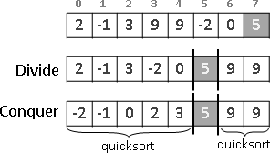

Divide 階段：選擇一個數值當作基準，把資料分割成左右兩堆，使得左堆數值小於基準，右堆數值大於基準，基準數值置於左右兩堆中間。

Conquer 階段：左右兩堆資料各自從事 Quicksort 。
	
Combine 階段：不做任何事。
*/
// ToDo Swift Code
import Foundation
array = [1,5,6,8,7,6,6,6,1,7,9,9,9,9]
func quicksort<T: Comparable>(array: [T], isOrdered: (T,T) -> Bool) -> [T] {
	guard array.count > 1 else { return array }
	let pivot = array[array.count / 2]
	var parts: (l:[T], m:[T], r:[T]) = ([],[],[])
	for element in array {
		if isOrdered(element, pivot) {
			parts.l.append(element)
		} else if element == pivot {
			parts.m.append(element)
		} else {
			parts.r.append(element)
		}
	}
	return quicksort(parts.l, isOrdered: isOrdered) + parts.m + quicksort(parts.r, isOrdered: isOrdered)
}

quicksort(array, isOrdered: <)
quicksort(array, isOrdered: >)

// Matthijs Hollemans Version
func quickSort<T: Comparable>(a: [T], isOrdered: (T,T) -> Bool) -> [T] {
	if a.count <= 1 {
		return a
	} else {
		let pivot = a[a.count/2]
		let less = a.filter { isOrdered($0, pivot) }
		let equal = a.filter { $0 == pivot }
		let greater = a.filter { isOrdered(pivot, $0) }
		return quickSort(less, isOrdered: isOrdered) + equal + quickSort(greater, isOrdered: isOrdered)
	}
}
quickSort(array, isOrdered: <)
quickSort(array, isOrdered: >)
/*:
## 範例：不重複組合（ Combination ）
_____________________
從 N 個人抓 M 個人出來組團，有哪些組合方式呢？

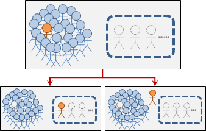

N 個人當中的其中一個人，叫做甲君好了，我們將原問題分割成兩種情形：甲君在團中、甲君不在團中。

	_____________________________________________
	甲君在團中，演變成剩下N-1個人要再抓M-1個人出來組團。
	甲君不在團中，演變成剩下N-1個人仍要抓M個人出來組團。
	_____________________________________________

綜合這兩個子問題的組合方式，就得到答案。
*/
func combination(n: Int, _ m: Int) -> Int {
	guard n > 0 || m  > 0 else { return 0 }
	guard n >= m else { return 0 }
	guard n != m else { return 1 }
	guard n > 1 else { return 1 }
	return combination(n - 1, m - 1) + combination(n - 1, m)
}
combination(4, 3)

/*:
## 範例：河內塔（ Tower of Hanoi ）
_____________________
三根柱子、一疊盤子，盤子大小皆不同（盤子中間還得打個洞，這樣盤子才能穿在柱子上）。所有盤子都疊在第一根柱子，大的在下面，小的在上面。現在要將整疊盤子移到第三根柱子，並且保持原來的大小順序。每次只能搬動一個盤子到別根柱子，而且大的盤子一定要保持在小的盤子下面。

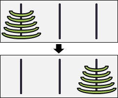

想要移動最大的盤子到第三根柱子，必須先挪開上方整疊盤子到第二根柱子。移動上方整疊盤子，正好與原問題相同、而少了一個盤子，可以視作子問題。

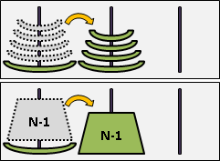

嘗試以此子問題解決原問題，解題過程因而簡化成三個步驟：一、上方整疊盤子移到第二根柱子；二、最大的盤子移到第三根柱子；三、方才的整疊盤子移到第三根柱子。

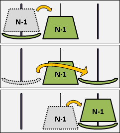

	int p[5];   // 盤子所在的柱子。第i小的盤子放在第p[i]根柱子。

	void move(int n, int t) { // 將前n小的盤子移到第t根柱子
	if (n == 0) return;
	move(n-1, 6-p[n]-t);
	cout << "從" << p[n] << "移到" << t;
	p[n] = t;
	move(n-1, t);
	}

	void tower_of_hanoi() {
	// 五個盤子，都疊在第一根柱子。
	for (int i=1; i<=5; ++i) p[i] = 1;
	// 五個盤子，從第一根柱子移到第三根柱子。
	move(5, 3);
	}
*/
// ToDo Swift Code
import UIKit

// class TowerofHanoi mian part is in the `Sources` sub-directory.
extension TowerofHanoi {
	func solve() {
		func problem(n: Int, from: Int, to: Int)
		{//解河洛塔的函式: 當河洛塔為少一階時有解, 則河洛塔有解
			if (n>0){
				let another = [0, 1, 2].filter{ $0 != from && $0 != to}[0]
				problem(n-1, from: from, to: another)
				move((from, n-1), t: (to, n-1))
				view
				var a=0
				for i in 0...3000 {
					a += i
				}
				
				
				problem(n-1, from: another, to: to)
			}
		}
		problem(self.numberOfplates, from: 0, to: 1)
	}
}

let toh = TowerofHanoi(numberOfplates: 8)

// remove comment markers to test
// toh.solve()

/*:
[10017]:http://uva.onlinejudge.org/external/100/10017.html ""

_____________________
UVa [10017]
_____________________
## Prune and Search
_____________________
「修剪搜尋法」是分治法的特例。去除不重要的子問題，只搜尋重要的子問題。

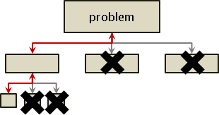

[920]:http://uva.onlinejudge.org/external/9/920.html ""

_____________________
UVa [920]
_____________________
## 範例：二分搜尋法（ Binary Search ）
_____________________

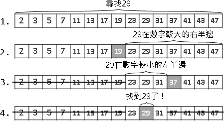

這是在已排序陣列裡面搜尋數值的方法。陣列由中央切成兩邊，一邊數字較小、一邊數字較大。這兩邊一定有一邊不是我們所要的，可以去除，只需要繼續尋找其中一邊。

[10077]:http://uva.onlinejudge.org/external/100/10077.html ""
*/
func binarySearch<T: Comparable>(a: [T], key: T, range: Range<Int>? = nil ) -> Int? {
	var r: Range<Int> = range == nil ? 0..<a.count : range!
	guard r.startIndex < r.endIndex else { return nil }
	let midIndex = (r.startIndex + r.endIndex) / 2
	guard key != a[midIndex] else { return midIndex }
	if key < a[midIndex] {
		r = r.startIndex..<midIndex
	} else {
		r = midIndex + 1..<r.endIndex
	}
	return binarySearch(a, key: key, range: r)
}

var anArray: [Int] = [2, 3, 5, 7, 11, 13, 17, 19, 23, 29, 31, 37, 41, 43, 47]
anArray.startIndex
anArray.endIndex
anArray.count

binarySearch(anArray, key: 43)

/*:
_____________________
UVa [10077]
_____________________
## 範例：尋找陣列裡第 k 大的數
_____________________

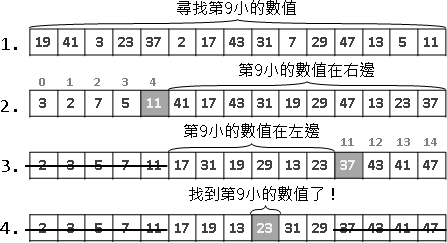

運用 Quicksort 的分割手法，把陣列切成兩邊，一邊數字較小、一邊數字較大。這兩邊一定有一邊不是我們所要的，可以去除，只需要繼續尋找其中一邊。

## 範例：尋找假幣（ Counterfeit Coin Problem ）
_____________________
一堆硬幣，當中一枚硬幣是假幣，重量比真幣輕，肉眼無法分辨差異。手邊的工具僅有一台天平，但沒有砝碼，該如何藉由天平判斷假幣？

當硬幣總數為一，那麼該幣就是假幣。當硬幣總數為二，那麼就無解了。當硬幣總數為三以上，一定有辦法找出假幣，以下介紹兩種策略。

採用遞增法。每次取兩枚硬幣，放在天平兩端秤重。當天平平衡，表示這兩枚硬幣都是真幣，接著繼續處理剩餘硬幣。當天平傾斜，比較輕的硬幣就是假幣。

採用分治法。兩枚硬幣放在天平兩端秤重，當天平平衡，表示這兩枚硬幣都是真幣。接著只剩下 N-2 枚硬幣要尋找假幣──問題遞迴縮小了！

剩下 N-2 枚，太多了一點。一次取多一點硬幣，同時放在天平兩端秤，問題就能縮小更多了！

把所有硬幣平均分成三份，取兩份放在天平兩端秤重。當天平平衡，表示剩下的一份含有假幣，問題一次便縮小為 1/3 。當天平傾斜，表示比較輕的一份含有假幣，問題一次便縮小為 1/3 。
	

讀者可以想想看：如果硬幣數量不是三的次方怎麼辦？如果一開始不知道假幣與真幣孰輕孰重怎麼辦？

## Marriage before Conquest
_____________________

	_______________________________________________________________
	Yu-Han 說道：
	2014/1/11 at 9:00

	分享一下最近看到的技巧 – “marriage-before-conquest"
	在做Divide and conquer中，遞迴求解的部份解答可以用來加速剩下的計算。

	一個簡單的例子是
	http://www.geeksforgeeks.org/sorted-linked-list-to-balanced-bst/
	把已排序的單向鏈結串列轉成平衡的二元搜尋樹。

	如果是用很直接的找中點然後分半遞迴求解，
	時間複雜度是O(n lg n)，
	但是實際上建立完左半邊的時候，就可以直接得到中點，
	因此就可以使得時間複雜度降為O(n)。

	一個稍困難的例子是，給定二維空間中的點集合S，
	我們稱點p為S中的maxima，
	如果在S中沒有任何點的x座標以及y座標同時都大於點p的x座標與y座標。
	問題是要把所有maxima找出來。

	基於Divide and conquer的技巧，利用x座標等分成兩半分別找出maxima，
	然後把在子問題中是maxima但是在考慮整體時不是maxima的點刪除，
	如此的時間複雜度可達到O(n lg n)。

	使用marriage-before-coquest的技巧，
	可以把時間複雜度降到O(n lg h)，h為maxima的個數。
	方法是先計算右半邊的maxima，
	然後利用右半邊的maxima把左半邊中不可能成為全體的maxima的點先刪除，
	最後才計算左半邊。

	同樣的技巧也可以用在convex hull上達到O(n lg h)的時間複雜度。

	Yu-Han 說道：
	2014/1/11 at 23:51

	以convex hull為例子的話，
	是prune-and-search和marriage before conquest的綜合應用。
	當有了右半邊的convex hull的點，要刪除左半邊不可能為convex hull的點時，
	需要使用線性規劃（利用prune-and-search），
	或是自己設計一個prune-and-search的方法。
	所以marriage before conquest和prune-and-search是不同的技巧。

	除了這三個例子之外，我也找不太到其他marriage-before-conquest的範例了。
	_______________________________________________________________

_____________________

[Previous](Recursive Method.md) | 回到[目錄](SUMMARY.md) |本文來源: [演算法筆記](http://www.csie.ntnu.edu.tw/~u91029/AlgorithmDesign.html#6) | [Next](Dynamic Programming.md)
