[Previous](Divide and Conquer.md) | 回到[目錄](SUMMARY.md) |本文來源: [演算法筆記](http://www.csie.ntnu.edu.tw/~u91029/AlgorithmDesign.html#7) | [Next](Greedy Method.md)
_____________________
# Dynamic Programming
### 長江後浪催前浪，一替新人趲舊人。《張協狀元》
_____________________
## Dynamic Programming = Divide and Conquer + Memoization

動態規劃是分治法的延伸。當遞迴分割出來的問題，一而再、再而三出現，就運用記憶法儲存這些問題的答案，避免重複求解，以空間換取時間。

動態規劃的過程，就是反覆地讀取數據、計算數據、儲存數據。

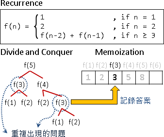

動態規劃龐大複雜，此處僅簡介。詳細介紹請見「 Dynamic Programming 」。

## 範例：階乘（ Factorial ）
_____________________
1 × 2 × 3 × ⋯ × N 。整數 1 到 N 的連乘積。 N 階乘。 N! 。

N! 源自 (N-1)! ，如此就遞迴分割問題了。

陣列的每一格對應每一個問題。設定第一格的答案，再以迴圈依序計算其餘答案。

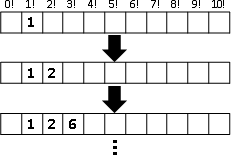

時間複雜度分析：總共 N 個問題，每個問題花費 O(1) 時間，總共花費 O(N) 時間。

空間複雜度分析，有兩種情況：

求 1! 到 N! ：總共 N 個問題，用一條 N 格陣列儲存全部問題的答案，空間複雜度為 O(N) 。

只求 N! ：用一個變數累計乘積，空間複雜度為 O(1) 。

	const int N = 10;
	int f[N];

	void factorial() {
		f[0] = 0;
		f[1] = 1;
		for (int i=2; i<=N; ++i)
		 f[i] = f[i-1] * i;
	}
*/
// ToDo Swift Code
func factorial(n: Int) -> [Int] {
	var f = [0, 1]
	for i in 2..<n {
		f.append(f[i-1] * i)
	}
	return f
}
let f = factorial(10)
f[6]

//Struct Static Variable
public struct Factorial {
	private static var N: Int = 1
	private static var factorialArray: [Int] = [0, 1]
	private static func advanceTo(n: Int) {
		guard N < n else { return }
		for i in N+1...n {
			factorialArray.append(i * factorialArray[i - 1])
		}
		N = n
	}
	public static func getFactorial(n: Int) -> Int {
		advanceTo(n)
		return factorialArray[n]
	}
}
Factorial.getFactorial(6)
Factorial.getFactorial(3)

/*:
	const int N = 10;

	void factorial() {
			int f = 1;
			for (int i=2; i<=N; ++i)
			 f *= i;
	}
*/
// ToDo Swift Code
func factorial1(n: Int) -> Int {
	guard n != 1 else { return 1 }
	return n * factorial1(n - 1)
}
let f1 = factorial1(6)
/*:
[623]:http://uva.onlinejudge.org/external/6/623.html ""
[568]:http://uva.onlinejudge.org/external/5/568.html ""
[10220]:http://uva.onlinejudge.org/external/102/10220.html ""
[10323]:http://uva.onlinejudge.org/external/103/10323.html ""

_____________________
UVa [623], UVa [568], UVa [10220], UVa [10323]
_____________________
## 範例：樓梯路線（ Staircase Walk ），計數問題
_____________________
一個方格棋盤，從左上角走到右下角，每次只能往右走一格或者往下走一格。請問有幾種走法？

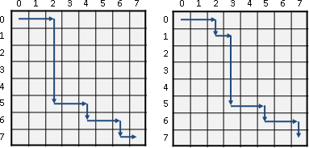

對於任何一個方格來說，只可能「從左走來」或者「從上走來」，答案是兩者相加。

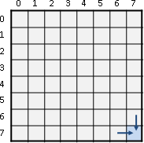

「從左走來」是一個規模更小的問題，「從上走來」是一個規模更小的問題，答案是兩者相加。

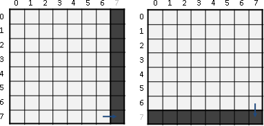

二維陣列的每一格對應每一個問題。設定第零行、第零列的答案，再以迴圈依序計算其餘答案。

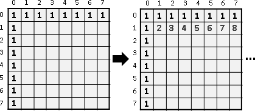

時間複雜度分析：令 X 和 Y 分別是棋盤的長和寬。計算一個問題需要 O(1) 時間（計算兩個子問題的時間）。總共 X*Y 個問題，所以計算所有問題需要 O(XY) 時間。

空間複雜度分析：總共 X*Y 個問題，所以需要 O(XY) 空間，簡單來說就是二維陣列啦！如果不需要儲存所有問題的答案，只想要得到其中一個特定問題的答案，那只需要一維陣列就夠了，也就是 O(min(X, Y)) 空間。

	const int X = 8, Y = 8;
	int c[X][Y];

	void staircase_walk() {
		// [Initial]
		for (int i=0; i<X; i++) c[i][0] = 1;
		for (int j=0; j<Y; j++) c[0][j] = 1;
		// [Compute]
		for (int i=1; i<X; i++)
			for (int j=1; j<Y; j++)
				c[i][j] = c[i-1][j] + c[i][j-1];
		// 輸出結果
		cout << "由(0,0)走到(7,7)有" << c[7][7] << 種走法;
		//  cout << "由(0,0)走到(7,7)有" << c[X-1][Y-1] << 種走法;
		int x, y;
		while (cin >> x >> y)
			cout << "由(0,0)走到(x,y)有" << c[x][y] << 種走法;
	}
*/
// ToDo Swift Code
func staircase_walk(x x: Int, y: Int) -> (m: Int, array: [[Int]]) {
	let t = [Int](count: x, repeatedValue: 1)
	var c = [[Int]](count: y, repeatedValue: t)
	// [Initial] : 這裡運用Array的initializer於建立陣列時一起做了
	// [Compute]
	for i in 1..<x{
		for j in 1..<y {
			c[i][j] = c[i-1][j] + c[i][j-1]
		}
	}
	return (c[x-1][y-1], c)
}
staircase_walk(x:8, y: 8).m
staircase_walk(x:8, y: 8).array

/*:
節省記憶體是動態規劃當中重要的課題！

如果只打算求出一個問題，那麼只需要儲存最近算出來的問題答案，讓計算過程可以順利進行就可以了。

兩條陣列輪替使用，就足夠儲存最近算出來的問題答案、避免 c[i-1][j] 超出陣列範圍。

	const int X = 8, Y = 8;
	int c[2][Y];    // 兩條陣列，儲存最近算出來的問題答案。

	void staircase_walk() {
		// [Initial]
		for (int j=0; j<Y; ++j) c[0][j] = 1;
		// [Compute]
		for (int i=1; i<X; i++)
			for (int j=1; j<Y; j++)
			// 只是多了 mod 2，
			// 外觀看起來就像兩條陣列輪替使用。
			c[i % 2][j] = c[(i-1) % 2][j] + c[i % 2][j-1];
		// 輸出結果
		cout << "由(0,0)走到(7,7)有" << c[7 % 2][7] << 種走法;
		//  cout << "由(0,0)走到(7,7)有" << c[(X-1) % 2][Y-1] << 種走法;
	}
*/
// ToDo Swift Code
func staircase_walk1(x x: Int, y: Int) -> (m: Int, array: [[Int]]) {
	let t = [Int](count: x, repeatedValue: 1)
	var c = [[Int]](count: 2, repeatedValue: t)
	// [Compute]
	for i in 1..<x{
		for j in 1..<y {
			c[i % 2][j] = c[(i-1) % 2][j] + c[i % 2][j-1]
		}
	}
	return (c[(x-1) % 2][y-1], c)
}
staircase_walk1(x:8, y: 8).m
staircase_walk1(x:8, y: 8).array

/*:
事實上，一條陣列就夠了。也不能再少了。

	const int X = 8, Y = 8;
	int c[Y];   // 一條陣列就夠了

	void staircase_walk() {
		// [Initial]
		for (int j=0; j<Y; ++j) c[j] = 1;
		// [Compute]
		for (int i=1; i<X; i++)
			for (int j=1; j<Y; j++)
				c[j] += c[j-1];
		// 輸出結果
		cout << "由(0,0)走到(7,7)有" << c[7] << 種走法;
		//  cout << "由(0,0)走到(7,7)有" << c[Y-1] << 種走法;
	}
*/
// ToDo Swift Code
func staircase_walk2(x x: Int, y: Int) -> (m: Int, array: [Int]) {
	var c = [Int](count: y, repeatedValue: 1)
	// [Compute]
	for _ in 1..<x{
		for j in 1..<y {
			c[j] += c[j-1]
		}
	}
	return (c[y-1], c)
}
staircase_walk2(x:8, y: 8).m
staircase_walk2(x:8, y: 8).array

/*:
	const int X = 8, Y = 8;
	int c[Y];   // 一條陣列就夠了

	void staircase_walk() {
		// [Initial]
		c[0] = 1;   // 部分步驟移到[Compute]
		// [Compute]
		for (int i=0; i<X; i++) // 從零開始！
			for (int j=1; j<Y; j++)
				c[j] += c[j-1];
	 
		// 輸出結果
		cout << "由(0,0)走到(7,7)有" << c[7] << 種走法;
		//  cout << "由(0,0)走到(7,7)有" << c[Y-1] << 種走法;
	}
*/
// ToDo Swift Code
func staircase_walk3(x x: Int, y: Int) -> (m: Int, array: [Int]) {
	var c = [Int](count: y, repeatedValue: 1)
	// [Compute]
	for _ in 0..<x{
		for j in 1..<y {
			c[j] += c[j-1]
		}
	}
	return (c[y-1], c)
}
staircase_walk3(x:8, y: 8).m
staircase_walk3(x:8, y: 8).array
/*:
如果某些格子上有障礙物呢？把此格設為零。

如果也可以往右下斜角走呢？添加來源 c[i-1][j-1] 。
	
如果可以往上下左右走呢？不斷繞圈子，永遠不會結束，走法無限多種。

[10599]:http://uva.onlinejudge.org/external/105/10599.html ""
[825]:http://uva.onlinejudge.org/external/8/825.html ""
[926]:http://uva.onlinejudge.org/external/9/926.html ""
[4787]:https://icpcarchive.ecs.baylor.edu/external/47/4787.pdf ""

_____________________
UVa [10599], UVa [825], UVa [926], ICPC [4787]
_____________________
## 範例：樓梯路線（ Staircase Walk ），計數問題
_____________________
這個問題雙向都可以遞歸。對於任何一個方格來說，只可能「向右走出」或者「向下走出」。

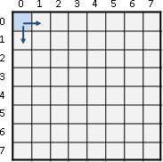

_____________________
## 範例：樓梯路線（ Staircase Walk ），極值問題
_____________________
動態規劃的問題，可以分為「計數問題」和「極值問題」。方才介紹「計數問題」，現在介紹「極值問題」。

一個方格棋盤，格子擁有數字。從左上角走到右下角，每次只能往右走一格或者往下走一格。請問總和最小的走法？（或者總和最大的走法？）

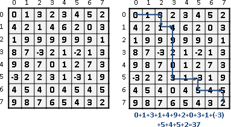

	const int X = 8, Y = 8;
	int a[X][Y];
	int c[X][Y];

	void staircase_walk() {
		// [Initial]
		c[0][0] = a[0][0];
		for (int i=1; i<X; i++)
			c[i][0] = c[i-1][0] + a[i][0];
		for (int j=1; j<Y; j++)
			c[0][j] = c[0][j-1] + a[0][j];
		// [Compute]
		for (int i=1; i<X; i++)
			for (int j=1; j<Y; j++)
				c[i][j] = max(c[i-1][j], c[i][j-1]) + a[i][j];
		// 輸出結果
		cout << "由(0,0)走到(7,7)的最小總和" << c[7][7];
		//  cout << "由(0,0)走到(7,7)的最小總和" << c[X-1][Y-1];
		int x, y;
		while (cin >> x >> y)
			cout << "由(0,0)走到(x,y)的最小總和" << c[x][y];
	}
*/
// ToDo Swift Code
import UIKit
func buildView(gridMatrix: [[Int]], walk: [[Int]], path: [[String]]) -> UIView {
	let view = UIView(frame: CGRect(origin: CGPoint(x: 0, y: 0), size: CGSize(width: 600, height: 600)))
	view.backgroundColor = UIColor.blackColor()
	for i in 0..<gridMatrix.count {
		for j in 0..<gridMatrix[0].count {
			let lable = UILabel(frame: CGRect(origin: CGPoint(x: 75 * i, y: 75 * j), size: CGSize(width: 75, height: 37)))
			lable.backgroundColor = (i + j) % 2 == 0 ? UIColor.lightGrayColor() : UIColor.whiteColor()
			lable.backgroundColor = path[i][j] == "" ? lable.backgroundColor : UIColor.yellowColor()
			lable.backgroundColor = (i == gridMatrix.count - 1 && j == gridMatrix[0].count - 1) ? UIColor.yellowColor() : lable.backgroundColor
			lable.text = "\(gridMatrix[i][j])"
			lable.textColor = UIColor.blueColor()
			lable.textAlignment = NSTextAlignment.Center
			view.addSubview(lable)
			let stepsLable = UILabel(frame: CGRect(origin: CGPoint(x: 75 * i, y: 75 * j + 37), size: CGSize(width: 75, height: 38)))
			stepsLable.backgroundColor = lable.backgroundColor
			stepsLable.text = "\(walk[i][j]) " + path[i][j]
			stepsLable.textColor = UIColor.blackColor()
			stepsLable.textAlignment = NSTextAlignment.Center
			view.addSubview(stepsLable)
		}
	}
	return view
}
func staircase_walk_findpath(matrix:[[Int]]) -> (steps:Int, path: String) {
	var walk: [[Int]] = matrix
	let x = walk.count
	let y = walk[0].count
	var pathMatrix: [[String]] = walk.map{ $0.map{ _ in "" } }
	for j in 1..<y {
		walk[0][j] += walk[0][j-1]
	}
	for i in 1..<x {
		walk[i][0] += walk[i-1][0]
	}
	for i in 1..<x {
		for j in 1..<y {
			walk[i][j] += min(walk[i-1][j], walk[i][j-1])
		}
	}
	func backTrace(i: Int, j: Int) {
		guard i >= 1 || j >= 1 else { return }
		if j == 0 {
			pathMatrix[i - 1][j] = "→"
			backTrace(i - 1, j: j)
		} else if i == 0 {
			pathMatrix[i][j - 1] = "↓"
			backTrace(i, j: j - 1)
		}else if walk[i][j] == walk[i - 1][j] + gridMatrix[i][j] {
			pathMatrix[i - 1][j] = "→"
			backTrace(i - 1, j: j)
		} else {
			pathMatrix[i][j - 1] = "↓"
			backTrace(i, j: j - 1)
		}
	}
	backTrace(x - 1, j: y - 1)
	buildView(gridMatrix, walk: walk, path: pathMatrix)
	return (walk[x-1][y-1], pathMatrix[x-1][y-1])
}
let gridMatrix: [[Int]] = [[3,2,6,4,5,3,8,6], [2,4,5,2,9,7,5,4], [6,3,2,5,4,1,9,2], [5,7,3,2,9,7,2,2], [4,1,1,7,6,9,8,1], [3,1,6,7,2,4,1,7], [1,4,9,8,6,3,2,1], [9,3,1,4,4,7,2,8]]
let solution = staircase_walk_findpath(gridMatrix)
solution.steps
solution.path

/*:
想要印出路線，另外用一個陣列，紀錄從哪走來。

	const int X = 8, Y = 8;
	int a[X][Y];
	int c[X][Y];
	int p[X][Y];
	int out[X+Y-1];

	void staircase_walk() {
		// [Initial]
		c[0][0] = a[0][0];
		p[0][0] = -1;   // 沒有源頭
		for (int i=1; i<X; i++) {
			c[i][0] = c[i-1][0] + a[i][0];
			p[i][0] = 0;    // 從上走來
		}
		for (int j=1; j<Y; j++) {
			c[0][j] = c[0][j-1] + a[0][j];
			p[0][j] = 1;    // 從左走來
		}
		// [Compute]
		for (int i=1; i<X; i++)
			for (int j=1; j<Y; j++)
				if (c[i-1][j] < c[i][j-1]) {
					c[i][j] = c[i-1][j] + a[i][j];
					p[i][j] = 0;    // 從上走來
				}
				else if (c[i-1][j] > c[i][j-1]) {
					c[i][j] = c[i][j-1] + a[i][j];
					p[i][j] = 1;    // 從左走來
				}
				else //if (c[i-1][j] == c[i][j-1])// {
					// 從上走來、從左走來都可以，這裡取左。
					c[i][j] = c[i][j-1] + a[i][j];
					p[i][j] = 1;
				}
		// 反向追蹤路線源頭
		int n = 0;  // out size
		for (int i=X-1, j=Y-1; i>=0 && j>=0; ) {
			out[n++] = p[i][j];
			if (p[i][j] == 0) i--;
			else if (p[i][j] == 1) j--;
		}
		// 印出路線
		for (int i=n-1; i>=0; --i)
			cout << out[i];
	}
*/
// ToDo Swift Code
// 略
/*:
額外介紹一個技巧。為了避免減一超出邊界，需要添補許多程式碼。整個棋盤往右下移動一格，就能精簡許多程式碼。

	const int X = 8, Y = 8;
	int a[X+1][Y+1];    // 整個棋盤往右往下移動一個
	int c[X+1][Y+1];    // 全域變數，將自動初始化為零。
	int p[X+1][Y+1];
	int out[X+Y-1];

	void staircase_walk(){
		// [Initial]
		// [Compute]
		for (int i=1; i<=X; i++)
			for (int j=1; j<=Y; j++)
				if (c[i-1][j] < c[i][j-1]) {
					c[i][j] = c[i-1][j] + a[i][j];
					p[i][j] = 0;    // 從上走來
				}
				else //if (c[i-1][j] >= c[i][j-1])// {
					c[i][j] = c[i][j-1] + a[i][j];
					p[i][j] = 1;    // 從左走來
				}
		// 反向追蹤路線源頭
		int n = 0;  // out size
		for (int i=X, j=Y; i>0 && j>0; ) {
			out[n++] = p[i][j];
			if (p[i][j] == 0) i--;
			else if (p[i][j] == 1) j--;
		}
		// 印出路線
		for (int i=n-1; i>=0; --i)
		cout << out[i];
	}
*/
// ToDo Swift Code
// 略
/*:
	const int X = 8, Y = 8;
	int a[X+1][Y+1];    // 整個棋盤往右往下移動一個
	int c[X+1][Y+1];    // 全域變數，將自動初始化為零。
	int p[X+1][Y+1];
	int out[X+Y-1];

	void staircase_walk() {
		// [Initial]
		// [Compute]
		const int x[2] = {1, 0};
		const int y[2] = {0, 1};
		for (int i=1; i<=X; i++)
			for (int j=1; j<=Y; j++) {
				if (c[i-1][j] < c[i][j-1]) p[i][j] = 0;
				else                       p[i][j] = 1;
				int& d = p[i][j];
				c[i][j] = c[i-x[d]][j-y[d]] + a[i][j];
			}
		// 反向追蹤路線源頭
		int n = 0;  // out size
		for (int i=X, j=Y; i>0 && j>0; ) {
			int& d = p[i][j];
			out[n++] = d;
			i -= x[d]; j -= x[d];
		}
		// 印出路線
		for (int i=n-1; i>=0; --i)
			cout << out[i];
	}
*/
// ToDo Swift Code
// 略
/*:
## 範例：樓梯路線（ Staircase Walk ），極值問題
_____________________

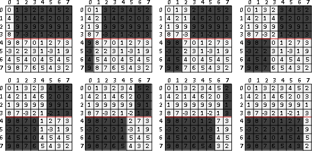

節省記憶體是動態規劃當中重要的課題！

方才的分割方式：分割最後一步，窮舉最後一步從哪走來；方才的實作方式：由小到大的迴圈。問題答案 c[i][j] ，可以精簡成一維陣列。路線來源 p[i][j] ，無法精簡成一維陣列。

想讓路線來源精簡成一維陣列，必須採用另一種分割方式：從地圖中線分割，窮舉穿過中線的所有地點；同時採用另一種實作方式：由大到小的遞迴。

詳細介紹請見「 Dynamic Programming 」。
	
## 範例：巴斯卡三角形（ Pascal's Triangle ）
_____________________

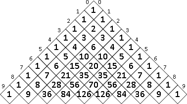

巴斯卡三角形左右對稱，可以精簡掉對稱部分。巴斯卡三角形逆時針轉 45˚ ，視覺上就可以一一對應至表格。

時間複雜度為 O(N^2) ，空間複雜度為 O(N^2) 。

[369]:http://uva.onlinejudge.org/external/3/369.html ""
[485]:http://uva.onlinejudge.org/external/4/485.html ""
[10564]:http://uva.onlinejudge.org/external/105/10564.html ""
_____________________
UVa [369], UVa [485], UVa [10564]
_____________________
## 範例：矩陣相乘次序（ Matrix Chain Multiplication ）
_____________________

矩陣乘法具有結合律。一連串的矩陣乘法，從中任取兩個相鄰的矩陣相乘，先行結合成一個新矩陣，不會改變所有矩陣相乘之後的結果。

在一連串的矩陣乘法中，無論從何處開始相乘，計算結果都一樣，然而計算時間卻有差異。兩個矩陣大小為 a x b 及 b x c ，相乘需要 O(a*b*c) 時間（當然還可以更快，但是此處不討論），那麼一連串的矩陣相乘，需要多少時間呢？

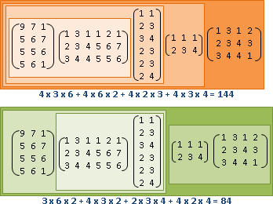

原來的一連串矩陣，可以從最後一次相乘的地方分開，化作兩串矩陣相乘。考慮所有可能的分法。

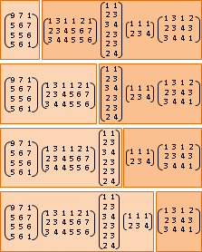

	int f[100][100];
	int r[100], c[100];

	void matrix_chain_multiplication() {
		memset(array, 0x7f, sizeof(array));
		for (int i=0; i<N; ++i)
			array[i][i] = 0;
	 
		for (int l=1; l<N; ++l)
			for (int i=0; i+l<N; ++i) {
				int k = i + l;
				for (int j=i; j<k; ++j)
					f[i][k] = min(f[i][k], f[i][j] + f[j+1][k] + r[i] * c[j] * c[k]);
			}
	}
*/
// ToDo Swift Code
func matrixMultiplication(a: [[Int]], _ b: [[Int]]) -> [[Int]]? {
	//A: m x l  , B: l x n, C: m x n, cij = ai1b1j + ai2b2j + ... + ailblj
	let m = a.count
	let l = a[0].count
	let n = b[0].count
	guard !a.isEmpty && !b.isEmpty else { return nil }			// check A, B is not empty
	guard !a[0].isEmpty && !b[0].isEmpty else { return nil }	// check A sub, B sub is not empty
	guard a[0].count == b.count else { return nil }				// check A columns and B rows is same l.
	for element in a {
		if element.count != l { return nil }					// check each A row has same columns
	}
	for element in b {
		if element.count != n { return nil }					// chech each B row has same columns
	}
	let row = [Int](count: n, repeatedValue: 0)
	var matrix = [[Int]](count: m, repeatedValue: row)
	for i in 0..<matrix.count {
		for j in 0..<matrix[i].count {
			for k in 0..<l {
				matrix[i][j] += a[i][k] * b[k][j]
			}
		}
	}
	return matrix
}
public func * (lhs: [[Int]], rhs: [[Int]]) -> [[Int]]? {
	return matrixMultiplication(lhs, rhs)
}
func matrix_chain_multiplication(matrixes: [[[Int]]]) -> [[Int]]? {
	guard matrixes.count > 1 else { return nil }
	var result: [[Int]]? = matrixes[0]
	let remainings = matrixes[1..<matrixes.count]
	for matrix in remainings {
		if let ans = result {
			result = ans * matrix
		}
	}
	return result
}
func matrix_chain_multiplication(matrixes: [[Int]]...) -> [[Int]]? {
	return matrix_chain_multiplication(matrixes)
}
func min_matrix_chain_multiplication(matrixes: [[[Int]]]) -> [[Int]]? {
	let m: ([[[Int]]]) -> [[Int]]? = min_matrix_chain_multiplication
	guard !matrixes.isEmpty else { return nil }
	guard matrixes.count > 1 else { return matrixes[0] }
	guard matrixes.count > 2 else { return matrixes[0] * matrixes[1] }
	guard matrixes.count > 3 else {
		let a = matrixes[0].count, b = matrixes[1].count, c = matrixes[2].count, d = matrixes[2][0].count
		let forward = a * b * c + a * c * d
		if forward == min(a * b * c + a * c * d, a * b * d + b * c * d) {
			return m(Array(matrixes[0..<2]))! * matrixes[2]
		} else {
			return matrixes[0] * m(Array(matrixes[1..<3]))!
		}
	}
	let mid = Array(matrixes[1..<matrixes.count - 1])
	return m([matrixes[0],min_matrix_chain_multiplication(mid)!,matrixes[matrixes.count - 1]])
}
func min_matrix_chain_multiplication(matrixes: [[Int]]...) -> [[Int]]? {
	return min_matrix_chain_multiplication(matrixes)
}

let aMatrix = [[9, 7, 1], [5, 6, 7], [5, 5, 6], [5, 6, 1]]
let bMatrix = [[1, 3, 1, 1, 2, 1], [2, 3, 4, 5, 6, 7], [3, 4, 4, 5, 5, 6]]
let cMatrix = [[1, 1], [2, 3], [3, 4], [2, 3], [2, 3], [2, 4]]
let dMatrix = [[1, 1, 1], [2, 3, 4]]
let eMatrix = [[1, 3, 1, 2], [2, 3, 4, 3], [3, 4, 4, 1]]

matrix_chain_multiplication(aMatrix, bMatrix, cMatrix, dMatrix, eMatrix)
min_matrix_chain_multiplication(aMatrix, bMatrix, cMatrix, dMatrix, eMatrix)

func solvingTimeInterval(parameters: [[[Int]]], problemBlock: ([[[Int]]]) -> [[Int]]?) -> Double {
	let start = NSDate() // <<<<<<<<<< Start time
	_ = problemBlock(parameters)
	let end = NSDate()   // <<<<<<<<<<   end time
	let timeInterval: Double = end.timeIntervalSinceDate(start) // <<<<< Difference in seconds (double)
	print("Time to evaluate problem : \(timeInterval) seconds")
	return timeInterval
}
solvingTimeInterval([aMatrix, bMatrix, cMatrix, dMatrix, eMatrix], problemBlock: matrix_chain_multiplication)
solvingTimeInterval([aMatrix, bMatrix, cMatrix, dMatrix, eMatrix], problemBlock: min_matrix_chain_multiplication)
/*:
可以調整成 online 版本。

	for (int k=1; k<N; ++k)
		for (int i=k-1; i>=0; --i)
			for (int j=k-1; j>=i; --j)
	//      for (int j=i; j<k; ++j)
				f[i][k] = min(f[i][k], f[i][j] + f[j+1][k] + r[i] * c[j] * c[k]);
*/
// ToDo Swift Code
/*:
想要印出矩陣相乘的順序，另外用一個陣列，紀錄最後一次的相乘位置。

[348]:http://uva.onlinejudge.org/external/3/348.html ""
[442]:http://uva.onlinejudge.org/external/4/442.html ""
[6669]:https://icpcarchive.ecs.baylor.edu/external/66/6669.pdf ""
_____________________
UVa [348], UVa [442], ICPC [6669]
_____________________
[Previous](Divide and Conquer.md) | 回到[目錄](SUMMARY.md) |本文來源: [演算法筆記](http://www.csie.ntnu.edu.tw/~u91029/AlgorithmDesign.html#7) | [Next](Greedy Method.md)
