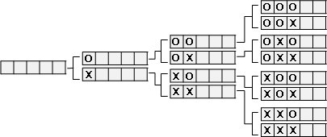
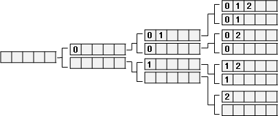

[Previous](Enumerate Permutations.md) | 回到[目錄](Modeling.md) |本文來源: [演算法筆記](http://www.csie.ntnu.edu.tw/~u91029/Backtracking.html#3) | [Next](8 Queen Problem.md)
_____________________
# Enumerate Combinations
## Combination （ Subset ）
_____________________
便是數學課本中「排列組合」的「組合」；概念等於「子集合」。但是這裡不是要計算組合有多少種，而是枚舉所有的組合，以字典順序枚舉。

例如 {1,2,3} 所有的組合就是 {} 、 {1} 、 {2} 、 {3} 、 {1,2} 、 {1,3} 、 {2,3} 、 {1,2,3} 。
	
## 範例：枚舉 {0,1,2,3,4} 所有組合
_____________________
該如何枚舉呢？先觀察平時我們計算組合個數的方法。
	
	{0,1,2,3,4} 所有組合個數總共 2^5 個： 0 可取可不取，有兩種情形、 1 可取可不取，有兩種情形、 ... 、 4 可取可不取，有兩種情形。根據乘法原理，總共 2*2*2*2*2 = 2^5 種情形。

枚舉方式可以仿照乘法原理。建立一個陣列，當作一個集合。 solution[i] = true 表示這個集合擁有第 i 個元素，觀念等同「Set資料結構：索引儲存(http://www.csie.ntnu.edu.tw/~u91029/Set.html)」。

依序枚舉每個位置。針對每個位置，試著填入取或不取。

	bool solution[5];   // 索引儲存
	void backtrack(int n) {
		// it's a solution
		if (n == 5) {
			for (int i=0; i<5; i++)
			if (solution[i])
			cout << i << ' ';
			cout << endl;
			return;
		}
		// 選取數字n，然後繼續枚舉之後的位置。
		solution[n] = true;
		backtrack(n+1);
		// 不取數字n，然後繼續枚舉之後的位置。
		solution[n] = false;
		backtrack(n+1);
	}
	void enumerate_combinations() {
			backtrack(0);
	}
*/

import Foundation

var track: [Int] = [Int]()
func backtrack(n: Int) {
	guard n < 3 else {
		return
	}
	track.append(n)
	backtrack(n + 1)
	track.append(n)
	backtrack(n + 1)
}

backtrack(0) //track = [0, 1, 2, 2, 1, 2, 2, 0, 1, 2, 2, 1, 2, 2]

/*:
觀察上面範例，可了解backtrack的完整執行流程
*/
// 枚舉 {0,1,2,3,4} 所有組合
var solution = [Bool](count: 5, repeatedValue: true)
// sorting method
func increment(a: [Int], _ b: [Int]) -> Bool {
	if a.count < b.count {
		return true
	} else if a.count == b.count && a.description < b.description {
		return true
	}
	return false
}
// transform an `i-th element` existing matrix to form a real Int matrix. i.e. [F,T,T] x [1,2,3] = [2,3]
// 此方法可以藉助zip函式完成
func trans(combination: [Bool]) -> [Int] {
	var array:[Int] = [Int]()
	var source = [0, 1, 2, 3, 4]
	for i in 0..<combination.count {
		if combination[i] {
			array.append(source[i])
		}
	}
	return array
}

func enumerateCombinations() -> [[Int]] {
	var array = [[Bool]]()
	var source = [0, 1, 2, 3, 4]
	func backtrack(n: Int) {
		guard n < 5 else {
			array.append(solution)
			return
		}
		solution[n] = true
		backtrack(n + 1)
		solution[n] = false
		backtrack(n + 1)
	}
	backtrack(0)
	return array.flatMap{ zip($0, source).flatMap{$0 ? $1 : nil} }
//	return array.flatMap{ trans($0) }
}
let combined = enumerateCombinations().sort{ increment($0, $1) }
combined
combined.count

/*:
亦得改用其他資料結構，例如「Set資料結構：循序儲存(http://www.csie.ntnu.edu.tw/~u91029/Set.html)」。

	int subset[5];  // 循序儲存
	void backtrack(int n, int size) { // size為子集合大小
		// it's a solution
		if (n == 5) {
			// print solution
			for (int i=0; i<size; i++)
			cout << subset[i] << ' ';
			cout << endl;
			return;
		}
		// 選取數字n，然後繼續枚舉剩下的數字。
		subset[size] = n;
		backtrack(n+1, size+1);
		// 不取數字n，然後繼續枚舉剩下的數字。
		backtrack(n+1, size);
	}

	void enumerate_combinations() {
			backtrack(0, 0);
	}
*/
var sol = [Int]()
func enumerateCombinations_1() -> [[Int]] {
	var array = [[Int]]()
	var source = [0, 1, 2, 3, 4]
	func backtrack(n: Int) {
		guard n < 5 else {
			array.append(sol)
			return
		}
		sol.append(source[n])
		backtrack(n + 1)
		sol.removeLast()
		backtrack(n + 1)
		
	}
	backtrack(0)
	return array
}

let combined1 = enumerateCombinations_1().sort{ increment($0, $1) }
combined1
combined1.count
let t0 = timeElapsedInSecondsWhenRunningCode({ enumerateCombinations() })
let t1 = timeElapsedInSecondsWhenRunningCode({ enumerateCombinations_1() })
t0
t1

/*:
## 範例：枚舉 {0,1,2,3,4} 所有組合
_____________________
依序枚舉每個選取。針對每個選取，試著填入各個位置。

	bool solution[5];   // 索引儲存
	void backtrack(int n) {
		// print_solution
		for (int i=0; i<5; i++)
		if (solution[i])
		cout << i << ' ';
		cout << endl;
		for (; n<5; ++n){
			// 選取數字n
			solution[n] = true;
			// 然後繼續枚舉後面的數字
			backtrack(n+1);
			// 回復原狀
			solution[n] = false;
		}
	}
	void enumerate_combinations() {
			backtrack(0);
	}
*/

/*:

	int subset[5];  // 循序儲存
	void backtrack(int n, int size) {  // size為子集合大小
		// print_solution
		for (int i=0; i<size; i++)
		cout << subset[i] << ' ';
		cout << endl;
		for (; n<5; ++n) {
			// 選取數字n
			subset[size] = n;
			// 然後繼續枚舉後面的數字
			backtrack(n+1, size+1);
			// 不必特地回復原狀，數字n會覆蓋過去。
		}
	}
	void enumerate_combinations() {
			backtrack(0, 0);
	}

## 範例：枚舉 {6,7,13,4,2} 所有組合
_____________________
預先排序數字，輸出結果就會照字典順序排列。

	int array[5] = {6, 7, 13, 4, 2};
	int subset[5];  // 循序儲存
	void backtrack(int n, int size) { // size為子集合大小
		// it's a solution
		if (n == 5) {
			print_solution();
			return;
		}
		// 選取數字array[n]，然後繼續枚舉剩下的數字。
		subset[size] = array[n];
		backtrack(n+1, size+1);
		// 不取數字array[n]，然後繼續枚舉剩下的數字。
		backtrack(n+1, size);
	}
	void enumerate_combinations() {
			sort(array, array+5);
			backtrack(0, 0);
	}

_____________________

	int array[5] = {6, 7, 13, 4, 2};
	int subset[5];  // 循序儲存
	void backtrack(int n, int size) { // size為子集合大小
		print_solution();
		for (; n<5; ++n) {
			// 選取數字array[n]
			subset[size] = array[n];
			// 然後繼續枚舉剩下的數字
			backtrack(n+1, size+1);
		}
	}

	void enumerate_combinations() {
			sort(array, array+5);
			backtrack(0, 0);
	}

_____________________
[Previous](Enumerate Permutations.md) | 回到[目錄](Modeling.md) |本文來源: [演算法筆記](http://www.csie.ntnu.edu.tw/~u91029/Backtracking.html#3) | [Next](8 Queen Problem.md)
