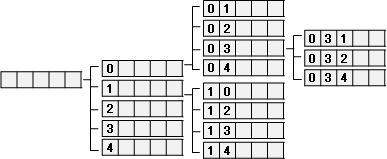
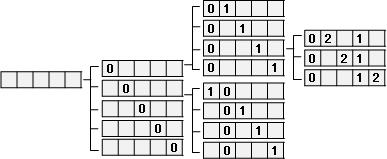

[Previous](Backtracking.md) | 回到[目錄](Modeling.md) |本文來源: [演算法筆記](http://www.csie.ntnu.edu.tw/~u91029/Backtracking.html#2) | [Next](Enumerate Combinations.md)
_____________________
# Enumerate Permutations
## Permutation
_____________________
便是數學課本中「排列組合」的「排列」。但是這裡不是要計算排列有多少種，而是枚舉所有的排列，以字典順序枚舉。

例如 {1,2,3} 所有的排列就是 {1,2,3} 、 {1,3,2} 、 {2,1,3} 、 {2,3,1} 、 {3,1,2} 、 {3,2,1} 。

## 範例：枚舉 {0,1,2,3,4} 所有排列
_____________________
依序枚舉每個位置。針對每個位置，試著填入各種數字。

	int solution[5];    // 用來存放一組可能的答案
	bool used[5];       // 紀錄數字是否使用過，用過為 true。
	void backtrack(int n) {
		// it's a solution
		if (n == 5) {
			// 印出一組可能的數據
			for (int i=0; i<5; i++)
			cout << solution[i] << ' ';
			cout << endl;
			return;
		}
		// 逐步枚舉數字0到4，並且遞迴下去，繼續枚舉之後的維度。
		if (!used[0]) {         // 用過的數字不能再用
			used[0] = true;     // 紀錄用過的數字
			solution[n] = 0;    // 第 n 格填入數字 0
			backtrack(n+1);     // 繼續枚舉之後的維度
			used[0] = false;    // 回收用完的數字
		}
		if (!used[1]) {
			used[1] = true;
			solution[n] = 1;
			backtrack(n+1);
			used[1] = false;
		}
		......

		if (!used[4]){
			used[4] = true;
			solution[n] = 4;
			backtrack(n+1);
			used[4] = false;
		}
	}

	void enumerate_permutations() {
		for (int i=0; i<5; i++) // initialization
		used[i] = false;
		backtrack(0);   // 印出數字0到4的所有排列。
	}
*/
var solution: [Int] = [Int](count: 5, repeatedValue: 0)
var used: [Bool] = [Bool](count: 5, repeatedValue: false)
func permutations() -> [[Int]] {
	var permutations = [[Int]]()
	func backtrack(n: Int)  {
		guard n < 5 else {
			permutations.append(solution)
			return
		}
		if !used[0] {
			used[0] = true
			solution[n] = 0
			backtrack(n + 1)
			used[0] = false
		}
		if !used[1] {
			used[1] = true
			solution[n] = 1
			backtrack(n + 1)
			used[1] = false
		}
		if !used[2] {
			used[2] = true
			solution[n] = 2
			backtrack(n + 1)
			used[2] = false
		}
		if !used[3] {
			used[3] = true
			solution[n] = 3
			backtrack(n + 1)
			used[3] = false
		}
		if !used[4] {
			used[4] = true
			solution[n] = 4
			backtrack(n + 1)
			used[4] = false
		}
	}
	backtrack(0)
	return permutations
}
let permutations1 = permutations()
permutations1.count

/*:
一般來說，重複很多次的程式碼，都會用迴圈進行簡化。

	void backtrack(int n) {
		// it's a solution
		if (n == 5) {
			for (int i=0; i<5; i++)
			cout << solution[i] << ' ';
			cout << endl;
			return;
		}
		// 寫成一個迴圈
		for (int i=0; i<5; i++)
		if (!used[i]) {
			used[i] = true;
			solution[n] = i;
			backtrack(n+1);
			used[i] = false;
		}
	}
*/
func permutations_short() -> [[Int]] {
	var permutations = [[Int]]()
	func backtrack(n: Int)  {
		guard n < 5 else {
			permutations.append(solution)
			return
		}
		for i in 0..<5 {
			if !used[i] {
				used[i] = true
				solution[n] = i
				backtrack(n + 1)
				used[i] = false
			}
		}
	}
	backtrack(0)
	return permutations
}
let permutations2 = permutations_short()
permutations2.count

/*:
## 範例：枚舉 {0,1,2,3,4} 所有排列
_____________________
依序枚舉每個數字。針對每個數字，試著填入各個位置。

	int solution[5];    // 用來存放一組可能的答案
	bool filled[5];     // 紀錄各個位置是否填過數字，填過為true
	void backtrack(int n) {
		// it's a solution
		if (n == 5) {
			for (int i=0; i<5; i++)
			cout << solution[i] << ' ';
			cout << endl;
			return;
		}
		for (int i=0; i<5; i++)     // 試著將數字 n 填入各個位置
		if (!filled[i]) {
			filled[i] = true;   // 紀錄填過的位置
			solution[i] = n;    // 將數字 n 填入第 i 格
			backtrack(n+1);     // 繼續枚舉下一個數字
			filled[i] = false;  // 回收位置
		}
	}

	void enumerate_permutations() {
		for (int i=0; i<5; i++) // initialization
		filled[i] = false;
		backtrack(0);   // 印出數字1到5的所有排列。
	}
*/
var filled = [Bool](count: 5, repeatedValue: false)
func permutations_filled() -> [[Int]] {
	var permutations = [[Int]]()
	func backtrack(n: Int)  {
		guard n < 5 else {
			permutations.append(solution)
			return
		}
		for i in 0..<5 {
			if !filled[i] {
				filled[i] = true
				solution[i] = n
				backtrack(n + 1)
				filled[i] = false
			}
		}
	}
	backtrack(0)
	return permutations
}
let permutations3 = permutations_filled()
permutations3.count

/*:
## 範例：枚舉 abc 所有排列
_____________________
這跟先前範例大同小異，程式碼稍做修改即可。

	char s[3] = {'a', 'b', 'c'};    // 字串，需要先由小到大排序過
	char solution[3];   // 用來存放一組可能的答案
	bool used[3];       // 紀錄該字母是否使用過，用過為true。
	void backtrack(int n, int N) {
		if (n == N) // it's a solution {
			for (int i=0; i<N; i++)
			cout << solution[i];
			cout << endl;
			return;
		}
		// 針對solution[i]這個位置，枚舉所有字母，並各自遞迴。
		for (int i=0; i<N; i++)
		if (!used[i]) {
			used[i] = true;
			solution[n] = s[i]; // 填入字母
			backtrack(n+1, N);
			used[i] = false;
		}
	}

	void enumerate_permutations() {
		for (int i=0; i<5; i++) // initialization
		used[i] = false;
		backtrack(0, 3);    // 印出字母abc的所有排列。
	}
*/
var charSolution = [String](count: 3, repeatedValue: "")
func permutations_chars() -> [[String]] {
	var permutations = [[String]]()
	var chars = ["a", "b", "c"]
	func backtrack(n: Int)  {
		guard n < 3 else {
			permutations.append(charSolution)
			return
		}
		for i in 0..<3 {
			if !used[i] {
				used[i] = true
				charSolution[n] = chars[i]
				backtrack(n + 1)
				used[i] = false
			}
		}
	}
	backtrack(0)
	return permutations
}
let permutations4 = permutations_chars()
permutations4.count

/*:
## 範例：枚舉 abb 所有排列，避免重複排列。
_____________________
答案應該為 abb 、 aba 、 baa 。然而使用剛剛的程式碼，答案卻是這樣：

	abb
	abb
	bab
	bba
	bab
	bba

這跟預期的不一樣。會有這種結果，是由於之前的程式有個基本假設：字串中的每個字母都不一樣。儘管出現了一樣的字母，但是程式還是當作不一樣的字母，依舊列出所有可能的排列，導致有些排列重複出現。

想要避免產生重複排列，在枚舉某一個位置的字母時，避免重複填入一樣的字母。若將輸入的字串由小到大排序，字母會依照順序出現，所以只需檢查方才填入的字母，判斷一不一樣，就可以避免填入一樣的字母了。

	char s[3] = {'a', 'b', 'b'};    // 字串，需要先由小到大排序過
	char solution[3];
	bool used[3];

	void backtrack(int n, int N) {
		if (n == N) {
			for (int i=0; i<N; i++)
			cout << solution[i];
			cout << endl;
			return;
		}
		char last_letter = '\0';
		for (int i=0; i<N; i++)
		if (!used[i])
		if (s[i] != last_letter) {  // 避免枚舉一樣的字母
			last_letter = s[i];     // 紀錄方才填入的字母
			used[i] = true;
			solution[n] = s[i];
			backtrack(n+1, N);
			used[i] = false;
		}
	}
*/

func permutations_chars1() -> [[String]] {
	var permutations = [[String]]()
	var chars = ["a", "b", "b"]
	func backtrack(n: Int)  {
		guard n < 3 else {
			permutations.append(charSolution)
			return
		}
		var lastLetter = ""
		for i in 0..<3 {
			if (!used[i]) {
				if charSolution[i] != lastLetter {  // 避免枚舉一樣的字母
					lastLetter = charSolution[i]    // 紀錄方才填入的字母
					used[i] = true
					charSolution[i] = chars[n]
					backtrack(n+1)
					used[i] = false
				}
			}
		}
	}
	backtrack(0)
	return permutations
}
let permutations5 = permutations_chars1()
permutations5.count

/*:
	char s[3] = {'a', 'b', 'b'};    // 字串，需要預先由小到大排序
	char solution[3];
	bool used[3];

	void backtrack(int n, int N) {
		if (n == N) {
			for (int i=0; i<N; i++)
			cout << solution[i];
			cout << endl;
			return;
		}
		char last_letter = '\0';
		for (int i=0; i<N; i++) {                          
			// if not 改成 continue
			if (used[i]) continue;
			if (s[i] == last_letter) continue;  // 避免枚舉一樣的字母
			last_letter = s[i];     // 紀錄剛才使用過的字母
			used[i] = true;
			solution[n] = s[i];
			backtrack(n+1, N);
			used[i] = false;
		}
	}
*/

func permutations_chars2() -> [[String]] {
	var permutations = [[String]]()
	var chars = ["a", "b", "b"]
	func backtrack(n: Int)  {
		guard n < 3 else {
			permutations.append(charSolution)
			return
		}
		var lastLetter = ""
		for i in 0..<3 {
			if !used[i] {
				if used[i] { continue }
				if chars[i] == lastLetter { continue }
				lastLetter = chars[i]
				used[i] = true
				charSolution[n] = chars[i]
				backtrack(n + 1)
				used[i] = false
			}
		}
	}
	backtrack(0)
	return permutations
}
let permutations6 = permutations_chars2()
permutations6.count

/*:
當字母重覆出現次數很多次，此時可以使用 128 格的陣列，每一格分別存入 128 個 ASCII 字元的出現次數，簡化程式碼。

	char s[3] = {'a', 'b', 'b'};
	char solution[3];
	int array[128]; // 分別存入 128 個 ASCII 字元的出現次數
	void backtrack(int n, int N) {
		if (n == N) {
			for (int i=0; i<N; i++)
			cout << solution[i];
			cout << endl;
			return;
		}
		for (int i=0; i<128; i++)   // 枚舉每一個字母
		if (array[i] > 0) {     // 還有字母剩下來，就要枚舉
			array[i]--;         // 用掉了一個字母
			solution[n] = i;    // char 變數可以直接存入 ascii 數值
			backtrack(n+1, N);
			array[i]++;         // 回收了一個字母
		}
	}
	void enumerate_permutations() {
		// initialization
		for (int i=0; i<3; i++) array[i] = 0;
		for (int i=0; i<3; i++) array[s[i]]++;
		backtrack(0, 3);    // 印出字母abb的所有排列。
	}

_____________________
UVa [195](http://uva.onlinejudge.org/external/1/195.html) [441](http://uva.onlinejudge.org/external/4/441.html) [10098](http://uva.onlinejudge.org/external/100/10098.html) [10063](http://uva.onlinejudge.org/external/100/10063.html) [10776](http://uva.onlinejudge.org/external/107/10776.html)
_____________________

## Next Permutation
_____________________
給定其中一個排列，按照字典順序，找到下一個排列。

我們可以每個字母製作字母卡，用字母卡排出字串。想要找出下一個排列，很直覺的想法是：先將字串最右邊的字母卡，拿一些起來；再看看能不能利用手上的字母卡，重新拼成下一個字串；若是不行的話，就再多拿一點字母卡起來，看看能不能拼成下一個字串。詳細的辦法就不多說了。

可以使用 STL 的 next_permutation() 。

_____________________
UVa [146](http://uva.onlinejudge.org/external/1/146.html) [845](http://uva.onlinejudge.org/external/8/845.html)
_____________________
[Previous](Backtracking.md) | 回到[目錄](Modeling.md) |本文來源: [演算法筆記](http://www.csie.ntnu.edu.tw/~u91029/Backtracking.html#2) | [Next](Enumerate Combinations.md)
