[Previous](Memorization.md) | 回到[目錄](SUMMARY.md) |本文來源: [演算法筆記](http://www.csie.ntnu.edu.tw/~u91029/AlgorithmDesign.html#3) | [Next](Iterative Method.md)
_____________________
# Enumeration
### 愚者千慮，必有一得。《史記》
_____________________
## Enumeration
「枚舉法」利用了電腦無與倫比的計算速度。找到不確定的變數，枚舉所有可能性，逐一判斷正確性。

	__________________________
	Enumerate
	一筆一筆列出所有資料。
	對應到程式語言的for。

	Search
	瀏覽所有資料，找出需要的部份。
	對應到程式語言的for加if。
	__________________________

收集充分資訊，就能解決問題。

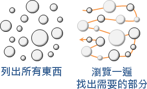
_____________________
## 範例：枚舉一百個平方數
採用直接法：依序枚舉數字 1 到 100 ；枚舉過程當中，將數字平方得到平方數。


```swift
func print_squares(n: Int) {
	for i in 0...n {
		print("Square of interger \(i) is \(i * i).")
	}
}
print_squares(10)
```
採用試誤法：依序枚舉數字 1 到 ∞ ；枚舉過程當中，判斷數字是不是平方數。


```swift
func square_test(n: Int) {
	for i in 0...n {
		let j = Int(sqrt(Double(i)))
		if j * j == i {
			print("\(i) is a square number of an interanger.")
		}
	}
}
square_test(100)
```
_____________________
## 範例：尋找陣列裡的最小值
由小到大枚舉陣列索引值，逐一比較陣列元素。

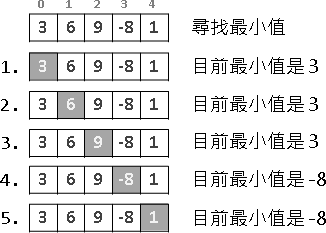

```swift
func findMin(array: [Int]) -> Int {
	var min: Int = Int.max
	for a in array {
		min = a < min ? a : min
	}
	print("The minimum interger in array is \(min)")
	return min
}
let findMinArray = [3, 6, 9, -8, 1]
findMin(findMinArray)
```

	C++範例
    int find_minimum(int array[], int n) {
		int min = 2147483647;
		for (int i=0; i<n; i++) // 枚舉索引值
			if (array[i] < min) // 比較元素
				min = array[i]; // 隨時紀錄最小值
		return min;
	}
_____________________
## 範例：尋找陣列裡的特定數字
找到所有特定數字：瀏覽一遍所有數字。

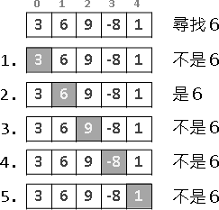
```swift
func findSix(array: [Int]) -> (idx: Int?, num: Int?) {
	var idx: Int?, num: Int? = nil
	for i in 0..<array.count {
		if array[i] == 6 {
			num = 6
			idx = i
			break
		}
	}
	if let index = idx {
		print("Found \(num!) @ index of \(index).")
	} else {
		print("Can't find \(6) in the \(array) array.")
	}
	return (idx, num)
}
findSix(findMinArray)
let xxx = [3, 5, 9, -8, 1]
findSix(xxx)
```
找到其中一個特定數字：一旦找到，立即停止瀏覽，以節省時間。

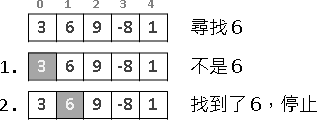

```swift
func findNumber(n: Int, inArray array: [Int]) -> (idx: Int?, num: Int?) {
	var idx: Int?, num: Int? = nil
	for i in 0..<array.count {
		if array[i] == n {
			num = n
			idx = i
			break
		}
	}
	return (idx, num)
}
findNumber(5, inArray: findMinArray)
findNumber(-8, inArray: findMinArray)
```
_____________________
## 範例：尋找二維陣列裡的特定數字


多個元素成為一個橫條、多個橫條成為一個陣列。內層先枚舉元素，外層再枚舉橫條，就能枚舉所有元素。

方才是由內而外、由小到大進行思考，其實也可以由外而內、由大到小進行思考：外層先枚舉每一個橫條，內層再枚舉一個橫條的每一個元素，就能枚舉所有元素。
```swift
var array2D = [[3, 6, 9, -8, 1], [2, 4, 6, 8, 10], [11, 7, 5, 3, 2]]
func find(n: Int, in2DArray array: [[Int]]) -> (idx: (x: Int?,y: Int?), num: Int?) {
	var x: Int?, y: Int? , num: Int? = nil
	for i in 0..<array.count {
		for j in 0..<array[i].count {
			if array[i][j] == n {
				num = n
				x = i
				y = j
				break
			}
		}
		if let px = x {
			print("Found \(num!) at index of (\(px), \(y!)).")
			break
		}
	}
	if x == nil { print("Can't find \(n) in the \(array) array.") }
	return ((x,y), num)
}
find(8, in2DArray: array2D)
```
此處再介紹一種特別的思考方式：第一層枚舉每一個橫條，第二層枚舉每一個直條，就能枚舉所有直條與橫條的交錯之處。

雖然前後兩個思考方式完全不同，但是前後兩支程式碼卻完全相同。

	// C++範例
    bool find(int n) {
		int array[3][5] = {
				{3, 6, 9, -8, 1},
				{2, 4, 6, 8, 0},
				{7, 5, 3, 2, 1}
		};
		// 第一層枚舉每一個橫條
		for (int i=0; i<3; i++)
			// 第二層枚舉每一個直條
			for (int j=0; j<5; j++)
				// 就能枚舉所有橫條與直條交錯之處
				if (array[i][j] == n)
					return true;
		return false;
	}
_____________________
## 範例：平面上距離最近的兩個點（ Closest Pair Problem ）

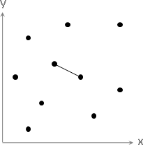

第一層枚舉第一個點，第二層枚舉第二個點。為了避免重複枚舉相同的一對點，第二層只枚舉索引值更高的點。
```swift
let points = [[3, 3], [1, 5], [4, 6], [2, 8], [9, 9], [2, 1], [7, 2], [6, 5], [9, 4], [5, 9]]
func closest(inPoints array: [[Int]]) -> (pair: (p1: [Int], p2: [Int]), distance: Double) {
	var p1: [Int] = [0, 0]
	var p2: [Int] = [0, 0]
	var distance = Double(Int.max)
	for i in 0..<array.count - 1 {
		for j in (i + 1)..<array.count {
			let dx = array[i][0] - array[j][0]
			let dy = array[i][1] - array[j][1]
			let dij = sqrt(Double(dx * dx + dy * dy))
			if dij < distance {
				distance = dij
				p1 = array[i]
				p2 = array[j]
			}
		}
	}
	print("The minimun distance of points pairs in the \(array) is \(distance) between \(p1) and \(p2)")
	return ((p1, p2), distance)
}
let closest_dis = closest(inPoints: points)
closest_dis.pair.p1
closest_dis.pair.p2
closest_dis.distance
```
可以把計算距離的程式碼，抽離出來成為一個函式。好處是程式碼變得清爽許多，增加程式碼可讀性。壞處是大量呼叫函式，導致執行速度變慢。
```swift
func distance(p1: [Int], p2: [Int]) -> Double {
	let dx = p1[0] - p2[0]
	let dy = p1[1] - p2[1]
	return sqrt(Double(dx * dx + dy * dy))
}
func closest_1(inPoints: [[Int]]) -> (pair: (p1: [Int], p2: [Int]), d: Double) {
	var p1: [Int] = [0, 0]
	var p2: [Int] = [0, 0]
	var d = Double(Int.max)
	for i in 0..<inPoints.count - 1 {
		for j in (i + 1)..<inPoints.count {
			let dij = distance(inPoints[i], p2: inPoints[j])
			if dij < d {
				d = dij
				p1 = inPoints[i]
				p2 = inPoints[j]
			}
		}
	}
	return ((p1, p2), d)
}
closest_1(points).pair.p1
closest_1(points).pair.p2
closest_1(points).d
```
魚與熊掌不可兼得，這兩種程式碼各有優缺點，沒有絕對的好壞。程式員必須自行取捨。
_____________________
## 範例：字串匹配（ String Matching ）
從長字串之中，找到短字串的出現位置。

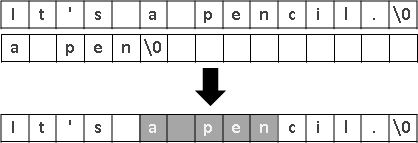

第一層先枚舉所有可以匹配的位置，第二層再枚舉所有需要匹配的字元。
```swift
func findTa(str: String, inStr: String) -> Int? {
	let length = str.characters.count
	var tar: [Character] = Array(str.characters)
	var sou: [Character] = Array(inStr.characters)
	for i in 0..<sou.count - length + 1 {
		var f: Bool = true
		for j in 0..<tar.count {
			if sou[i + j] != tar[j] {
				f = false
				break
			}
		}
		if f {return i}
	}
	return nil
}
findTa("a pen", inStr: "It's a pencil.")
findTa("a pan", inStr: "It's a pencil.")
findTa(".", inStr: "It's a pencil.")
```
因為短字串不會超出長字串末段，所以第一層枚舉範圍可以再略微縮小。

因為只要一個相異字元，就足以表明匹配位置錯誤，所以第二層的枚舉過程可以提早結束。

	//C++範例
    void string_matching() {
		char text[14] = "It's a pencil.";
		char pattern[6] = "a pen";
		// 仔細估量枚舉範圍
		for (int i=0; i<14-6+1; i++) {
			bool match = true;
			for (int j=0; j<5; j++)
				if (text[i+j] != pattern[j]) {
					match = false;
					break;
				}
			
			if (match)
				cout << "短字串出現在第" << i << "個字元";
		}
	}
_____________________
## 範例：統計字母數量


第一層先枚舉 26 種英文字母，第二層再枚舉字串的所有字元，計算一種字母的數量。
```swift
var hello = "Hello, World"   // A -> 65, a -> 97
func countCharacter(str: String) -> [Int] {
	var array = [Int](count: 27, repeatedValue: 0)
	for scalar in str.unicodeScalars {
		var i: Int = (scalar.value < 65 || scalar.value > 122) ? 91 : Int(scalar.value)  // not a~z | A~Z -> 91 -> 26
		i = (i >= 97) ? (i - 97) : (i - 65)
		array[i] += 1
	}
	for i in 0..<array.count {
		print("\(Character(UnicodeScalar(65 + i)))", terminator: ": \(array[i])\t\t")
		if i % 5 == 4 || i == array.count - 1 {
			print("\n")
		}
	}
	return array
}
let charArray = countCharacter(hello)
print("")
countCharacter("The best way to predict the future is to invent it.").description

// 利用dictionary, 不印出時較簡潔易懂
func countCharacter_(str: String) -> [Character:Int] {
	var dic = [Character:Int]()
	for scalar in str.unicodeScalars {
		let idx = scalar.value > 96 ? Int(scalar.value - 32) : Int(scalar.value)
		dic[Character(UnicodeScalar(idx))] = dic[Character(UnicodeScalar(idx))] == nil ? 1 : dic[Character(UnicodeScalar(idx))]! + 1
	}
	var n = 0
	for i in 65..<91 {
		if let char = dic[Character(UnicodeScalar(i))] {
			n += 1
			print(Character(UnicodeScalar(i)), terminator: ": \(char)\t\t")
			if n % 5 == 0 {
				print("\n")
			}
		}
	}
	return dic
}
countCharacter_("The best way to predict the future is to invent it.").description
```
先前曾經介紹過統計字母數量的範例。先前範例當中，雖然耗費記憶體空間，但是執行速度快──簡單來說就是空間大、時間小。此處範例當中，則是空間小，時間大，恰恰相反。這兩種方式各有優缺點，程式員必須自行取捨。
_____________________
## 範例：反轉字串
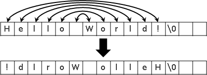

兩個枚舉，一個從頭到尾，一個從尾到頭，步調相同，逐步對調字元。雖然是兩個枚舉，卻只有一個迴圈。
```swift
func reverse(str: String) -> String {
	var array: [Character] = Array(str.characters)
	for i in 0..<array.count / 2 {
		swap(&array[i], &array[array.count - 1 - i])
	}
	return String(array)
}
reverse(hello)
reverse("The best way to predict the future is to invent it.")

// 使用標準函式庫
String(hello.characters.reverse())
```
	
    // C++範例
    void reverse(char* s) {
		int n = strlen(s);
		for (int i=0; i<n/2; i++)
			swap(s[i], s[n-1-i]);
	}
_____________________
UVa [[1595](http://uva.onlinejudge.org/external/15/1595.html)]
_____________________
## 範例：尋找總和為 10 的區間
假設陣列元素只有正數。
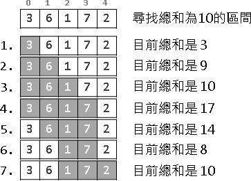

兩個枚舉，枚舉區間左端以及枚舉區間右端，都是從頭到尾，保持一左一右，視情況輪流枚舉。雖然是兩個枚舉，卻只有一個迴圈。
```swift
var nums = [3, 6, 1, 7, 2]
func findInterval(sum: Int, array: [Int]) -> [(s: Int, e: Int)] {
	var ta = [(s: Int, e: Int)]()
	for i in 0..<array.count - 1 {
		var sum_t = array[i]
		if sum_t == sum {
			ta.append((i,i))
		}
		for j in (i + 1)..<array.count {
			sum_t += array[j]
			if sum_t == sum {
				ta.append((i,j))
			} else if sum_t > 10 {
				break
			}
		}
	}
	return ta
}
findInterval(10, array: nums)
// ToDo Swift Code   => Swift 3.0不能使用c style for loop使得array[i++]要分成兩行寫
func find_interval(array: [Int], n: Int, num: Int) {
	var sum = 0
	var i = 0, j = 0
	while j <= n {
		if sum > num {
			sum -= array[i]
			i += 1
		} else {
			sum += array[j]
			j += 1
		}
		if (sum == num) {
			print("[\(i),\(j - 1)]", separator: "", terminator: "\n")
		}
	}
}
find_interval(nums, n: 4, num: 10)
```
讀者可以想想看：陣列元素若有零、有負數，是否要調整枚舉方式？
_____________________
UVa [[972](http://uva.onlinejudge.org/external/9/972.html)], UVa [[10464](http://uva.onlinejudge.org/external/104/10464.html)], UVa [[11536](http://uva.onlinejudge.org/external/115/11536.html)], UVa [[11572](http://uva.onlinejudge.org/external/115/11572.html)]
_____________________
## 範例：尋找陣列之中的最小值，陣列已經由小到大排序
找到其中一個最小值：經常整理房間，尋找東西就快；預先排序資料，搜尋速度就快。


```swift
var arrayX = [3, 3, 6, 6, 9]
let de = arrayX.sort { $0 > $1 }
let inc = arrayX.sort()
de
inc
```
找到所有最小值：讀者請自行嘗試。
_____________________
## 範例：尋找陣列之中的特定數字，陣列已經由小到大排序
找到其中一個特定數字：首先找到陣列中央的數字，依其數字大小，繼續搜尋左半段或者右半段。


```swift
var arrayXX = [2, 3, 5, 7, 11, 13, 17, 19, 23, 29, 31, 37, 41, 43, 47]
func find(num: Int, inArr: [Int]) -> Int? {
	var sorted = inArr.sort()
	var idxL = 0
	var idxR = sorted.count
	repeat {
		let mid = (idxL + idxR) / 2
		if sorted[mid] == num {
			print("Found \(num) at index: \(mid)")
			return mid
		} else {
			if sorted[mid] > num {
				idxR = mid - 1
			} else {
				idxL = mid + 1
			}
		}
	} while idxL <= idxR
	return nil
}
find(13, inArr: arrayXX)
```
找到所有特定數字：讀者請自行嘗試。
_____________________
## 範例：平面上距離最近的兩個點（ Closest Pair Problem ）

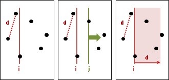

找到距離最近的其中一對點：預先依照 X 座標排序所有點，搜尋得以略過大量情況。
```swift
func closest_2(inPoints: [[Int]]) -> (pair: (p1: [Int], p2: [Int]), d: Double) {
	var sorted = inPoints.sort{ $0[0] < $1[0] }
	var p1: [Int] = [0, 0]
	var p2: [Int] = [0, 0]
	var d = Double(Int.max)
	for i in 0..<sorted.count - 1 {
		for j in (i + 1)..<sorted.count {
			if Double(sorted[j][0] - sorted[i][0]) > d { break }  //加速
			let dij = distance(sorted[i], p2: sorted[j])
			if dij < d {
				d = dij
				p1 = sorted[i]
				p2 = sorted[j]
			}
		}
	}
	return ((p1, p2), d)
}
closest_2(points).pair.p1
closest_2(points).pair.p2
closest_2(points).d
```
找到距離最近的每一對點：讀者請自行嘗試。

## 範例：英文單字從單數變複數
_____________________

枚舉各種情況，寫成大量判斷式。

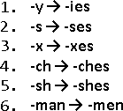
```swift   
// *** 'hasPrefix' and 'hasSuffix' methods
func plural(s: String) -> String {
	var array = Array(s.characters)
	if s.hasSuffix("y") {
		array.removeLast()
		return String(array) + "ies"
	} else if s.hasSuffix("s") || s.hasSuffix("x") || s.hasSuffix("ch") || s.hasSuffix("sh") {
		return s + "es"
	} else if s.hasSuffix("man") {
		array.removeLast()
		array.removeLast()
		return String(array) + "en"
	} else {
		return s + "s"
	}
}
plural("Prefix")
```
_____________________
## 範例：小畫家倒墨水（ Flood Fill Algorithm ）
電腦圖片可以想成是一張方格紙，每個方格都填著一種顏色。現在要實現小畫家倒墨水的功能：以某一格為起點，只要相鄰方格顏色一樣，就染成同一個顏色。

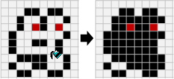

運用大量指令，枚舉上下左右四個方向；運用遞迴，枚舉相鄰同色方格。

必須避免已經枚舉過的方格又重複枚舉，否則程式在有生之年都不會結束。
```swift
import UIKit
var subViews: [UIView] = [UIView]()
var view = UIView(frame: CGRect(x: 0, y: 0, width: 50, height: 50))
let c1 = UIColor.blueColor()
let c2 = UIColor.yellowColor()
for i in 0..<10 {
	for j in 0..<10 {
		let subView = UIView(frame: CGRect(x: i * 5, y: j * 5, width: 5, height: 5))
			subView.backgroundColor = rand() % 2 == 0 ? c1 : c2
		subViews.append(view)
		view.addSubview(subView)
	}
}
view
func flood(p: CGPoint, new_color: UIColor, old_color: UIColor) {
	let idx = Int(p.x * 10 + p.y)
	if (p.x >= 0 && p.x < 10 && p.y >= 0 && p.y < 10) {   // 不能超出邊界
		let subView = view.subviews[idx]
		if (subView.backgroundColor == old_color)   {// 同色方格才枚舉{
			// 染色
			subView.backgroundColor = new_color
			// 枚舉上下左右四個方向
			let nextL = CGPoint(x: p.x - 1, y: p.y)
			let nextR = CGPoint(x: p.x + 1, y: p.y)
			let nextU = CGPoint(x: p.x, y: p.y - 1)
			let nextD = CGPoint(x: p.x, y: p.y + 1)
			flood(nextL, new_color: new_color, old_color: old_color)
			flood(nextR, new_color: new_color, old_color: old_color)
			flood(nextU, new_color: new_color, old_color: old_color)
			flood(nextD, new_color: new_color, old_color: old_color)
		}
	}
}
flood(CGPoint(x: 3, y: 3), new_color: c1, old_color: c2)
view
```
大量指令，亦得寫成一個迴圈。
```swift
func flood1(p: CGPoint, new_color: UIColor, old_color: UIColor) {
	let idx = Int(p.x * 10 + p.y)
	if (p.x >= 0 && p.x < 10 && p.y >= 0 && p.y < 10) {   // 不能超出邊界
		let subView = view.subviews[idx]
		if (subView.backgroundColor == old_color)   {// 同色方格才枚舉{
			// 染色
			subView.backgroundColor = new_color
			// 枚舉上下左右四個方向
			let a = [CGPoint(x: -1.0, y: 0.0), CGPoint(x: +1.0, y: 0.0), CGPoint(x: 0.0, y: -1.0), CGPoint(x: 0.0, y: +1.0)]
			for i in 0..<4 {
				let newP = CGPoint(x: p.x + a[i].x, y: p.y + a[i].y)
				flood(newP, new_color: new_color, old_color: old_color)
			}
		}
	}
}
flood1(CGPoint(x: 3, y: 9), new_color: c1, old_color: c2)
view
```
多層判斷式，亦得拆解成一層一層的判斷式。
```swift
func flood2(p: CGPoint, new_color: UIColor, old_color: UIColor) {
	let idx = Int(p.x * 10 + p.y)
	if !(p.x >= 0 && p.x < 10 && p.y >= 0 && p.y < 10) { return }  // 不能超出邊界
	let subView = view.subviews[idx]
	if (subView.backgroundColor != old_color) { return }
	subView.backgroundColor = new_color
	let a = [CGPoint(x: -1.0, y: 0.0), CGPoint(x: +1.0, y: 0.0), CGPoint(x: 0.0, y: -1.0), CGPoint(x: 0.0, y: +1.0)]
	for i in 0..<4 {
		let newP = CGPoint(x: p.x + a[i].x, y: p.y + a[i].y)
		flood(newP, new_color: new_color, old_color: old_color)
	}
}
flood2(CGPoint(x: 8, y: 3), new_color: c1, old_color: c2)
view
```


_____________________
UVa [[260](http://uva.onlinejudge.org/external/2/260.html)], UVa [[280](http://uva.onlinejudge.org/external/2/280.html)], UVa [[352](http://uva.onlinejudge.org/external/3/352.html)], UVa [[469](http://uva.onlinejudge.org/external/4/469.html)], UVa [[572](http://uva.onlinejudge.org/external/5/572.html)], UVa [[601](http://uva.onlinejudge.org/external/6/601.html)]

UVa [[657](http://uva.onlinejudge.org/external/6/657.html)], UVa [[776](http://uva.onlinejudge.org/external/7/776.html)], UVa [[782](http://uva.onlinejudge.org/external/7/782.html)], UVa [[784](http://uva.onlinejudge.org/external/7/784.html)], UVa [[785](http://uva.onlinejudge.org/external/7/785.html)], UVa [[871](http://uva.onlinejudge.org/external/8/871.html)]

UVa [[10267](http://uva.onlinejudge.org/external/102/10267.html)], UVa [[10336](http://uva.onlinejudge.org/external/103/10336.html)], UVa [[10946](http://uva.onlinejudge.org/external/109/10946.html)]

ICPC [[4792](https://icpcarchive.ecs.baylor.edu/external/47/4792.pdf)], ICPC [[5130](https://icpcarchive.ecs.baylor.edu/external/51/5130.pdf)]
_____________________
## Straightforward Method / Trial and Error
「直接法」，直接算出答案。例如按照流程進行得到答案、套用公式計算答案、直接印出答案。
_____________________
UVa [[488](http://uva.onlinejudge.org/external/4/488.html)], UVa [[10055](http://uva.onlinejudge.org/external/100/10055.html)], UVa [[10370](http://uva.onlinejudge.org/external/103/10370.html)], UVa [[10878](http://uva.onlinejudge.org/external/108/10878.html)], UVa [[10929](http://uva.onlinejudge.org/external/109/10929.html)]
_____________________
「嘗試錯誤法」、「試誤法」，針對答案進行 Enumerate 與 Search 。有些困難的問題，難以直接推導答案，既然推導不出來，就慢慢測試答案、慢慢驗算吧──確立答案的範圍，窮舉所有可能的答案，再從中搜尋正確答案。
_____________________
UVa [[10167](http://uva.onlinejudge.org/external/101/10167.html)], UVa [[10125](http://uva.onlinejudge.org/external/101/10125.html)], UVa [[296](http://uva.onlinejudge.org/external/2/296.html)], UVa [[846](http://uva.onlinejudge.org/external/8/846.html)], UVa [[714](http://uva.onlinejudge.org/external/7/714.html)]
_____________________
直接法和試誤法剛好相反。直接法是由題目本身下手，推導答案；試誤法則是從答案下手，讓答案迎合題目需求。

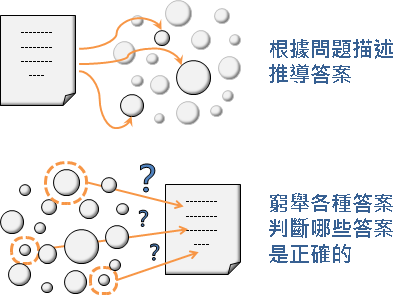
_____________________
## 範例：暴力攻擊（ Brute Force Attack ）
破解密碼最簡單的方法叫做「暴力攻擊」。不知道密碼規律的情況下，無法直接推導正確密碼，只好以試誤法一一檢驗所有可能的密碼，從中找出正確密碼。

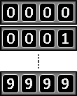
_____________________
## 範例：單向函數（ One-way Function ）
「單向函數」是一種特別的函數，給定輸入很容易算出輸出，但是給定輸出卻很難算出輸入。

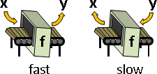

舉例來說，令一個函數的輸入是兩個質數，輸出是兩個質數的乘積。給定兩個質數可以輕易的在多項式時間內算出乘積，然而給定兩質數的乘積卻需要指數時間才能完成質因數分解。

如果給定一個單向函數的輸入，求其輸出，就適合用直接法，套用函數快速算得答案；如果給定一個單向函數的輸出，求其輸入，就適合用試誤法，嘗試各種輸入並套用函數快速驗證答案。
_____________________
[Previous](Memorization.md) | 回到[目錄](SUMMARY.md) |本文來源: [演算法筆記](http://www.csie.ntnu.edu.tw/~u91029/AlgorithmDesign.html#3) | [Next](Iterative Method.md)
