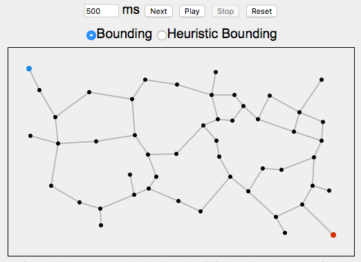

[Previous](8 Queen Problem.md) | 回到[目錄](Modeling.md) |本文來源: [演算法筆記](http://www.csie.ntnu.edu.tw/~u91029/Backtracking.html#5) | [Next](0_1 Knapsack Problem.md)
_____________________
# Euclidean Shortest Path
## © 2010 [tkcn](http://tkcnandy.blogspot.com/ ""). All rights reserved.

※ 當下生成的路徑片段，是深紅色粗線   ※ 直至當前所找到的最短路徑，是深金色粗線

## 二維座標平面，兩點之間的最短路徑
_____________________
在一張地圖上有很多個地點，鄰近的地點有筆直道路相通，我們也知道每一段道路的長度。現在要沿著道路，從一個地點走到另一個地點，請問要怎麼走距離會最短呢？

一條最短的路徑，肯定不會繞圈子的。我們可以使用 Backtracking 窮舉所有排列，製造出所有可能的路徑。每當生成一條路徑時，就判斷這條路徑是不是歷來最短的路徑，隨時記得歷來最短的路徑是那一條。

	struct Point {double x, y;} p[10];  // 所有地點的座標，
	// 編號為 0 到 9。
	bool connect[10][10];   // 兩個地點之間是否有筆直道路相通
	// 若相通為 true，不相通為 false。
	int s = 0, t = 9;       // 起點與終點的編號
	int solution[10];       // 一條可能的路徑
	bool used[10];          // 紀錄數字是否使用過，用過為 true。
	int best_solution[10];  // 隨時記得歷來最短的路徑是那一條
	int best_dist;          // 隨時記得歷來最短的路徑的長度
	// 計算兩點之間的直線距離
	double length(Point& a, Point& b) {
		double dx = b.x - a.x, dy = b.y - a.y;
		return sqrt(dx * dx + dy * dy);
	}
	void backtrack(int n, int a, int dist) {
		// pruning，生成不合理的解答就馬上回溯。
		if (n > 2 && !connect[solution[n-2]][solution[n-1]])
		return;
		// it's a solution
		if (a == t) {
			// 紀錄目前製造出的最短的路徑
			if (dist < best_dist) {
				best_dist = dist;
				for (int i=0; i<n; ++i)
				best_solution[i] = solution[i];
			}
			return;
		}
		// 窮舉所有排列
		for (int b=0; b<10; ++b)
		if (!used[b]) {
			used[b] = true;
			solution[n] = b;
			backtrack(n+1, b, dist + length(p[a], p[b]);
			used[b] = false;
		}
	}
	void Euclidean_shortest_path() {
			best_dist = 1e9;    // 設定為很大的數值，代表無限遠的意義。
			used[s] = true;     // 設定好起步起點
			solution[0] = s;
			backtrack(0+1, 0, 0);
	}

pruning 的程式碼，除了可以放在遞迴函式一開始的地方，也可以挪到遞迴函式呼叫的前一刻。大家可以視情況，選用直觀易懂的寫法。

	void backtrack(int n, int a, int dist) {
		// it's a solution
		if (a == t) {
			// 紀錄目前製造出的最短的路徑
			if (dist < best_dist) {
				best_dist = dist;
				for (int i=0; i<n; ++i)
				best_solution[i] = solution[i];
			}
			return;
		}
		// 窮舉所有排列
		for (int b=0; b<10; ++b)
		if (connect[a][b])  // pruning，有路才能通行。
		if (!used[b]) {
			used[b] = true;
			solution[n] = b;
			backtrack(n+1, b, dist + length(p[a], p[b]);
			used[b] = false;
		}
	}

很多人誤認 Backtracking 就是圖論中的 DFS ，然而兩者沒有關係。兩者相似的地方是： Backtracking 遇到不合理的解答會馬上回溯， DFS 遇到拜訪過的節點會馬上回溯。

## Bounding
_____________________
遞迴過程中，如果當下產生的片段路徑，已經超過歷來最短的路徑長度，則可以馬上回溯。堅持遞迴下去，片段路徑只會越變越長，將來仍然是超過歷來最短的路徑長度，根本不可能構成正確解答──不如當下就回溯，及早發現及早治療。

	void backtrack(int n, int a, int dist){
		// bound
		// 片段路徑已經太長，窮舉下去沒有意義了，可以馬上回溯。
		if (dist >= best_dist) return;
		......
	}

## Heuristic Bounding
_____________________
遞迴過程中，如果當下產生的片段路徑，我們預測它延伸到終點之後，鐵定超過歷來最短的路徑長度，則可以馬上回溯。先知先覺，防範未然，少走許多冤枉路。

	void backtrack(int n, int a, int dist) {
		// heuristic bound
		// 還沒到之前，如果發現已經太遠了，就不繼續走，改換條路。
		if (dist + length(p[a], p[t]) >= best_dist) return;
		......
	}

這個問題可以套用最短路徑演算法，甚至可以使用 A* 、 IDA* 解決。不過這已經超出 backtracking 的範圍了。

_____________________
[Previous](8 Queen Problem.md) | 回到[目錄](Modeling.md) |本文來源: [演算法筆記](http://www.csie.ntnu.edu.tw/~u91029/Backtracking.html#5) | [Next](0_1 Knapsack Problem.md)
