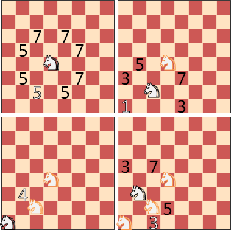
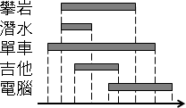
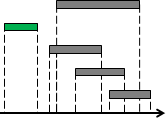
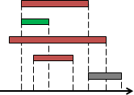
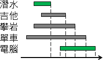
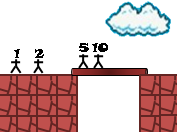
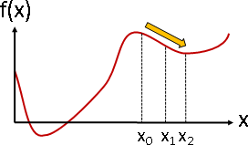
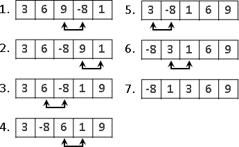
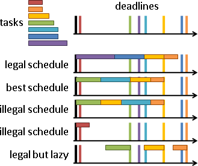
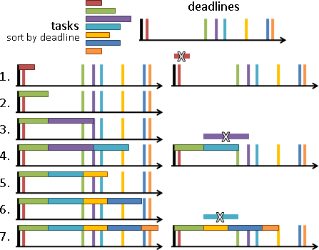

[Previous](Dynamic Programming.md) | 回到[目錄](SUMMARY.md) |本文來源: [演算法筆記](http://www.csie.ntnu.edu.tw/~u91029/AlgorithmDesign.html#8) | [Next](Scaling Method.md)
_____________________
# Greedy Method
### 今朝有酒今朝醉，明日愁來明日愁。《羅隱．自遣》
### 博觀而約取，厚積而薄發。《蘇軾．稼說送張琥》
_____________________
## Greedy Method

中文譯作「貪心法」，以 Incremental Method 或 Iterative Method 製造答案的方法，大致上分為兩類：

	__________________________________________
	一、填答案：從沒有答案開始，逐步填滿答案。
	二、改答案：先隨便弄個答案，逐步修飾答案。
	__________________________________________

	__________________________________________
	一、觀察問題特徵，擬定一個填答案、改答案的原則。
	二、隨便挑幾個特例，手算一下。
	　　如果答案都對，就大膽假設此原則是正確的。
	　　（也可以嘗試證明此原則必定正確。）
	三、實作程式碼，把答案算出來。
	__________________________________________

[120]:http://uva.onlinejudge.org/external/1/120.html ""
[311]:http://uva.onlinejudge.org/external/3/311.html ""
[410]:http://uva.onlinejudge.org/external/4/410.html ""
[514]:http://uva.onlinejudge.org/external/5/514.html ""
[538]:http://uva.onlinejudge.org/external/5/538.html ""
[668]:http://uva.onlinejudge.org/external/6/668.html ""
[757]:http://uva.onlinejudge.org/external/7/757.html ""
[10148]:http://uva.onlinejudge.org/external/101/10148.html ""
[10201]:http://uva.onlinejudge.org/external/102/10201.html ""
[10249]:http://uva.onlinejudge.org/external/102/10249.html ""
[10366]:http://uva.onlinejudge.org/external/103/10366.html ""
[10382]:http://uva.onlinejudge.org/external/103/10382.html ""
[10440]:http://uva.onlinejudge.org/external/104/10440.html ""
[10602]:http://uva.onlinejudge.org/external/106/10602.html ""
[10716]:http://uva.onlinejudge.org/external/107/10716.html ""
[10718]:http://uva.onlinejudge.org/external/107/10718.html ""
[10982]:http://uva.onlinejudge.org/external/109/10982.html ""
[3752]:https://icpcarchive.ecs.baylor.edu/external/37/3752.pdf ""
[4788]:https://icpcarchive.ecs.baylor.edu/external/47/4788.pdf ""

__________________________________________
UVa [120], UVa [311], UVa [410], UVa [514], UVa [538]
UVa [668], UVa [757], UVa [10148], UVa [10201], UVa [10249]
UVa [10366], UVa [10382], UVa [10440], UVa [10602], UVa [10716]
UVa [10718], UVa [10982], ICPC [3752], ICPC [4788]
__________________________________________
## 範例：找零錢
__________________________________________
你去商店買東西，你掏出了一張一百元，買了一包 23 元的零食。店員須找零錢給你，但是你希望店員找給你的硬幣數目越少越好，如此口袋會輕一點。那麼店員會給你幾個硬幣呢？

填答案的原則是：先找給你面額較高的硬幣。

金額越少，找給你的硬幣數目也就越少。先找給你面額較高的硬幣，金額下降的最多──如此一來，往後找給你的硬幣數目就一定是最少了。

注意到：當錢幣面額很特別時，這個方法才正確。詳情請參考「 Change-Making Problem 」。

## 範例：文章換行（ Word Wrap ）
__________________________________________
一大段的英文段落，適當的將文章換行，讓文字不超過紙張邊界，盡量節省紙張空間。

填答案的原則是：字儘量往前擠，擠不下就換行。

## 範例：騎士周遊問題（ Knight's Tour ）
__________________________________________
西洋棋盤上，請找到一條路線，讓騎士恰好經過棋盤上每一格各一次。

填答案的原則是：走向出路選擇較少的格子。如果遇到出路選擇一樣多的格子，就走向位於下方的格子。如果又遇到一樣低的格子，就走向位於左方的格子。

這種填答案的方式，耗盡死路，保留活路，將來走入死胡同的機會就變少了。有一種「置之死地而後生」的味道。

注意到：這個方法不一定會成功。我們根本無法證明這個方法會成功，只是乍看起來比較容易成功。

我們當下所做的最佳決定，以長遠的眼光來看，不一定是最佳決定。儘管貪心法不見得得到正確的、最好的答案，卻是個快速得到答案的好方法。
*/
import UIKit
func buildView() -> UIView {
	let view = UIView(frame: CGRect(origin: CGPoint(x: 0, y: 0), size: CGSize(width: 600, height: 600)))
	view.backgroundColor = UIColor.blackColor()
	for i in 0..<8 {
		for j in 0..<8 {
			let v = UIView(frame: CGRect(origin: CGPoint(x: 75 * i, y: 75 * j), size: CGSize(width: 75, height: 75)))
			v.backgroundColor = (i + j) % 2 == 0 ? UIColor.lightGrayColor() : UIColor.whiteColor()
			view.addSubview(v)
		}
	}
	return view
}

enum Next:Int {
	case RUU = 1, RRU, RRD, RDD, LDD, LLD, LLU, LUU
	func next() -> (Int, Int) {
		var x: Int {
			switch self {
			case RRU, RRD:
				return 2
			case RUU, RDD:
				return 1
			case LUU, LDD:
				return -1
			case LLU, LLD:
				return -2
			}
		}
		var y: Int {
			switch self {
			case RUU, LUU:
				return 2
			case RRU, LLU:
				return 1
			case RRD, LLD:
				return -1
			case RDD, LDD:
				return -2
			}
		}
		return (x, y)
	}
}

func + (lhs: (Int, Int), rhs: (Int, Int)) -> (Int, Int) {
	return (lhs.0 + rhs.0, lhs.1 + rhs.1)
}

func aroundChessBoard() {
	var horse = UIImageView(frame: CGRect(origin: CGPoint(x: 0, y: 0), size: CGSize(width: 75, height: 75)))
	horse.image = UIImage(named: "hourse.jpeg")
	var beenThere = [[Bool]](count: 8, repeatedValue: [Bool](count: 8, repeatedValue: false))
	var view = buildView()
	var start: (Int,Int) = (3, 4)
	var trace: [(Int, Int)] = []
	func nexts(now: (Int, Int)) -> [(Int, Int)] {
		let ns: [Next] = [.RUU, .RRU, .RRD, .RDD, .LDD, .LLD, .LLU, .LUU]
		let nextsteps = ns.flatMap{ now + $0.next() }
		return nextsteps.filter { (a: (x: Int, y: Int)) -> Bool in
			guard (a.x >= 0) && (a.x < 8) && (a.y >= 0) && (a.y < 8) else { return false }
			return !beenThere[a.x][a.y]
		}
	}
	func nOfavailables(next: (Int, Int)) -> Int {
		return nexts(next).count
	}
	func bestNext(now: (Int, Int)) -> (Int, Int)? {
		let nextCandidates = nexts(now)
		let availables = nextCandidates.flatMap{ nOfavailables($0) }
		let minIdx = nextCandidates.flatMap{ nOfavailables($0) }.indexOf{ $0 == availables.minElement()}
		if let idx = minIdx {
			return nextCandidates[idx]
		}
		return nil
	}
	func go(now: (Int, Int)) {
		var done: Bool {
			for row in beenThere {
				for b in row {
					if !b { return b }
				}
			}
			return true
		}
		guard !done else { return }
		beenThere[now.0][now.1] = true
		view.subviews[now.0 * 8 + now.1].addSubview(horse)
		view
		trace.append(now)
		if let nextStep = bestNext(now) {
			go(nextStep)
		} else { return }
	}
	go(start)
}

//aroundChessBoard()

/*:
## 範例：活動選擇問題（ Activity Selection Problem ）
__________________________________________
暑假到了，有好多好多有趣的營隊可以參加囉！攀岩、潛水、單車環島團、吉他營、電腦營、 …… ，每個營隊都好有趣，好想每個營隊都參加──可是卻有好多營隊的活動期間都互相卡到，沒辦法同時參加。到底要參加哪些營隊活動才好呢？當然是越多種越好！

填答案的原則很簡單：優先選擇最早結束的活動，就能剩下最多時間來安排其他活動。

仔細分成兩種情況進行討論：一、最早結束的活動，與其他活動的時間不重疊；二、最早結束的活動，與某些活動的時間重疊。

一的狀況下，參加最早結束的活動，顯然是最理想的──憑空多參加了一個活動，又不耽誤到其他活動。

此觀念可以用 Recursive Method 詮釋：去除最早結束的活動、遞迴縮小問題。

二的狀況下，最早結束的活動、以及時間與之重疊的活動當中，只能選擇其中一個參加。此時參加最早結束的活動，得以剩下比較多的時間，仍是最理想的。

此觀念可以用 Recursive Method 詮釋：去除最早結束的活動、去除因而無法參加的活動，遞迴縮小問題。

填答案的原則是：所有活動按照結束時間排序，依序參加活動。如果時間允許就參加，如果時間衝突就不參加。

[10020]:http://uva.onlinejudge.org/external/100/10020.html ""
[4328]:https://icpcarchive.ecs.baylor.edu/external/43/4328.pdf ""
[5105]:https://icpcarchive.ecs.baylor.edu/external/51/5105.pdf ""

__________________________________________
UVa [10020], ICPC [4328], ICPC [5105]
__________________________________________
## 範例：過橋問題（ Bridge and Torch Problem ）
__________________________________________
月黑風高的夜晚，有一座不長不短的獨木橋，只能同時容兩人併行。

此時正好有四個寂寞難耐、悲苦淒涼，事實上是窮極無聊的四個人路經此地。他們手邊僅帶著一支手電筒，想要通過這危險的獨木橋。那橋下可是暗潮洶湧，一失足成千古恨，奔流到海不復回。

幸好四人閒閒沒事就常走這座橋，對路況簡直熟悉到不行，閉著眼睛走都可以，於是乎四人知道自己過橋分別需時 1 分鐘、 2 分鐘、 5 分鐘、 10 分鐘。但是不管他們的腳程不可思議的快、莫名其妙的慢，四人都是貪生怕死之徒，手上沒有握著手電筒的話，誰都不敢過橋；四人也都是視財如命之徒，就是誰也不想浪費錢，去附近的便利商店買支手電筒，寧可摔到水裡隨波逐流環遊世界去。

最後他們只好協議說，一次兩人同時持手電筒過橋，再請其中一人送回手電筒，沒事做的人就在橋邊哭爹喊娘等手電筒回來，如此一來四人最終都能夠順利過橋。

兩人同時過橋時必須配合走得慢的人的速度，請問全員過橋最快要多久時間？

有一些規矩你是知道的，例如不能把手電筒用丟的丟過河，不能四個人疊羅漢一起過橋，不能把橋拆了做木筏之類的。

題目終於說完了，現在來談填答案的原則：

腳程快的人送手電筒回來那是最好的；相對地，腳程慢的人就應該讓他留在彼岸不要回來。不管先走後走，人人都還是要過橋，所以先試試看把腳程最慢的人送到對岸吧！

當人數眾多，至少四人時，令 A 與 B 是最快與次快， C 與 D 是次慢與最慢。讓最慢的兩個人過橋主要有兩種方式，第一種是 AB 去 A 回、 CD 去 B 回，第二種是 AD 去 A 回、 AC 去 A 回，至於其它方式所花的時間恰好跟這兩種方式一樣。採用比較快的那一種方式，讓最慢的兩個人過橋之後，問題範疇就縮小了。

	// 各個人的腳程由慢到快排序
	int a[8] = {1, 2, 5, 10, 15, 16, 30, 31};

	void bridge_and_torch() {
		int n, t = 0;
		for (n=8-1; n>=3; n-=2) {
			int t1 = a[0] + a[1]*2 + a[n];
			int t2 = a[0]*2 + a[n-1] + a[n];
			t += min(t1, t2);
		}
		if (n == 2) t += a[0] + a[1] + a[2];
		else if (n == 1) t += a[1];
		else t += a[0];
		cout << "所有人過橋的總時間為" << t;
	}
*/
// ToDo Swift Code

/*:
[10037]:http://uva.onlinejudge.org/external/100/10037.html ""

_____________
UVa 10037
_____________
## 範例：函數的區域最小值
_____________

改答案的原則是：一開始 x 隨意設定一個數值，例如設定 x = 0 。微調 x 值，並且計算 f(x) ──如果 f(x) 減少，就更新 x ；如果 f(x) 沒減少，就不更新 x 。不斷修改 x 值，最後就到達區域最小值。
*/
import Foundation
struct HillClimbing {
	var f: (Double) -> Double
	var sol: Double
	var step: Double
	
	var report: String {
		var solution = sol
		var neighbor: [Double] {
			var array = [Double]()
			for i in 0..<2 {
				let advance = i % 2 == 0 ? step : -step
				array.append(solution.advancedBy(advance))
			}
			return array
		}
		var height: Double {
			return f(solution)
		}
		while true {
			var solArray = [Double]()
			if f(neighbor[0]) >= height && f(neighbor[1]) >= height {
				solArray = [solution, solution]
				while true {
					if f(neighbor[0]) >= height {
						solution = neighbor[0]
					} else {
						solArray[0] = solution
						solution = solArray[1]
						break
					}
				}
				while true {
					if f(neighbor[1]) >= height {
						solution = neighbor[1]
					} else {
						solArray[1] = solution
						break
					}
				}
				print("Solution: \(solArray[0].format("+.2"))\t -> f(x) = \(f(solArray[0]).format("+.4"))\n" +
					"Solution: \(solArray[1].format("+.2"))\t -> f(x) = \(f(solArray[1]).format("+.4"))")
				return "Solution: \(solArray[0].format("+.2"))\t -> f(x) = \(f(solArray[0]).format("+.4"))\n" +
					"Solution: \(solArray[1].format("+.2"))\t -> f(x) = \(f(solArray[1]).format("+.4"))"
			} else if f(neighbor[0]) >= height {
				solution = neighbor[0]
			} else if f(neighbor[1]) >= height {
				solution = neighbor[1]
			} else {
				print("Solution: \(solution.format("+.2"))\t -> f(x) = \(f(solution).format("+.4"))")
				return "Solution: \(solution.format("+.2"))\t -> f(x) = \(f(solution).format("+.4"))"
			}
		}
	}
}

var f4 = {
	(x: Double) -> Double in
	-abs(x * x - 4)
}

var x = 0.0, dx = 0.01
// remove comment to test
//var sol = HillClimbing(f: f4, sol: x, step: dx)
//sol.report

/*:
## 範例：交換相鄰數字的排序法
_____________

改答案的原則是：每當發現相鄰兩個數字，左邊數字大於右邊數字，兩個數字就交換位置。

不斷交換位置，導致大數字逐漸往右端移動、小數字逐漸往左端移動，最後一定能完成排序。

讀者可以想想看：交換任意兩個數字的排序法，成立嗎？

順帶一提，排序過程反向操作，可以得到一個結論：排序過的陣列，經由兩兩相鄰交換，一定可以得到各種排列方式。

## 範例：荷蘭國旗問題（ Dutch National Flag Problem ）
_____________

[Dutch National Flag Problem 1]:http://www.iis.sinica.edu.tw/~scm/ncs/2010/10/dutch-national-flag-problem/ ""
[Dutch National Flag Problem 2]:http://www.iis.sinica.edu.tw/~scm/ncs/2010/10/dutch-national-flag-problem-2/ ""
[Dutch National Flag Problem 3]:http://www.iis.sinica.edu.tw/~scm/ncs/2010/10/dutch-national-flag-problem-3/ ""

* [Dutch National Flag Problem 1] 
* [Dutch National Flag Problem 2] 
* [Dutch National Flag Problem 3]

## 範例：工作排程問題（ Single Machine Scheduling, Minimize the Number of Tardy Jobs ）（ 1||∑Ui ）
_____________
有一位苦命上班族，要馬上處理臨時指派的 N 份工作。經驗老到的他，馬上就精準的估計出每份工作各要花掉多少時間，可是每份工作都有不同的完工期限，這造成有些工作可能會來不及完成。他做事專心，要求品質，一次只處理一份工作，一份一份接著做；來不及完成的工作，乾脆放棄不做。

請找出一種排程，讓如期完成的工作最多（也就是讓逾期完成的工作最少），順便讓總工時越短越好。

合理排程之相鄰交換性質：

一個合理排程，其中某兩個如期完成的工作 A 與 B ， A 與 B 緊鄰完成， A 早做 B 晚做， A 期限晚 B 期限早（或期限相同），則 A 與 B 對調位置之後，仍是一個合理排程。分析如下：

	________________________________________________________
	A與B視作一體進行交換：排程裡的其他工作皆不受影響。
	A放到B的位置：A的期限比B還晚，B都能如期完成了，所以A也能如期完成。
	B放到A的位置：B提早做，更能如期完成。
	________________________________________________________

一個合理排程，不斷地進行相鄰交換，終會形成「工作依照期限排序」的合理排程！反之亦然！小心，不相鄰則不可貿然交換。

因此，我們只需著眼於「工作依照期限排序」的合理排程。

[10026]:http://uva.onlinejudge.org/external/100/10026.html ""
[11389]:http://uva.onlinejudge.org/external/113/11389.html ""

_____________
UVa [10026], UVa [11389]
_____________
填答案的原則是：所有工作依照期限排序，依序加入排程。一次加入一個工作，一旦發現逾期，立即從排程當中抽掉工時最長的工作。

	_______________________________________
	已經加入N個工作，排程裡有M個工作。
	排程裡的工作，是前N個工作的最佳解。也就是說：
	α. 這M個工作，全部如期完成。
	β. 前N個工作之中，如期完成的工作數量最多就是M。
	γ. 前N個工作之中，這M個工作總工時最短。
	_______________________________________

以數學歸納法證明之。假設 N 成立，當第 N+1 個工作加入排程，有兩種情況。

一、沒有發生逾期：

這 M 個工作，本來就是如期完成、工作數量最多、總工時最短的最佳選擇。第 N+1 個工作加入之後， αβγ 依然成立。

二、發生逾期，立即抽出工時最長的工作：

這 M 個工作，已經能如期完成。抽出工時最長的工作，補上工時稍短（或相等）的第 N+1 個工作，更能如期完成了。 α 成立。

這 M 個工作，總工時已經是最短了，還是無法添加第 N+1 個工作，不得已抽掉一個工作，工作數量已經盡量多了。 β 成立。

抽出工時最長的工作，總工時下降最多。 γ 成立。

	struct Job {int time, due;} job[10];
	priority_queue<int> pq;

	bool cmp(const Job& j1, const Job& j2) {
		return j1.due < j2.due;
	}

	void Moore_Hodgson() {
		sort(job, job+10, cmp);
		int t = 0;
		for (int i=0; i<10; ++i) {
			pq.push(job[i].time);
			t += job[i].time;
			if (t > job[i].due) t -= pq.top(), pq.pop();
		}
		cout << "如期完成的工作數量，最多為" << pq.size();
		cout << "逾期完成的工作數量，至少為" << 10 - pq.size();
	}
*/
// ToDo Swift Code
struct Job {
	var time: Int
	var due: Int
	init(_ t: Int, _ d:Int) {
		self.time = t
		self.due = d
	}
}

func performance(jobs: [Job]) -> (times: [Int], dues: [Int], starts: [Int], delays: [Bool], onSKD: Int, lastFinishTime: Int)  {
	var times = jobs.flatMap{ $0.time }
	var dues = jobs.flatMap{ $0.due }
	var starts: [Int] {
		var a = [Int]()
		for i in 0..<jobs.count {
			a.append(Array(times[0..<i]).reduce(0){ $0 + $1 })
		}
		return a
	}
	var delays: [Bool] {
		var a = [Bool]()
		for i in 0..<jobs.count {
			a.append(starts[i] + times[i] > dues[i])
		}
		return a
	}
	let onSKD = delays.filter{ !$0 }.count
	let lastFinishTime = starts[onSKD - 1] + times[onSKD - 1]
	return (times, dues, starts, delays, onSKD, lastFinishTime)
}

func buildView(jobs: [Job]) -> UIView {
	let view = UIView(frame: CGRect(origin: CGPoint(x: 0, y: 0), size: CGSize(width: 360, height: 100)))
	view.backgroundColor = UIColor.init(red: 0.8, green: 0.1, blue: 0.1, alpha: 0.3)
	var times = performance(jobs).times
	var dues = performance(jobs).dues
	var starts = performance(jobs).starts
	let colors: [UIColor] = [.blueColor(), .yellowColor(), .cyanColor(), .greenColor(), .redColor()]
	for i in 0..<jobs.count {
		let acceptv = UIView(frame: CGRect(origin: CGPoint(x: 0, y: i * 10), size: CGSize(width: dues[i] * 10, height: 10)))
		acceptv.backgroundColor = UIColor.whiteColor()
		view.addSubview(acceptv)
		let sub = UIView(frame: CGRect(origin: CGPoint(x: starts[i] * 10, y: i * 10), size: CGSize(width: times[i] * 10, height: 10)))
		sub.backgroundColor = colors[i % 5]
		view.addSubview(sub)
	}
	return view
}

func optimizeSKD(inout jobs: [Job]) {
	guard performance(jobs).onSKD != jobs.count else { return }
	// main goal => sort the jobs to minimize numbers of delays
	let byDue: (Job, Job) -> Bool = { $0.due < $1.due }
	let byTime_Due: (Job, Job) -> Bool = { (x1: Job,x2: Job) -> Bool in
		if x1.time < x2.time {
			return true
		}
		return x1.due < x2.due
	}
	jobs = jobs.sort(byDue)
	if performance(jobs).onSKD != jobs.count {
		jobs = jobs.sort(byTime_Due)
		jobs = Array(jobs[0..<jobs.count - 1]).sort(byDue)
	}
	optimizeSKD(&jobs)
}
var jobs = [Job(8, 24), Job(5, 18), Job(6, 12), Job(4, 30), Job(5, 22), Job(3, 18), Job(2, 18), Job(5, 20), Job(3, 15), Job(6, 20)]
buildView(jobs)
performance(jobs).onSKD   //before optimize, only 3 tasks can be finished on time.
optimizeSKD(&jobs)
buildView(jobs)
performance(jobs).onSKD
performance(jobs).lastFinishTime

// 應還有許多實作方式，例如節點搜尋求解，有再機會實作

//下面的程式碼為實作時實驗與觀察用途，可忽略
func testBlockForBuildImplmentation() {
	var jobs = [Job(2, 24), Job(5, 16), Job(3, 18), Job(2, 24), Job(3, 18), Job(5, 24), Job(4, 18), Job(3, 20), Job(1, 15), Job(6, 18)]
	buildView(jobs)
	let byDue: (Job, Job) -> Bool = { $0.due < $1.due }
	jobs = jobs.sort(byDue)
	buildView(jobs)
	performance(jobs).onSKD
	performance(jobs).lastFinishTime

	let byTime_Due: (Job, Job) -> Bool = { (x1: Job,x2: Job) -> Bool in
		if x1.time < x2.time {
			return true
		}
		return x1.due < x2.due
	}
	var sbt = jobs.sort(byTime_Due)

	buildView(sbt)
	performance(sbt).onSKD
	performance(sbt).lastFinishTime

	jobs = Array(sbt[0..<sbt.count - 1]).sort(byDue)
	buildView(jobs)
	performance(jobs).onSKD
	performance(jobs).lastFinishTime
}

/*:
	struct Job {
		int time, due;
		bool operator<(const Job& j) const {
			return due < j.due;
		}
	} job[10];

	int heap[10], size = 0;

	void Moore_Hodgson() {
		sort(t, t+10);
		int t = 0;
		for (int i=0; i<10; ++i) {
			heap[size++] = job[i].time;
			push_heap(heap, heap+size);
			t += job[i].time;
			if (t > job[i].due) {
				t -= heap[0];
				pop_heap(heap, heap+size);
				size--;
			}
		}
		cout << "如期完成的工作數量，最多為" << size;
		cout << "逾期完成的工作數量，至少為" << 10 - size;
	}
*/
// ToDo Swift Code
/*:
[10154]:http://uva.onlinejudge.org/external/101/10154.html ""
[3277]:https://icpcarchive.ecs.baylor.edu/external/32/3277.pdf ""
[4850]:https://icpcarchive.ecs.baylor.edu/external/48/4850.pdf ""

_____________
UVa [10154], ICPC [3277], ICPC [4850]
_____________
## 範例：工作排程問題（ 2-Machine Flowshop Scheduling ）（ F2||Cmax ）
_____________
兩台機器， N 份工作，一台機器一次只能處理一個工作。每份工作必須先經過初號機處理一段時間，再經過貳號機處理一段時間，才算處理完畢。

請找出一種排程，迅速完成所有工作。

	____________________________________________
	1. 建立兩個空的List，叫做L1和L2。
	2. 從N個工作、2N個工時當中，不斷挑出工時最短的工作。
	如果最短工時是初號機的工時，該工作加到L1前端。
	如果最短工時是貳號機的工時，該工作加到L2後端。
	3. L1 L2，即是排程。
	____________________________________________

	_____________________________________________________________
	1. 建立兩個空的List，叫做L1和L2。
	2. 對每一個工作，若初號機工時小於貳號機工時，該工作加到L1，反之則加到L2。
	3. L1照初號機工時由小到大排序。
	L2照貳號機工時由大到小排序。
	4. L1 L2，即是排程。
	_____________________________________________________________

	int c1[10];
	int c2[10];
	bool cmp1(const int& i, const int& j) {return c1[i] < c1[j];}
	bool cmp2(const int& i, const int& j) {return c2[i] > c2[j];}

	void Johnson() {
		vector<int> l1, l2;
		for (int i=0; i<10; ++i)
			if (c1[i] < c2[i])
				l1.push_back(i);
			else
				l2.push_back(i);
		sort(l1.begin(), l1.end(), cmp1);
		sort(l2.begin(), l2.end(), cmp2);
		vector l = l1 + l2;
		int t1 = 0, t2 = 0;
		for (int i=0; i<l.size(); ++i) {
			t1 += c1[l[i]];
			t2 = max(t1, t2) + c2[l[i]];
		}
		cout << "總完成時間為" << t2 << endl;
	}
*/
// ToDo Swift Code
/*:
_____________
[11269]:http://uva.onlinejudge.org/external/112/11269.html ""
[11729]:http://uva.onlinejudge.org/external/117/11729.html ""

_____________
UVa [11269], UVa [11729]
_____________________
[Previous](Dynamic Programming.md) | 回到[目錄](SUMMARY.md) |本文來源: [演算法筆記](http://www.csie.ntnu.edu.tw/~u91029/AlgorithmDesign.html#8) | [Next](Scaling Method.md)
