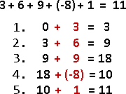
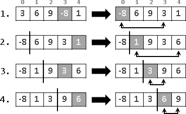
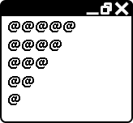
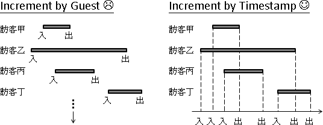
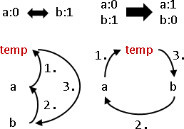
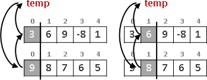
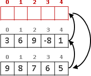

[Previous](Algorithm Introduction.md) | 回到[目錄](SUMMARY.md) |本文來源: [演算法筆記](http://www.csie.ntnu.edu.tw/~u91029/AlgorithmDesign.html#1) | [Next](memorization.md)
_____________________
# Incremental Method
#### 不積跬步，無以至千里。不積小流，無以成江海。《荀子》
_____________________
## Incremental Method
「遞增法」是符合電腦運作特性的方法。電腦執行程式，一次只做一個動作，完成了一件事才做下一件事。當一個問題太大太多時，化整為零、一個一個解決吧！

合抱之木，生於毫末；九層之臺，起於累土；千里之行，始於足下。謹以此句與大家共勉。
_____________________
## 範例：加總數字
無論電腦再怎麼強，還是得一個一個累加數字。


```swift
func summation(array:[Int]) -> Int {
	var sum = 0
	for x in array {
		sum += x
	}
	return sum
}
let anArray = [3, 6, 9, -8, 1]
summation(anArray)

// 使用標準程式庫
anArray.reduce(0){ $0 + $1 }

func summation(array:[Int], n: Int) -> Int {		// 此處n為加總矩陣中前n個元素與範例中的n為矩陣大小意義上不同
	var sum = 0
	for i in 0..<n {
		sum += array[i]
	}
	return sum
}
summation(anArray)
summation(anArray, n: 3)  // summation of first n items
```
_____________________
## 範例：複製字串
無論電腦再怎麼強，還是得逐字複製。


```swift
// Swift String is not an Array, 特性上與C / C++差異很大，需特別留意
var sourceStr = "incremental"
var source: [Character] = Array(sourceStr.characters)  // transfer string -> [char]
func copy(s: [Character]) -> [Character] {
	var array: [Character] = []
	for char in s {
		array.append(char)
	}
	return array
}
var target = copy(source)
target
target.count
String(target)

func copy(s: String) -> [Character] {
	var array: [Character] = []
	var source: [Character] = Array(s.characters)
	for i in 0..<source.count {
		array.append(source[i])
	}
	return array
}
target = copy(sourceStr)
```
_____________________
## 範例：選擇排序法（ Selection Sort ）
找到第一小的數字，放在第一個位置；再找到第二小的數字，放在第二個位置。一次找一個數字，如此下去就會把所有數值按照順序排好了。


```swift
func selectionSort_1<T>(array: [T], _ isOrderedBefore: (T, T) -> Bool) -> [T] {
	guard array.count > 1 else { return array }
	var tempArray = array
	for i in 0 ..< array.count - 1 {
		var minIdx = i
		for j in i + 1 ..< array.count {
			if !isOrderedBefore(tempArray[minIdx], tempArray[j]) {
				minIdx = j
			}
		}
		if i != minIdx {
			swap(&tempArray[i], &tempArray[minIdx])
		}
	}
	return tempArray
}
var unsort = [3, 6, 9, -8, 1]
selectionSort_1(unsort, <)
selectionSort_1(unsort, >)


func selectionSort<T>(array: [T], _ isOrderedBefore: (T, T) -> Bool) -> [T] {
	guard array.count > 1 else { return array }
	var a = array
	for x in 0 ..< a.count - 1 {
		var lowest = x
		for y in x + 1 ..< a.count {
			if isOrderedBefore(a[y], a[lowest]) {
				lowest = y
			}
		}
		if x != lowest {
			swap(&a[x], &a[lowest])
		}
	}
	return a
}

let list = [ 10, -1, 3, 9, 2, 27, 8, 5, 1, 3, 0, 26 ]
selectionSort(list, <)
selectionSort(list, >)
```
_____________________
## 範例：印出直角三角形
_____________________
多字成行，多行成直角三角形。由細微的東西開始，一件一件組起來。


```swift
func printTriangle(n: Int, incremental: Bool) {
	func printLine(n: Int) {
		for _ in 1...n {
			print("@", separator: "", terminator: "")
		}
		print("", separator: "", terminator: "\n")
	}
	for i in 1...n {
		let j = incremental ? i : (n - i + 1)
		printLine(j)
	}
}
printTriangle(5, incremental: true)
printTriangle(5, incremental: false)
```
___________________________________
_UVa [[488](http://uva.onlinejudge.org/external/4/488.html "UVa 488)], UVa [[10038](http://uva.onlinejudge.org/external/100/10038.html "UVa 10038)], UVa [[10107](http://uva.onlinejudge.org/external/101/10107.html "UVa 10107)], Uva [[10370](http://uva.onlinejudge.org/external/103/10370.html "UVa 10370)]_
___________________________________

## 範例：人潮最多的時段(Interval Partitioning Problem)
一群訪客參加宴會，我們詢問到每一位訪客的進場時刻與出場時刻，請問宴會現場擠進最多人的時段。

換個角度想，想像會場門口裝著一支監視器。有訪客進入，會場就多一人；有訪客離開，會場就少一人。如此就很容易統計會場人數。遞增的標的是時刻，而不是訪客。

【註：這個技巧在中文網路上暱稱為「離散化」。】



此處僅找出人數。找出人潮最多的時段，就留給各位自行嘗試吧。
```swift
import Foundation
struct Guest {
	var arrival: Int
	var leave: Int
}
// 店營業時間10:00 ~ 22:00
func randGuests(n: Int) -> [Guest] {
	func randGuest() -> Guest {
		let i = 10 + Int(arc4random() % 12)    // 進店時間10:00~21:00
		let stay = 1 + Int(arc4random() % 6)   //停留時間1 ~ 6小時
		let j = i + stay <= 22 ? i + stay : 22
		return Guest(arrival: i, leave: j)
	}
	var a: [Guest] = []
	for _ in 1...n {
		a.append(randGuest())
	}
	return a
}
var guests: [Guest] = randGuests(100)
func maxGuest(guests: [Guest]) -> (max_guest: Int, at_hour: Int) {
	var guestsDifferencePerHour: [Int] = Array(count: 24, repeatedValue: 0)
	var guestsInStore_t = Array(count: 24, repeatedValue: 0)
	for guest in guests {
		guestsDifferencePerHour[guest.arrival] += 1
		guestsDifferencePerHour[guest.leave] -= 1
	}
	for i in 0..<guestsDifferencePerHour.count {
		guestsInStore_t[guestsDifferencePerHour.count - 1 - i] = summation(guestsDifferencePerHour, n: guestsDifferencePerHour.count - i)
	}
	print(guestsDifferencePerHour)
	print(guestsInStore_t)
	return (guestsInStore_t.maxElement()!, guestsInStore_t.indexOf(guestsInStore_t.maxElement()!)!)
}
maxGuest(guests)
```
_______________________________
_UVa [[688](http://uva.onlinejudge.org/external/6/688.html "UVa 688)], UVa [[972](http://uva.onlinejudge.org/external/9/972.html "UVa 972)], UVa [[10613](http://uva.onlinejudge.org/external/106/10613.html "UVa 10613)], UVa [[10585](http://uva.onlinejudge.org/external/105/10585.html "UVa 10585)], UVa [[10963](http://uva.onlinejudge.org/external/109/10963.html "UVa 10963)]_

_UVa [[308](http://uva.onlinejudge.org/external/3/308.html "UVa 308)], UVa [[837](http://uva.onlinejudge.org/external/8/837.html "UVa 837)]_
_______________________________

## 範例：儲存座標
遞增的標的，主為點，次為座標軸。


遞增的標的，主為座標軸，次為點。


```swift
struct Point {
	var x: Float
	var y: Float
}
var points: [Point] = [Point(x: 0, y: 1),Point(x: 1,y: 2), Point(x: 3, y: 0), Point(x: 2, y: 2), Point(x: 3, y: 1)]
var points_x: [Float] = {
	var a: [Float] = []
	for i in 0..<5 {
		a.append(points[i].x)
	}
	return a
}()
var points_y: [Float] = {
	var a: [Float] = []
	for i in 0..<5 {
		a.append(points[i].y)
	}
	return a
}()
```
_____________________
## 範例：印出轉換成小寫的字串


有需要改變的，只有大寫字母──如果是大寫字母，就轉換成小寫字母並且印出；如果不是大寫字母，就直接印出。

```swift
var hello = "Hello World!"
func print_lowercase(str: String) {
	var temp = ""
	for var char in str.characters {
		if char >= "A" && char <= "Z" {
			char = "abcdefghijklmnopqrstuvwxyz"["ABCDEFGHIJKLMNOPQRSTUVWXYZ".characters.indexOf(char)!]
		}
		temp += String(char)
	}
	print(temp)
}
print_lowercase(hello)

// 使用標準程式庫
hello.lowercaseString
```
也可以一步一步進行：（一）複製一份字串（二）字串統一換成小寫（三）印出字串。

	// C++範例
    void print_lowercase(){
		char s[15] = "Hello World!";
		char t[15];
		// 第一波：複製字串
		for (int i=0; s[i]; i++)
			t[i] = s[i];
		// 第二波：換成小寫
		for (int i=0; s[i]; i++)
			if (t[i] >= 'A' && t[i] <= 'Z')
				t[i] = t[i] - 'A' + 'a';
		// 第三波：印出字串
		cout << t;
	}

	void print_lowercase(){
			char s[15] = "Hello World!";
			char t[15];
			// 每一波的程式碼可以自行包裝成為函式，
			// 亦可套用內建函式庫。
			my_copy(s, t);      // 複製字串
			my_lowercase(t);    // 換成小寫
			cout << t;          // 印出字串
	}

第一種解法稱作 one-pass ，資料只會讀取一遍。讀取資料的同時，也一口氣處理掉所有事情。

第二種解法稱作 multi-pass ，資料會重複讀取許多遍。所有事情劃分成數個階段，逐步處理，每個階段只專心處理一件事情。

one-pass 的優點是：程式碼簡短、執行時間也短。缺點是：程式碼不易編修。

multi-pass 的優點是：程式碼一目了然，容易編修、測試、除錯；程式碼可以包裝成為函式，也有機會套用內建函式庫。缺點是：需要額外的暫存記憶體。

這兩種方式各有利弊。程式員必須自行取捨。
_____________________
## 範例：對調數字
利用一個變數，暫存其中一個數字，以便對調。


```swift
func swap_int() {
	var a = 0, b = 1
	let temp = a
	a = b
	b = temp
	print("a = \(a), b = \(b)")
}
swap_int()

func swap_T<T>(inout a: T, inout b: T) {
	let temp = a
	a = b
	b = temp
	print("a = \(a), b = \(b) ")
}
var a = 3.0
var b = 5.6
swap_T(&a, b: &b)
a
b
```
_____________________
## 範例：對調陣列
節省記憶體的方法：採用遞增法，逐一對調數字。



```swift
var aArray = ["acd","xyz","zz"]
var bArray = ["sss","opo"]
swap_T(&aArray, b: &bArray)
aArray
bArray
```
浪費記憶體的方法：建立一條陣列，暫存其中一條陣列。



	// C++範例
    void swap_int_array()
		{
			int a[5] = {3, 6, 9, -8, 1};
			int b[5] = {9, 8, 7, 6, 5};
			
			// multi-pass
			int temp[5];
			for (int i=0; i<5; ++i) temp[i] = a[i];
			for (int i=0; i<5; ++i) a[i] = b[i];
			for (int i=0; i<5; ++i) b[i] = temp[i];
	}
	void swap_int_array()
		{
			int a[5] = {3, 6, 9, -8, 1};
			int b[5] = {9, 8, 7, 6, 5};
			
			// multi-pass
			int temp[5];
			my_copy(a, temp);
			my_copy(b, a);
			my_copy(temp, b);
	}
_____________________
[Previous](Algorithm Introduction.md) | 回到[目錄](SUMMARY.md) |本文來源: [演算法筆記](http://www.csie.ntnu.edu.tw/~u91029/AlgorithmDesign.html#1) | [Next](memorization.md)
