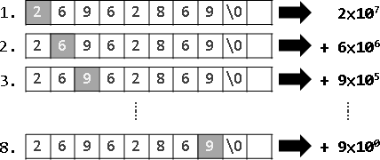
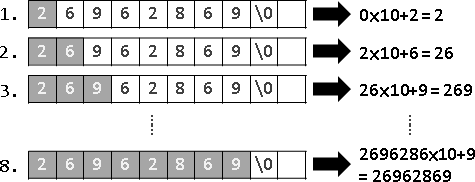
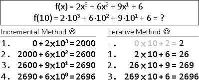
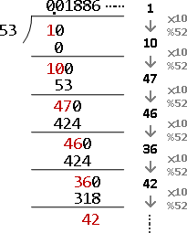
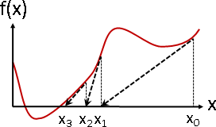
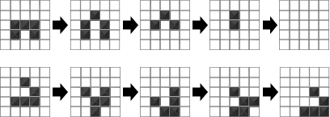
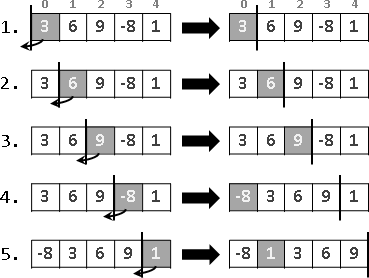
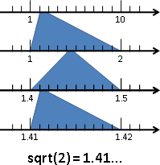
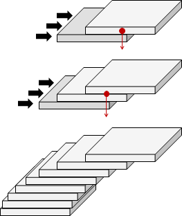
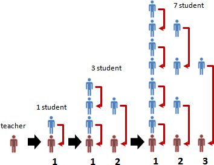

[Previous](Enumeration.md) | 回到[目錄](SUMMARY.md) |本文來源: [演算法筆記](http://www.csie.ntnu.edu.tw/~u91029/AlgorithmDesign.html#4) | [Next](Recursive Method.md)
_____________________
# Iterative Method
### 道生一，一生二，二生三，三生萬物。《老子》
_____________________
## Iterative Method

繁中「疊代法」、簡中「递推法」。不斷利用目前求得的數值，再求得新數值。

[997]:http://uva.onlinejudge.org/external/9/997.html ""

_____________________
UVa [997]
_____________________
## 範例：字串變整數
_____________________

直覺的方式是遞增法。個、十、百、千、萬、 …… ，每個位數分別乘上 10 的次方，通通加起來。此處按照高位數到低位數的順序進行處理，以符合字串的儲存順序。

	// 計算字串長度
	int string_length(char* s) {
		int n = 0;
		while (s[n]) n++;
		return n;
	}

	// 計算10的exp次方
	int pow10(int exp) {
		int n = 1;
		for (int i=0; i<exp; i++)
			n *= 10;
		return n;
	}

	void string_to_integer() {
		char s[10] = "26962869";
		// 預先計算字串長度。
		int length = string_length(s);
		// 依序處理高位數到低位數。
		int n = 0;
		for (int i=0; i<length; i++)
			n += (s[i] - '0') * pow10(length - 1 - i);
		cout << n;
	}
*/
import Foundation
// ToDo Swift Code
// 略, 上例法已介紹過

/*:
更好的方式是遞推法！由高位數到低位數、也就是由左到右讀取字串，每讀取一個字元，就將數值乘以十、加上當前字元的對應數字。

	void string_to_integer() {
		char s[10] = "26962869";
		int n = 0;
		for (int i=0; s[i]; i++)
			n = n * 10 + s[i] - '0';
		cout << n;
	}
*/
// ToDo Swift Code
var str: String = String(stringInterpolationSegment: 2696286)
func stringtoInt(integerLiteralString string: String) -> Int {
	let chars = string.characters
	guard !chars.isEmpty else { return 0 }
	var n = 0
	for char in chars {
		n = n * 10 + Int("\(char)")!
	}
	return n
}
stringtoInt(integerLiteralString: str)

// 使用標準函式庫
Int(str)

/*:
同一個問題，有著不同的解法。有著程式碼很長、執行速度很慢的方法，也有著程式碼很短，執行速度很快的方法。一支程式的好壞，除了取決於正確性和可讀性之外，同時也取決於計算方法。

[759]:http://uva.onlinejudge.org/external/7/759.html ""

_____________________
UVa [759]
_____________________
## 範例：秦九韶演算法（ Horner's Rule ）
_____________________
多項式函數，代入數值。一乘一加，不斷更迭，求得函數值。完全不需要次方運算。

*/
// ToDo Swift Code
func horner(x: Double, polynomial: [Double]) -> Double {
// A function that implements the Horner Scheme for evaluating a polynomial of coefficients *polynomial in x.
	var result:Double = 0
	for coefficient in polynomial {
		// result = result * x + coefficient
		result *= x
		result += coefficient
	}
	return result
}
horner(10.0, polynomial: [2,6,9,6])
horner(8.0, polynomial: [2,6,9,6])
/*:
## 範例：除法
_____________________
不斷乘以十、除以除數，就是一種遞推。

*/
// 上圖有誤，應為0.18867....，取餘數應是%53
func division(numerator a: Int, denominator b: Int) -> Double {
	var c:Double = 0.0
	var reminder = a
	if a / b > 0  {
		c = Double((a - (a % b)) / b)
	}
	for n in 1...16 {
		reminder = reminder % b * 10
		c += Double(reminder / b) / pow(10.0, Double(n))
		
	}
	return c
}
division(numerator: 10, denominator: 53)
Double(10)/Double(53)
/*:
## 範例：牛頓法（ Newton's Method ）
_____________________
找到連續函數等於零的位置。一開始隨便設定一個位置，不斷利用斜率求出下一個位置，就是一種遞推。

	___________________________________
		Xn+1 = Xn - f(Xn) / f'(Xn)
	___________________________________

*/

/*:

## 範例： 3n+1 猜想（ Collatz Conjecture ）
_____________________
猜想的內容是這樣的：有一個整數，如果是偶數，就除以 2 ；如果是奇數，就乘以 3 再加 1 。一個整數不斷這樣操作下去，最後一定會變成 1 。這個操作的過程就是一種遞推。

*/
// ToDo Swift Code
func collatzConjecture(n: Int) -> Int {
	guard n != 1  else { return n }
	var x = n
	if x % 2 == 0 { x /= 2 } else { x = x * 3 + 1}
	return collatzConjecture(x)
}
collatzConjecture(1000001008)
/*:
至今尚未有人能夠證明其正確性。有趣的是，目前也尚未檢查出任何反例。

[100]:http://uva.onlinejudge.org/external/1/100.html ""
[371]:http://uva.onlinejudge.org/external/3/371.html ""
[694]:http://uva.onlinejudge.org/external/6/694.html ""

_____________________
UVa [100],UVa [371],UVa [694]
_____________________
## 範例：生命遊戲（ Cellular Automaton ）
_____________________
一個二維的方格平面，每個格子都有一個細胞，可能是活的，可能是死的。細胞的生命狀況，隨時間變動，變動規則如下：

	______________________________________________________________________
	復活：一個死的細胞，若是它的八個鄰居，有三個細胞是活的，則在下一刻復活。
	存活：一個活的細胞，若是它的八個鄰居，有兩個或三個細胞是活的，則在下一刻存活。
	死於孤單：一個活的細胞，若是它的八個鄰居，只有零個或一個細胞是活的，則在下一刻死亡。
	死於擁擠：一個活的細胞，若是它的八個鄰居，有四個以上的細胞是活的，則在下一刻死亡。
	_______________________________________________________________________

實作時，我們可以弄兩張地圖，第一張地圖儲存現在這個時刻的狀態，第二張地圖儲存下一個時刻的狀態。兩張地圖交替使用，以節省記憶體空間。

細胞的變動規則，包裝成一個函式，讓程式碼易讀。

至今尚未有人能夠預測細胞最終會滅亡或延續。

	void go(int x, int y, bool map1[100][100], bool map2[100][100]) {
		int n = 八個鄰居中，還活著的細胞數目;
		if (!map1[x][y])
			if (n == 3)                 // 復活
				map2[x][y] = true;
			else                        // 仍舊死亡
				map2[x][y] = map1[x][y];
		else
			if (n == 2 || n == 3)       // 存活
				map2[x][y] = true;
			else if (n == 0 || n == 1)  // 死於孤單
				map2[x][y] = false;
			else if (n >= 4)            // 死於擁擠
				map2[x][y] = false;
	}

	void cellular_automata() {
			bool map[2][100][100];
			map[0][50][50] = true;  // 自行設定一些活的細胞
			map[0][50][51] = true;
			map[0][51][50] = true;
			for (int t=0; t<100; ++t)
				for (int x=0; x<100; ++x)
					for (int y=0; y<100; ++y)
						go(x, y, map[t%2], map[(t+1)%2]);
	}
*/
// Todo Swift Code
import UIKit
// 初始變數設定 cmap: 描述顏色設定, c1為活, c2為死
let c1 = UIColor.blueColor()
let c2 = UIColor.yellowColor()
var carray = [UIColor](count: 10, repeatedValue: c2)
var cmap = [[UIColor]](count: 10, repeatedValue: carray)
let iniState: [(x: Int, y: Int)] = [(2, 1), (3, 2), (1, 3), (2, 3), (3, 3)]
for p in iniState {
	cmap[p.x][p.y] = c1
}
//______________________________________________________________________________//
//																				//
//	復活：一個死的細胞，若是它的八個鄰居，有三個細胞是活的，則在下一刻復活。					//
//	存活：一個活的細胞，若是它的八個鄰居，有兩個或三個細胞是活的，則在下一刻存活。			//
//	死於孤單：一個活的細胞，若是它的八個鄰居，只有零個或一個細胞是活的，則在下一刻死亡。		//
//	死於擁擠：一個活的細胞，若是它的八個鄰居，有四個以上的細胞是活的，則在下一刻死亡。		//
//______________________________________________________________________________//

// 顯示對應map的UIView
func buildView(cmap: [[UIColor]]) -> UIView {
	let view = UIView(frame: CGRect(x: 0, y: 0, width: 50, height: 50))
	for i in 0..<10 {
		for j in 0..<10 {
			let subView = UIView(frame: CGRect(x: i * 5, y: j * 5, width: 5, height: 5))
			subView.backgroundColor = cmap[i][j]
			view.addSubview(subView)
		}
	}
	return view
}
// 鄰居座標
func neighbor(p: (x: Int, y: Int)) -> [(x: Int, y: Int)] {
	var points: [(x: Int, y: Int)] = []
	for i in -1...1 {
		for j in -1...1 {
			if !((p.x + i < 0 || p.x + i > 9 || p.y + j < 0 || p.y + j > 9) || (i == 0 && j == 0)) {
				points.append((p.x + i, p.y + j))
			}
		}
	}
	return points
}
// 計算鄰居的存活細胞數
func countlives(p: (x: Int, y: Int), map: [[UIColor]]) -> Int {
	let neighbors = neighbor((x: p.x, y: p.y))
	var n = 0
	for neighbor in neighbors {
		if map[neighbor.x][neighbor.y] == c1 { n += 1 }
	}
	return n
}
// 根據現狀map按照遊戲規則, 更新map
func cellular_auto(map: [[UIColor]]) -> [[UIColor]] {
	var newmap = map
	var newState: [(x: Int, y: Int)] = []
	for i in 0..<10 {
		for j in 0..<10 {
			switch countlives((x: i, y: j), map: map) {
			case 3:
				newmap[i][j] = c1
			case 0..<2:
				newmap[i][j] = c2
			case 2:
				newmap[i][j] = map[i][j]
			case 4..<10:
				newmap[i][j] = c2
			default:
				newmap[i][j] = map[i][j]
			}
			if newmap[i][j] == c1 {
				newState.append((x: i, y: j))
			}
		}
	}
	return newmap
}

let map0 = cmap
let view0 = buildView(map0)
let map1 = cellular_auto(map0)
let view1 = buildView(map1)
let map2 = cellular_auto(map1)
let view2 = buildView(map2)
let map3 = cellular_auto(map2)
let view3 = buildView(map3)
let map4 = cellular_auto(map3)
let view4 = buildView(map4)
let map5 = cellular_auto(map4)
let view5 = buildView(map5)

/*:
[447]:http://uva.onlinejudge.org/external/4/447.html ""
[457]:http://uva.onlinejudge.org/external/4/457.html ""
[10443]:http://uva.onlinejudge.org/external/104/10443.html ""
[10507]:http://uva.onlinejudge.org/external/105/10507.html ""

_____________________
UVa [447], UVa [457], UVa [10443], UVa [10507]
_____________________
## 範例：蘭頓的螞蟻（ Langton's Ant ）
_____________________
跟生命遊戲相似，不過這個遊戲更神奇。

	_______________________________________________________________
	一、格子有黑與白兩種顏色。
	二、螞蟻走入白格則右轉，走入黑格則左轉。
	三、螞蟻離開格子時，格子顏色顛倒。
	_______________________________________________________________

驚人的是，乍看完全沒有規律的路線，卻在 10647 步之後開始循環。原因至今不明。

[vedio]:https://youtu.be/1X-gtr4pEBU ""

Please see [vedio].

[11664]:http://uva.onlinejudge.org/external/116/11664.html ""
[7478]:https://icpcarchive.ecs.baylor.edu/external/74/7478.pdf ""
[7479]:https://icpcarchive.ecs.baylor.edu/external/74/7479.pdf ""

_____________________
UVa [11664], ICPC [7478], ICPC [7479]
*/
func langtonsAnt() {
	let g = Grid()		//grid map
	let grid = g.getGrid()
	let yellow = UIColor.yellowColor()
	let green = UIColor.greenColor()
	func getNewColor(preColor: UIColor) -> UIColor {
		switch preColor {
		case UIColor.grayColor():
			return yellow
		case yellow:
			return green
		case green:
			return yellow
		default:
			return green
		}
	}
	func setBackgroundColorAt(x: Int, _ y: Int, withNewcolor color: UIColor) {
		grid[x,y].subviews[0].superview?.backgroundColor = color
	}
	func getDirection(x: Int, _ y: Int, fromx x0: Int, formy y0: Int) -> String {
		if x == 27 && y == 27 && x0 == 27 && y0 == 27 { return "↑"}
		if x - x0 ==  1 {
			return "→"
		} else if x - x0 == -1 {
			return "←"
		} else if y - y0 == 1 {
			return "↓"
		} else {
			return "↑"
		}
	}
	func nextDirection(color: UIColor, currentDir: String) -> String {
		let l_r: Bool = color == yellow ? true : false
		switch currentDir {
		case "→":
			return l_r ? "↑" : "↓"
		case "←":
			return l_r ? "↓" : "↑"
		case "↓":
			return l_r ? "→" : "←"
		case "↑":
			return l_r ? "←" : "→"
		default:
			return ""
		}
	}
	func getNext(x: Int, _ y: Int, nextDir: String) -> (x1:Int, y1: Int) {
		var x1: Int {
			switch nextDir {
			case "→":
				return x + 1
			case "←":
				return x - 1
			default:
				return x
			}
		}
		var y1: Int {
			switch nextDir {
			case "↑":
				return y - 1
			case "↓":
				return y + 1
			default:
				return y
			}
		}
		return (x1, y1)
	}
	func moveTo(x: Int, _ y: Int, fromx x0: Int = 27, formy y0: Int = 27) {
		let currentDir = getDirection(x, y, fromx: x0, formy: y0)
		g.setAnt(x, y)
		let currentColor: UIColor = grid[x,y].subviews.last!.superview!.backgroundColor!
		let NewColor = getNewColor(currentColor)
		setBackgroundColorAt(x, y, withNewcolor: NewColor)
		let nextDir = nextDirection(NewColor, currentDir: currentDir)
		let next = getNext(x, y, nextDir: nextDir)
		_ = g.getView()
		moveTo(next.x1, next.y1, fromx: x, formy: y)
	}
	
	// 1. initialize (1) put ant @ 27,27 (2) the first grid set to be yellow
	moveTo(27, 27)
}
// remove comment markers to test
//langtonsAnt()

/*:
_____________________
## 範例：數學歸納法（ Mathematical Induction ）
_____________________
數學歸納法的第二步驟，就是證明可不可以遞推！第二步驟的證明過程中一定會用到遞推！

	__________________________________________
	1. 先證明 n = 1 成立。（有時候不見得要從1開始。）
	2. 假設 n = k 成立，證明 n = k+1 也會成立。

	當 1. 2. 得證，就表示 n = 1 ... ∞ 全部都成立。
	__________________________________________
*/
// 證明 1 + 2 + 3 + .... + n = (n * (n + 1)) / 2
// step 1: 
//		when n = 1, 1 = 1 成立
// step 2:
//		assume the statement is right.
//		let n = m
//		1 + 2 + 3 + .... + m = (m * (m + 1)) / 2
//		1 + 2 + 3 + .... + m + (m + 1) = (m * (m + 1)) / 2 + (m + 1) = ((m + 1) * (m + 2)) / 2
//		P(m)成立，推導出P(m+1)也成立，得證。

/*:
## 範例：插入排序法（ Insertion Sort ）
_____________________
從表面上來看是遞增法與枚舉法：第一層是遞增法，逐一把每個數字插入到左方已排序的陣列。第二層是枚舉法，搜尋插入位置；再將大量數字往右挪，以騰出空間插入數字。

但是從另一個角度來看，利用目前排序好的陣列，再求出更長的陣列，其實就是遞推法。

*/
// ToDo Swift Code
func insertionSort<T>(array: [T], _ isOrderedBefore: (T, T) -> Bool) -> [T] {
	var a = array
	for x in 1..<a.count {
		var y = x
		while y > 0 && !isOrderedBefore(a[y - 1], a[y]) {
			swap(&a[y], &a[y - 1])
			y -= 1
		}
	}
	return a
}
var array = [3, 6, 9, -8, 1]
insertionSort(array, <)
insertionSort(array, >)
/*:
## 範例：以試除法建立質數表
_____________________
從表面上來看是兩層的枚舉法：第一層先枚舉正整數，一一試驗是否為質數；第二層再枚舉所有已知質數，一一試除。

但是從另一個角度來看，利用目前求得的質數，再求出更多質數，其實就是遞推法。
*/

public struct PrimeTable {
	static var primes: [Int] = [2,3]
	public static func primeTable(n: Int) -> [Int] {
		guard n > primes.last else { return primes }
		func isPrime(number: Int) -> Bool {
			for prime in primes {
				guard !(prime * prime > number) else { break }
				if number % prime == 0 {
					return false
				}
			}
			return true
		}
		for i in primes.last! + 1 ... n {
			if isPrime(i) {
				primes.append(i)
			}
		}
		return primes
	}
	enum InputError: ErrorType {
		case Negative
		case RangeErr
	}
	public static func primeTable(from: Int, to n: Int) throws -> [Int] {
		guard from > 1 && n > 1 else { throw InputError.Negative }
		guard from < n else { throw InputError.RangeErr }
		guard n > primes.last else { return primes.filter{ $0 >= from && $0 <= n } }
		primeTable(n)
		return primes.filter{ $0 >= from && $0 <= n }
	}
}

PrimeTable.primeTable(10000)
PrimeTable.primeTable(100)
try? PrimeTable.primeTable(100, to: 5000)

/*:
## 範例：十分逼近法
_____________________
數線分割成十等份區間，從中找出正確區間，把對應的小數位數添到答案末端，然後不斷十等分下去。

利用目前求得的小數，再求出更多的小數，其實就是遞推法。

## 範例：書塔（ Book Stacking Problem ）
_____________________
將書本一本一本疊起來，成為一座斜塔，越斜越好。

對於任何一本書來說，其上方所有書本的整體重心，必須落在這本書上，這本書才能平穩地支撐住上方所有書本。

將書本插入到書塔底部，讓書塔的重心落在書本邊緣，就可以讓書塔最斜。插入書本到書塔底部之後，就更新書塔的重心位置，以便稍後插入下一本書本。

不斷插入書本到書塔底部、更新書塔重心，運用先前的書塔求得新的書塔──這段過程就是一種遞推。

## 範例：交卷
_____________________
考試結束了，學生要交卷，老師要收卷。大家將手上的考卷，不斷傳遞給其他人，不斷匯集給老師。一個人不能同時交卷和收卷，一個人不能同時交卷給多人（搗亂），一個人不能同時向多人收卷（手忙腳亂）。假設每個人交卷速度一致，請讓整個過程越短越好。

每個人隨時都在收卷交卷，一定最省時。老師亦然，一直處於收卷狀態，一定最省時。

遞增的標的，選定為老師。老師每次收卷，直接複製貼上前面幾次收卷的部屬方式，是最好的──這段過程就是一種遞推。
_____________________
[Previous](Enumeration.md) | 回到[目錄](SUMMARY.md) |本文來源: [演算法筆記](http://www.csie.ntnu.edu.tw/~u91029/AlgorithmDesign.html#4) | [Next](Recursive Method.md)
