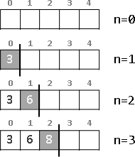
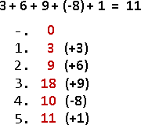
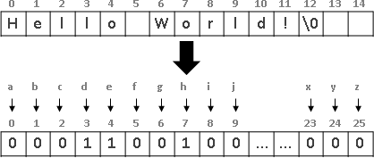
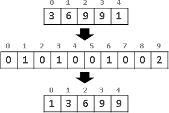
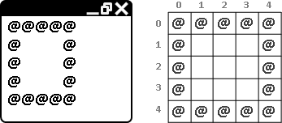
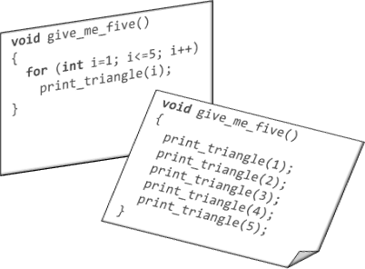

[Previous](Incremental Method.md) | 回到[目錄](SUMMARY.md) |本文來源: [演算法筆記](http://www.csie.ntnu.edu.tw/~u91029/AlgorithmDesign.html#2) | [Next](Enumeration.md)
_____________________
# Memoization
#### 惟事事，乃其有備，有備無患。《書經》
_____________________
## Memoization
「記憶法」是符合電腦運作特性的方法。電腦擁有大量儲存空間。只要將計算過的數值，儲存於記憶體，往後就能直接使用記憶體儲存的資料，不必再浪費時間重複計算一遍。


	Memoization（Tabulation）
	演算法執行過程之中，即時更新數值，儲存於記憶體。
	例如堆疊的大小。

	Preprocessing（Precalculation）
	演算法開始之時，預先計算數值，儲存於記憶體。
	例如圓周率、字串的長度、質數的表格。
	如果要儲存大量的、同性質的數值，我們可以將這些數值整理成一個表格（通常是陣列），以方便查閱──稱作「查詢表 
	lookup table 」。例如質數表便是一個「查詢表」。
_____________________
## 範例：陣列大小
使用一個變數，紀錄資料數量，以便迅速地增加資料。


```swift
//Swift的Array設計上與C/C++不太相同, 演算法操作上要特別留意與學習

var array = [Int]()
func array_size(array: [Int]) -> Int {
	var n = 0
	var a = array
	func addElement(i: Int) {
		a.append(i)
		n += 1
	}
	addElement(1)
	addElement(6)
	addElement(9)
	return n
}

extension Array {
	mutating func appendNew(element: Element) {
		self += [element]
	}
}
var anArray = [0, 1, 2, 3]
anArray.count
anArray.appendNew(4)
anArray.count

array_size(array)
```
C++ 程式語言的標準函式庫的 stack ，事實上也額外隱含了一個變數，紀錄資料數量。當堆疊塞入資料、彈出資料的時候，也就是呼叫 push 函式、呼叫 pop 函式的時候，就默默更新資料數量。
```swift
public struct Stack<T> {
	private var array = [T]()
	
	public var count: Int {
		return array.count
	}
	
	public var isEmpty: Bool {
		return array.isEmpty
	}
	
	public mutating func push(element: T) {
		array.append(element)
	}
	
	public mutating func pop() -> T? {
		if count == 0 {
			return nil
		} else {
			return array.removeLast()
		}
	}
	
	public func peek() -> T? {
		return array.last
	}
}
var stackOfNames = Stack(array: ["Carl", "Lisa", "Stephanie", "Jeff", "Wade"])
stackOfNames.push("Sean")
stackOfNames.count
stackOfNames.peek()
stackOfNames.pop()
stackOfNames.pop()
stackOfNames.count
```
## 範例：加總數字
_____________________
利用一個變數，累計數字的總和。


```swift
import Foundation

func summation() -> Int {
	let a = [3, 6, 9, -8, 1]
	var sum = 0
	for element in a {
		sum += element
	}
	return sum
}
summation()
// 使用標準函式庫
print("sum = \([3, 6, 9, -8, 1].reduce(0) { $0 + $1})")


func summation(array: [Int]) -> Int {
	var sum = 0
	for element in array {
		sum += element
	}
	return sum
}
summation([3, 6, 9, -8, 1])
```
_____________________
## 範例：統計字母數量
建立 26 格的陣列，讓字母 a 到 z 依序對應陣列的每一格，作為 lookup table 。一邊讀取字串，一邊累計字母出現次數。


```swift
// unicodeScalars很重要

var hello = "Hello, World"   // A -> 65, a -> 97
func countCharacter(str: String) -> [Int] {
	var array = [Int](count: 27, repeatedValue: 0)
	for scalar in str.unicodeScalars {
		var i: Int = (scalar.value < 65 || scalar.value > 122) ? 91 : Int(scalar.value)  // not a~z | A~Z -> 91 -> 26
		i = (i >= 97) ? (i - 97) : (i - 65)
		array[i] += 1
	}
	return array
}
let charCount = countCharacter(hello)
var countDic: [String: Int] = [:]
for i in 0..<charCount.count - 1 {
	let characters = "abcdefghijklmnopqrstuvwxyz".characters
	countDic[String(characters[characters.startIndex.advancedBy(i)])] = charCount[i]
}
countDic.description
```
_____________________
UVa [[10260](http://uva.onlinejudge.org/external/102/10260.html)], UVa [[10082](http://uva.onlinejudge.org/external/100/10082.html)], UVa [[10222](http://uva.onlinejudge.org/external/102/10222.html)], UVa [[12626](http://uva.onlinejudge.org/external/126/12626.html)]
_____________________
## 範例：統計數字數量
當數字範圍太大，無法建立那麼大的陣列，可以改用 hash table 、 binary search tree 等等資料結構作為 lookup table 。
	

```swift
let array_1 = [ 1, 3, 4, 10, 11, 100000000, 23, 99, 123, 514, 4]
func count_number(array: [Int]) -> [Int] {
	var c = [Int](count: 100000000, repeatedValue: 0)
	for element in array {
		c[element] += 1
	}
	return c
}
//let c = count_number(array_1)  //==> 資料量太大

func count_number_improve(array: [Int]) -> [Int: Int] {
	var dic = [Int: Int]()
	for element in array {
		if let _ = dic[element] {
			dic[element]! += 1
		} else {
			dic[element] = 1
		}
	}
	return dic
}
count_number_improve(array_1).description
```
_____________________
UVa [[11572](http://uva.onlinejudge.org/external/115/11572.html)], UVa [[141](http://uva.onlinejudge.org/external/1/141.html)]
_____________________
## 範例：計數排序法（ Counting Sort ）
建立足夠長的陣列，讓數字對應陣列的每一格，作為 lookup table 。統計每個數字的出現次數。由小到大讀取 lookup table ，順便排序數字。



```swift
let array_2 = [ 3, 6, 9, 9, 1, 8, 2, 6]
func sort_number(array: [Int]) -> [Int] {
	var c = [Int](count: 10, repeatedValue: 0)
	for element in array {
		c[element] += 1
	}
	var a = [Int]()
	for i in 0..<c.count {
		while c[i] != 0 {
			c[i] -= 1
			a.append(i)
		}
	}
	return a	
}
let sorted = sort_number(array_2)

func sort_number_dic(array: [Int]) -> [Int] {
	var dic = [Int: Int]()
	for element in array {
		if let _ = dic[element] {
			dic[element]! += 1
		} else {
			dic[element] = 1
		}
	}
	dic.description
	var a = [Int]()
	for i in 0..<10 {
		if let _ = dic[i] {
			for _ in 0..<dic[i]! {
				a.append(i)
			}
		}
	}
	return a
}
let sortedAgain = sort_number_dic(array_2)
```
_____________________
## 範例：求 1 到 n 的全部整數的立方和， n 的範圍由 1 到 10 。

以直接的方式，累加每個立方數。（儘管這個問題有公式解，但是為了方便舉例，所以這裡不採用公式解。）

```swift
//求 1 到 n 的全部整數的立方和， n 的範圍由 1 到 10 。

func sumOfCubic(n: Int) -> Int {
	var sum = 0
	for i in 0...n {
		sum += i * i * i
	}
	return sum
}
sumOfCubic(10)

//使用標準函式庫
let array_int = Array(1...10)
let array_cubic = array_int.map { $0 * $0 * $0 }
let sum_cubic = array_cubic.reduce(0) { $0 + $1 }
sum_cubic
```
使用 Memoization 。建立 11 格的陣列，每一格依序對應 0 到 10 的立方數，作為 lookup table 。一旦計算完畢，就儲存至表格；往後就直接讀取表格，不需重複計算。
```swift
// 本例使用static var在swift中只可使用於形態(class, struct, enum)中
struct SOC {
	static var answer: [Int] = Array(count: 11, repeatedValue: 0)
	static func getSoC(n: Int) -> Int {
		guard answer[n] == 0 else { return answer[n] }
		var sum = 0
		for i in 0...n {
			sum += i * i * i
			answer[i] = sum
		}
		return answer[n]
	}
	
}
SOC.getSoC(5)
SOC.answer[10]
SOC.getSoC(10)
SOC.answer[10]

func makeSumOfCubicTable(n: Int) -> [Int] {
	var array = [Int]()
	for i in 0...n {
		array.append(sumOfCubic(i))
	}
	return array
}
makeSumOfCubicTable(10)[10]
```
使用 Preprocessing 。
```swift
func sumOfCubicBy_precubicarray(n: Int) -> Int {
	var array = Array(count: 11, repeatedValue: 0)
	for i in 0...n {
		array[i] = i * i * i
	}
	var sum = 0
	for i in 0...n {
		sum += array[i]
	}
	return sum
}
sumOfCubicBy_precubicarray(10)
```
Preprocessing 當然也可以直接算答案啦。
    
	// C++範例
    int sum_of_cubes(int n) {
		int sum = 0;
		for (int i=1; i<=n; i++)
			sum += i * i * i;
		return sum;
	}

	void print_sum_of_cubes() {
		// 預先計算所有答案
		int answer[10 + 1];
		for (int i=1; i<=10; ++i)
			answer[i] = sum_of_cubes(i);
		
		// 直接讀取表格的答案
		int n;
		while (cin >> n && n > 0)
			cout << answer[n];
	}
最後是 Preprocessing 的極致。

	// C++範例
    void print_sum_of_cubes() {
		// 預先計算答案，寫死在程式碼裡面。
		int answer[10 + 1] ={
				0, 1, 9, 36, 100, 225,
				441, 784, 1296, 2025, 3025
		};
		// 直接讀取表格的答案
		int n;
		while (cin >> n && n > 0)
			cout << answer[n];
	}
_____________________
UVa [[10738](http://uva.onlinejudge.org/external/107/10738.html)], UVa [[10894](http://uva.onlinejudge.org/external/108/10894.html)]
_____________________
## 範例：印出方框
建立二維陣列：陣列的格子，依序對應視窗的文字。


不直接印出方框，而是間接填至陣列。不必數空白鍵，只需兩條水平線和兩條垂直線。
```swift
func printSQ() {
	var array = Array2D(columns: 5, rows: 5, initialValue: "")
	for i in 0..<5 {
		for j in 0..<5 {
			array[i, j] = (i == 0 || i == 4 || j == 0 || j == 4) ? "*" : " "
			array[i, 4] += "\n"
			print(array[i, j], separator: "", terminator: "")
		}
	}
}
printSQ()
```
_____________________
UVa [[105](http://uva.onlinejudge.org/external/1/105.html)], UVa [[706](http://uva.onlinejudge.org/external/7/706.html)]
_____________________
## 範例：拆開迴圈（ Loop Unrolling ）


迴圈語法的功能是：一段指令，重覆實施數次，但是每次都稍微變動一點點。

事實上，我們可以反璞歸真，拆開迴圈，還原成數行指令。如此一來，就節省了迴圈每次累加變數的時間，也節省了迴圈每次判斷結束條件的時間。

拆開迴圈是一種 Preprocessing ，預先計算迴圈變量、預先計算迴圈結束條件。

拆開迴圈之後，雖然提高了程式的執行速度，但是降低了程式可讀性。程式員必須自行取捨。
_____________________
[Previous](Incremental Method.md) | 回到[目錄](SUMMARY.md) |本文來源: [演算法筆記](http://www.csie.ntnu.edu.tw/~u91029/AlgorithmDesign.html#2) | [Next](Enumeration.md)
