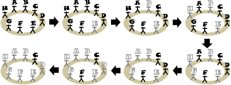
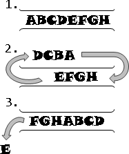
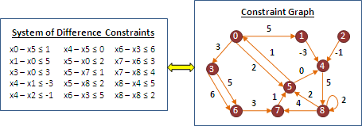
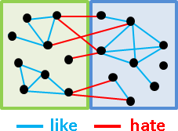
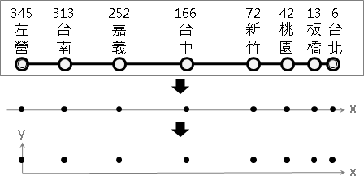

[Previous](Simulation.md) | 回到[目錄](SUMMARY.md) |本文來源: [演算法筆記](http://www.csie.ntnu.edu.tw/~u91029/AlgorithmDesign.html#14) | [Next](Backtracking.md)
_____________________
# Modeling
### 前事不忘，後事之師。《戰國策》
_____________________
## Modeling

把問題對應到耳熟能詳的模型，套用既有模型解決新問題。

## 範例：平行四邊形面積
_____________________
小學數學老師教過：長方形的面積是「長乘寬」。儘管不知道原因，不過這個公式肯定是正確的。那麼，請問平行四邊形面積如何計算？

把平行四邊形凸出的三角形切下來，補在另一邊，平行四邊形就變成了長方形。想要計算平行四邊形面積，可以直接套用長方形面積公式。

平行四邊形的底，就是長方形的長；平行四邊形的高，就是長方形的寬。平行四邊形的元件，一一對應到長方形。

## 範例：約瑟夫問題（ Josephus Problem ）
_____________________
8 個人圍成一圈，現在從第一個人開始報數，數到第 5 人時，就殺死這第 5 人；然後從被殺的下一位繼續重新報數，數到第 5 人時，就殺死這第 5 人。如此不斷數 5 人、殺此人，直到最後會剩下一個人，請問他是誰？

數人和殺人的動作可以對應到佇列（ queue ）的操作。首先把每個人依序放進佇列，接著連續 pop 和 push 4 人，接著 pop 第 5 人時，不要將他放回佇列裡面即可！

*/
// ToDo Swift Code
import Foundation
var array = ["a","b","c","d","e","f","g","h"]
var queue = Queue(array: array)
repeat {
	for _ in 0..<4 { queue.enqueue(queue.dequeue()!) }
	queue.dequeue()
} while queue.count != 1
queue[0]
/*:
## 範例：用圖論作為模型，模擬小畫家倒墨水。
_____________________
圖論的觀點之下， Flood Fill Algorithm 其實就是運用 Depth-first Search 找到 Connected Component 。

## 範例：用生命遊戲作為模型，模擬生命遊戲。
_____________________

[模擬生命遊戲]:https://youtu.be/QtJ77qsLrpw ""

* [模擬生命遊戲]

## 範例： System of Difference Constraints in Linear Programming
_____________________

問題：給定變數 x1 到 xN ，並給定一些 xi-xj≤c 的式子，作為條件限制。請判斷有沒有解，如果有解就求出其中一組解。

這個問題可以巧妙的轉換成最短路徑問題。 x1 到 xN 看作是圖上的 N 個點，一條 xi-xj≤c 的限制式子看作是一條 xj 到 xi 的邊，其權重是 c 。

如果無解，那麼圖上有負環。如果有解，那麼圖上各點的最短路徑長度就是其中一組解。為了讓圖上各點都有最短路徑長度值，可參考 Johnson's Algorithm 的做法。

[515]:http://uva.onlinejudge.org/external/5/515.html ""
[2058]:https://icpcarchive.ecs.baylor.edu/external/20/2058.pdf ""
_____________________
UVa [515], ICPC [2058]
_____________________

## 範例： Sentiment Relation in Social Balance Theory
_____________________
從前有一位心理學者認為，人與人之間的關係，可以粗略分為兩種：互相喜歡、互相討厭。這種關係稱作 Sentiment Relation ，是一種雙向關係，而且擁有喜歡與討厭兩種類型。假使兩人之間好惡分明，沒有亦敵亦友的情況，就會形成 Sentiment Relation 。

	___________________________
	like            hate
	A<------>B      A<------>B
	___________________________

另外 Sentiment Relation 還具有相當特殊的性質，有點像是 transitivity 、 symmetry 、 antisymmetry 的總合。這種性質的最佳寫照，諸如同仇敵愾、合縱連橫等等，翻成白話就是這樣：

	________________________
	1. 朋友的朋友就是我的朋友。
	2. 朋友的敵人就是我的敵人。
	3. 敵人的朋友就是我的敵人。
	4. 敵人的敵人就是我的朋友。
	________________________

在 Sentiment Relation 所形成的社交結構當中，如果產生了好與惡的矛盾，那麼這樣的社交結構就是不平衡的；如果好與惡合理，那麼這樣的社交結構就是平衡的。心理學者相信，當社交結構不平衡的時候，個體會嘗試改變自己的觀點，讓社交結構趨向平衡。

	_______________________________________________
	balance:

	A                A           like   like
	like / \ like    hate / \ hate      ----A----
	/   \            /   \         /  ha|te  \
	B-----C          B-----C       B-----C-----D
	like             like         hate   hate

	imbalance:

	A                A           like   like
	hate / \ hate    like / \ like      ----A----
	/   \            /   \         /  ha|te  \
	B-----C          B-----C       B-----C-----D
	hate             hate         like   like
	_______________________________________________

後來心理學者進一步發現，當社交結構達到平衡，所有人可以分成兩大陣營，使得陣營內部的關係都是互相喜歡，陣營與陣營之間的關係都是互相討厭。

說了這麼多終於要提到重點。現在問題來了，假設社交結構是平衡的，而我們也知道一些兩兩相互喜歡、相互討厭的資訊時，我們該如何確認誰在同一陣營、誰在不同陣營呢？

一、以 Bipartite Graph 作為模型：

把社交結構看作是 Bipartite Graph ， Bipartite Graph 的兩側分別是兩大陣營。首先利用 Graph Traversal 走訪喜歡的邊，找出所有連通分量，並各自縮成一點。然後再度利用 Graph Traversal 走訪討厭的邊，嘗試建立 Bipartite Graph ，如果無法建立則表示社交結構不平衡。

二、以聯集為基礎來建立新模型：

	___________________________
	當x與y是朋友：
	　x及朋友、y及朋友，都是好朋友。
	　x的敵人、y的敵人，都是好朋友。

	當x與y是敵人：
	　x及朋友、y的敵人，都是好朋友。
	　x的敵人、y及朋友，都是好朋友。
	___________________________

用 Disjoint Sets 的 union ，把好朋友們聯集在一起。要判斷同一陣營，就看看大家是不是同一群好朋友；要判斷不同陣營，就看看對方的敵人是不是跟自己是同一群好朋友。由於一開始每個人都沒有敵人，所以替每個人都設定一個虛擬的假想敵。

	#define _x (x + 100)    // x的假想敵
	#define _y (y + 100)    // y的假想敵

	// Disjoint-sets Forest
	int p[100 + 100];       // 前百人為本尊，後百人為假想敵。
	int init() {for (int i=0; i<200; ++i) p[i] = i;}
	int find(int x) {return x == p[x] ? x : (p[x] = find(p[x]));}
	void union(int x, int y) {p[find(x)] = find(y);}

	bool if_like(int x, int y) {
		return find(x) == find(y);
		//  return find(_x) == find(_y);
	}

	bool if_hate(int x, int y) {
		return find(x) == find(_y);
		//  return find(_x) == find(y);
	}

	// 結交朋友
	void like(int x, int y) {
		if (if_hate(x, y)) return;  // imbalance
		union(x, y);
		union(_x, _y);
	}

	// 樹立敵人
	void hate(int x, int y) {
		if (if_like(x, y)) return;  // imbalance
		union(x, _y);
		union(_x, y);
	}
*/
// ToDo Swift Code
/*:
[10158]:http://uva.onlinejudge.org/external/101/10158.html ""
[10505]:http://uva.onlinejudge.org/external/105/10505.html ""
[10608]:http://uva.onlinejudge.org/external/106/10608.html ""

_____________________
UVa [10158], UVa [10505], UVa [10608]
_____________________
## Reduction
_____________________
套用模型當中，有一種情況是：原問題是某一個問題的特例。套用通例，解決特例，稱作「歸約」。

因為通例相對複雜、特例相對單純，所以原問題極可能存在更快更好的解法。

## 範例：最短間距（ Minimum Gap Problem ）
_____________________
一條鐵道，沿途設站。已知里程，請找出距離最近的兩站。

以數線作為模型，鐵道對應到數線、車站對應到點座標，距離最近的兩站對應到「數線上距離最近的兩個點」。

想要解決「數線上距離最近的兩個點」，可以套用先前介紹的「平面上距離最近的兩個點」。這兩個問題的本質是相同的，前者是一維版本，後者是二維版本；前者是特例，後者是通例。

只要把每個車站的座標，增加一個維度，該維度的數值通通設定為相同數值，然後計算「平面上距離最近的兩個點」，就得到距離最近的兩站。

「數線上距離最近的兩個點」是特例、「平面上距離最近的兩個點」是通例，我們有機會替「數線上距離最近的兩個點」找到計算時間更短、更有效率的演算法。
_____________________
[Previous](Simulation.md) | 回到[目錄](SUMMARY.md) |本文來源: [演算法筆記](http://www.csie.ntnu.edu.tw/~u91029/AlgorithmDesign.html#14) | [Next](Backtracking.md)
