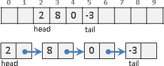
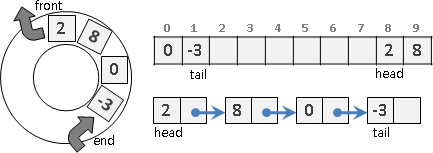

[Previous](Stack.md) | 回到[目錄](SUMMARY.md) |本文來源: [演算法筆記](http://www.csie.ntnu.edu.tw/~u91029/Data.html#3) | [Next](Algorithm Introduction.md)
_____________________
# 大量Data資料結構：
#### Queue / Stack
_____________________
## Queue

繁中「佇列」，簡中「队列」。像排隊，維持資料前後順序。

Array和List皆可實作。

插入、刪除需時**O(1)**。搜尋需時**O(N)**。

佇列有暫留的性質。

可以直接使用STL的queue。

_____________________
UVa [[10935](http://uva.onlinejudge.org/external/109/10935.html)], UVa [[11995](http://uva.onlinejudge.org/external/119/11995.html)], UVa [[12100](http://uva.onlinejudge.org/external/121/12100.html)], UVa [[1598](http://uva.onlinejudge.org/external/15/1598.html)]
_____________________
## 特殊的Queue

記憶體循環使用，稱作Circular Queue。

資料保持排序，可以隨時得到最小（大）值，稱作Priority Queue。資料保持排序，可以隨時得到最小值、最大值，稱作Double Ended Priority Queue。
_____________________
## Deque (Double Ended Queue)

兩頭皆能插入與刪除，稱作Deque，同時有著Stack和Queue的功效。

Array和Doubly Linked List皆可實作。

可以直接使用STL的deque。
_____________________
UVa [[12207](http://uva.onlinejudge.org/external/122/12207.html)]
_____________________
[Previous](Stack.md) | 回到[目錄](SUMMARY.md) |本文來源: [演算法筆記](http://www.csie.ntnu.edu.tw/~u91029/Data.html#3) | [Next](Algorithm Introduction.md)