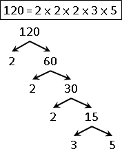
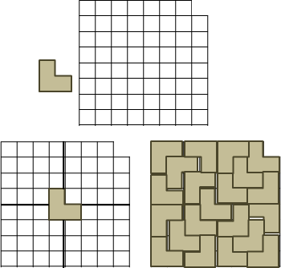
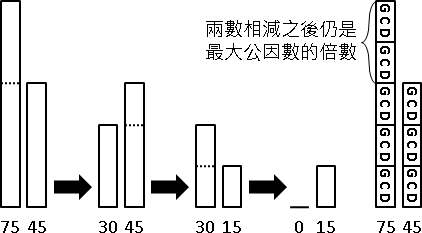
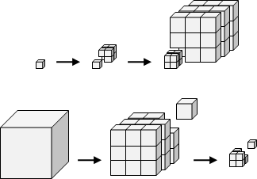
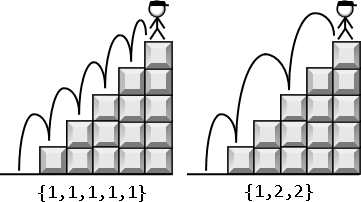
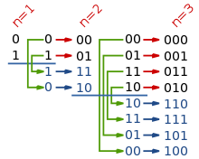

[Previous](Iterative Method.md) | 回到[目錄](SUMMARY.md) |本文來源: [演算法筆記](http://www.csie.ntnu.edu.tw/~u91029/AlgorithmDesign.html#5) | [Next](Divide and Conquer.md)
_____________________
# Recursive Method
### 易有太極，是生兩儀。兩儀生四象，四象生八卦。《易傳》
_____________________
## Recursive Method
繁中「遞迴法」、簡中「递归法」。重複運用相同手法，縮減問題範圍，直到釐清細節。

[10994]:http://uva.onlinejudge.org/external/109/10994.html ""
[10212]:http://uva.onlinejudge.org/external/102/10212.html ""
[10471]:http://uva.onlinejudge.org/external/104/10471.html ""
[10922]:http://uva.onlinejudge.org/external/109/10922.html ""

_____________________
UVa [10994], UVa [10212], UVa [10471], UVa [10922]
_____________________
## 範例：碎形（ Fractal ）
_____________________
利用相同手法繪圖，繪圖範圍越來越精細。

圖中的碎形稱作 Sierpinski triangle 。凡是尖端朝上的正三角形，就在當中放置一個尖端朝下的正三角形；放置之後，圖形就變得更細膩，範圍就變得更小了。

圖中的碎形稱作 Kosh snowflake 。一條邊三等分，去除中段，朝外補上兩段，形成尖角。

圖中的碎形稱作 Pythagorean tree 。不斷繪製正方形、直角三角形，看起來像是一棵茂密的樹。

	(略) 程式演示動畫

[177]:http://uva.onlinejudge.org/external/1/177.html ""
[10609]:http://uva.onlinejudge.org/external/106/10609.html ""

_____________________
UVa [177], UVa [10609]
_____________________
## 範例：質因數分解（ Integer Factorization ）
_____________________
不斷抽取出質因數，使數值不斷變小，直到成為質因數。

*/
import Foundation

// ToDo Swift Code
// PrimeTable struc: please refer to PrimeTable.swift in `sources` subdirectory.

func integerFactorixation(n: Int, primer: [Int] = []) -> [Int] {
	var array = primer
	let primes = PrimeTable.primeTable(n)
	for prime in primes {
		guard !(n < prime) else {break}
		guard n != prime else {
			array.append(prime)
			return array
		}
		if n % prime == 0 {
			array.append(prime)
			return integerFactorixation(n / prime, primer: array)
		}
	}
	return array
}
integerFactorixation(120)
integerFactorixation(248)
integerFactorixation(10796)

/*:
## 範例： L 形磁磚
_____________________
有一個邊長為 2 的 3 次方的正方形，右上角缺了一角邊長為 1 的正方形。現在要以 L 形磁磚貼滿這個缺了一角的正方形，該如何貼呢？

巧妙地將一塊 L 形磁磚放在中央的位置，就順利的把正方形切成四個比較小的、亦缺了一角的正方形。接下來只要遞迴處理四個小正方形，就解決問題了。

這個問題也可以改成缺口在任意一處，各位可以想想看怎麼解。

[10230]:http://uva.onlinejudge.org/external/102/10230.html ""

_____________________
UVa [10230]
_____________________
## 範例：輾轉相除法（ Euclid's Algorithm ）
_____________________
兩個數字輪流相除、求餘數，最後就得到最大公因數（ greatest common divisor, gcd ）。相信大家小時候都有學過。

我們可以把最大公因數想像成磚塊、把兩個數字都看成是最大公因數的倍數。

兩數相減所得的差值，一定是最大公因數的倍數。更進一步來說，兩數相除所得的餘數，一定是最大公因數的倍數。輾轉相除法的過程當中，兩數自始至終都是最大公因數的倍數。

運用這個性質，我們把兩數相除、求餘數，使得原始數字不斷縮小，直到得到最大公因數。真是非常巧妙的遞歸法！

	// 運用程式語言的迴圈語法。
	int gcd(int a, int b) {
		// 令 a 比 b 大，比較容易思考。
		while (b != 0) {
			int t = a % b;
			a = b;
			b = t;
		}
		return a;
	}
*/
// Todo Swift Code
enum ArithmeticError: ErrorType {
	case NegativeValue
}

// 用相減
func gcd<T: IntegerType>(a: T, _ b: T)throws -> T {
	guard a > T.allZeros && b > T.allZeros else { throw ArithmeticError.NegativeValue }
	var a_ = a, b_ = b
	while a_ != b_ {
		if a_ > b_ {
			a_ -= b_
		} else {
			b_ -= a_
		}
	}
	return a_
}

// 用餘數
func gcd_1<T: IntegerType>(a: T, _ b: T)throws -> T {
	guard a > T.allZeros && b >= T.allZeros else { throw ArithmeticError.NegativeValue }
	var x = max(a, b)
	var y = min(a, b)
	while y != 0 {
		let t = x % y
		x = y
		y = t
	}
	return x
}
try gcd_1(120, 72)
/*:
	// 運用程式語言的遞迴語法。
	int gcd(int a, int b) {
		// 令 a 比 b 大，比較容易思考。
		if (b == 0)
			return a;
		else
			return gcd(b, a % b);
	}
*/
// Todo Swift Code
func gcd_recusive<T: IntegerType>(a: T, _ b: T)throws -> T {
	guard a > T.allZeros && b >= T.allZeros else { throw ArithmeticError.NegativeValue }
	let x = max(a, b)
	let y = min(a, b)
	guard y != 0 else {return x}
	return try! gcd_recusive(y, x % y)
}
try gcd_recusive(64, 72)
/*:
注意到，遞推法、遞歸法，不等於程式語言中的迴圈、遞迴。遞推法、遞歸法是分析問題的方法，用來得到計算過程、用來得到演算法。至於編寫程式時，我們可以自由地採用迴圈或者遞迴。

## 遞推法、遞歸法，一體兩面，同時存在。
_____________________
遞推法與遞歸法恰好顛倒：遞推法是針對已知，逐步累積，直至周全；遞歸法是針對未知，反覆拆解，直至精確。

遞推法是由小到大，遞歸法是由大到小。

## 範例：秦九韶演算法（ Horner's Rule ）

遞推法是不斷配 x ，擴增已知；遞歸法是不斷提 x ，減少未知。

	__________________________________________
	a * x^2 + b * x^1 + c

	Iterative Method:
	{a} * x^2 + b * x^1 + c
		{a, *x} * x^1 + b * x^1 + c
			{a, *x, +b} * x^1 + c
				{a, *x, +b, *x} + c
					{a, *x, +b, *x, +c}

	Recursive Method:
	{a * x^2 + b * x^1 + c}
		{a * x^2 + b * x^1}, +c
	{a * x^1 + b}, *x, +c
	{a * x^1}, +b, *x, +c
	{a}, *x, +b, *x, +c
	__________________________________________

雖然遞推法與遞歸法的推理方向是相反的，但是遞推法與遞歸法的計算方向是一樣的，兩者都是由小範圍算到大範圍。

	_____________________
	Iterative Method:
	a, *x, +b, *x, +c

	Recursive Method:
	a, *x, +b, *x, +c
	_____________________

*/
// ToDo Swift Code
func horner(x: Double, preceding: Double = 0, polynomial_coefficients: [Double]) -> Double {
	// A function that implements the Horner Scheme for evaluating a polynomial of coefficients *polynomial in x.
	guard polynomial_coefficients != [] else { return preceding }
	var result:Double = preceding
	var coefficients = polynomial_coefficients
	result = result * x + coefficients.removeFirst()
	return horner(x, preceding: result, polynomial_coefficients: coefficients)
}
var polynomial = [2.0, 6.0, 9.0 , 6.0]
horner(10.0, polynomial_coefficients: polynomial)
horner(8.0, polynomial_coefficients: polynomial)

/*:

[498]:http://uva.onlinejudge.org/external/4/498.html ""
[10268]:http://uva.onlinejudge.org/external/102/10268.html ""
_____________________
UVa [498],UVa [10268]
_____________________
## 範例：爬樓梯
_____________________

眼前有五階樓梯，一次只能踏一階或踏兩階，那麼爬到五階總共有哪幾種踏法？例如 (1,1,1,1,1) 是其中一種踏法， (1,2,2) 是另一種踏法。

這個問題可以用遞推法，也可以用遞歸法。

首先採用遞推法。試著只爬少少的幾階樓梯，觀察一下踏法。

爬到一階的踏法：很明顯的只有一種， (1) 。

爬到兩階的踏法：有兩種， (1,1) 和 (2) 。

爬到三階的踏法：因為一次只能踏一階或踏兩階，所以只可能從第一階或從第二階踏上第三階。只要綜合 ( 爬到一階的踏法 ,2) 與 ( 爬到兩階的踏法 ,1) ，就是爬到三階的踏法。

爬到四階的踏法：同理，綜合 ( 爬到兩階的踏法 ,2) 與 ( 爬到三階的踏法 ,1) 即得。

遞推下去，就可求出爬到五階的踏法。

	_______________________________________________________________
	Forward Iterative Method:
	爬到一階　(1)
	爬到兩階　(1,1) (2)
	爬到三階　即是(爬到一階,2)與(爬到二階,1)
	　　　　　(1,2)
	　　　　　(1,1,1) (2,1)
	爬到四階　即是(爬到二階,2)與(爬到三階,1)
	　　　　　(1,1,2) (2,2)
	　　　　　(1,2,1) (1,1,1,1) (2,1,1)
	爬到五階　即是(爬到三階,2)與(爬到四階,1)
	　　　　　(1,2,2) (1,1,1,2) (2,1,2)
	　　　　　(1,1,2,1) (2,2,1) (1,2,1,1) (1,1,1,1,1) (2,1,1,1)
	_______________________________________________________________

前面是採用上樓梯的順序進行遞推，由第一階遞推到第五階。也可以採用下樓梯的順序進行遞推，由第五階遞推到第一階。

	_______________________________________________________________
	Backward Iterative Method:
	降到四階　(1)
	降到三階　(1,1) (2)
	降到二階　即是(2,降到四階)與(1,降到三階)
	　　　　　(2,1)
	　　　　　(1,1,1) (1,2)
	降到一階　即是(2,降到三階)與(1,降到二階)
	　　　　　(2,1,1) (2,2)
	　　　　　(1,2,1) (1,1,1,1) (1,1,2)
	降到平面　即是(2,降到二階)與(1,降到一階)
	　　　　　(2,2,1) (2,1,1,1) (2,1,2)
	　　　　　(1,2,1,1) (1,2,2) (1,1,2,1) (1,1,1,1,1) (1,1,1,2)
	_______________________________________________________________

有一些問題，比如爬樓梯問題，雙向都可以遞推。數值由小到大的方向稱為「正向」或「順向」（ forward ），數值由大到小的方向稱為「反向」或「逆向」（ backward ）。

接著採用遞歸法。由踏出的最後一步開始分析。

要「爬到五階」，最後一步一定是踏上第五階。要踏上第五階，只可能從第四階和第三階踏過來，也就是綜合 ( 爬到四階的踏法 ,1) 與 ( 爬到三階的踏法 ,2) 。

但是我們尚不知如何「爬到四階」和「爬到三階」，所以只好再分別研究「爬到四階」與「爬到三階」。不斷追究到「爬到一階」與「爬到兩階」的時候，就能確認答案了！

	__________________________________________
	Forward(?) Recursive Method:
	爬到五階　即是(爬到四階,1)與(爬到三階,2)
	爬到四階　即是(爬到三階,1)與(爬到二階,2)
	爬到三階　即是(爬到二階,1)與(爬到一階,2)
	爬到兩階　(2) (1,1)
	爬到一階　(1)
	__________________________________________

當然也可以雙向遞歸。就不贅述了。
*/
func waysToGet(n: Int) -> Int {
	guard n > 1 else { return 1 }
	guard n != 2 else { return 2 }
	return waysToGet(n - 2) + waysToGet(n - 1)
}

waysToGet(5)
waysToGet(20)

/*:
## 範例：格雷碼（ Gray Code ）
_____________________

	_______________________________________________________________
	Iterative Method:
	GrayCode(n-1)的每個數字，最高位數加一個0。
	GrayCode(n-1)的每個數字，高位數與低位數整個顛倒，然後在最高位數加一個1。
	兩者銜接起來就是GrayCode(n)。

	Recursive Method:
	GrayCode(n)的每個數字，分成兩類。
	第一類最高位數是0，把最高位數拿掉後，即形成GrayCode(n-1)。
	第二類最高位數是1，把最高位數拿掉後，即形成GrayCode(n-1)。
	_______________________________________________________________

也可以用最低位數為主，進行遞推、遞歸，生成順序不同的 Gray Code 。 Gray Code 具有循環的特性，有多種遞推、遞歸方式，不分正向與逆向。
*/
// 1. 建立N level的對應表, 2. 依表編碼結果
struct GrayCode {
	static var grayCodeTable: [String] = []
	static func grayCodeBits(N: Int) -> [String] {
		guard N > 1 else { return ["0", "1"] }
		guard Int(pow(2.0,Double(N))) > grayCodeTable.count else { return Array(grayCodeTable.prefix(Int(pow(2.0,Double(N))))) }
		var array: [String] = grayCodeTable
		for element in grayCodeBits(N-1) {
			array.append("0" + element)
		}
		for element in grayCodeBits(N-1).reverse() {
			array.append("1" + element)
		}
		grayCodeTable = array
		return Array(grayCodeTable.prefix(Int(pow(2.0,Double(N)))))
	}
}
GrayCode.grayCodeBits(8)
GrayCode.grayCodeBits(3)

func grayCode(n: Int) -> String {
	var bits = 0
	var x = n
	repeat {
		bits += 1
		x /= 2
	} while x != 0
	return GrayCode.grayCodeBits(bits)[n]
}
grayCode(16)

print("\tn\t\tbinary\t\tGray Code")
print("_______________________________________")
for i in 0..<64 {
	let a = Int8(i).bitRep()
	print("\t\(i)\t\t\(a)\t\t\(grayCode(i))")
}

/*:
_____________________
[Previous](Iterative Method.md) | 回到[目錄](SUMMARY.md) |本文來源: [演算法筆記](http://www.csie.ntnu.edu.tw/~u91029/AlgorithmDesign.html#5) | [Next](Divide and Conquer.md)
