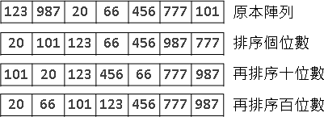
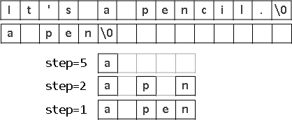
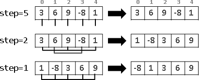

[Previous](Greedy Method.md) | 回到[目錄](SUMMARY.md) |本文來源: [演算法筆記](http://www.csie.ntnu.edu.tw/~u91029/AlgorithmDesign.html#9) | [Next](External Memory Algorithm.md)
_____________________
# Scaling Method
### 古之欲明明德於天下者，先治其國。
### 　　　　　欲治其國者，先齊其家。
### 　　　　　欲齊其家者，先修其身。
### 　　　　　欲修其身者，先正其心。《禮記》
_____________________
## Fixed Parameter Method
「固定參數法」。當問題太過困難，就增加限制，將部分變數改成常數。

## 範例：三維函數繪圖
_____________________
一、固定 X 值，計算 Y 值 Z 值；嘗試各種 X 值。

二、固定 Y 值，計算 X 值 Z 值；嘗試各種 Y 值。

三、固定 Z 值，計算 X 值 Y 值；嘗試各種 Z 值。

## Scaling Method
_____________________
「縮放法」。將數值拆解為不同數量級，每個數量級分別計算一次答案，並且累計每次計算成果。

## 範例：乘法
_____________________
數量級從小到大：乘數拆解為不同數量級，先以個位數相乘一次，再以十位數相乘一次， …… ，再以最高位數相乘一次，累加起來，得到正確結果。

## 範例：基數排序法（ Radix Sort ）
_____________________
數量級從小到大：所有數字先以個位數排序一次，再以十位數排序一次， …… ，再以最高位數排序一次，得到正確結果。

數量級從大到小：所有數字先以最高位數排序一次，再以前兩高位數排序一次， …… ，再以全部位數排序一次，得到正確結果。

改善計數排序法的效率，不必建立一長串陣列。

## 範例：多重解析度匹配（ Multiscale Matching ）
_____________________

從宏觀到微觀，從粗糙到細膩。短字串跳 N 格實施匹配。若足夠相似，才跳 N/2 格實施匹配。 …… 。若足夠相似，才跳 1 格實施匹配。

改善匹配的效率，不必每次都比對一大串字元。

## 範例： Shell 排序法（ Shell Sort ）
_____________________
從宏觀到微觀，從粗糙到細膩。跳 N 個數字為同一組，每組分別實施插入排序法。跳 N/2 個數字為同一組，各組分別實施插入排序法。 …… 。跳 1 個數字為同一組，所有數字實施插入排序法。

改善插入排序法的效率，不必每次都挪動一大串數字。
_____________________
[Previous](Greedy Method.md) | 回到[目錄](SUMMARY.md) |本文來源: [演算法筆記](http://www.csie.ntnu.edu.tw/~u91029/AlgorithmDesign.html#9) | [Next](External Memory Algorithm.md)
