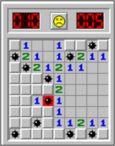
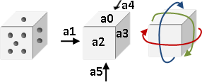

[Previous](Randomized Algorithm.md) | 回到[目錄](SUMMARY.md) |本文來源: [演算法筆記](http://www.csie.ntnu.edu.tw/~u91029/AlgorithmDesign.html#13) | [Next](Modeling.md)
_____________________
# Simulation
### 陽春召我以煙景，大塊假我以文章。《李白．春夜宴桃李園序》
_____________________
## Simulation

撰寫程式，模擬行為。

[10550]:http://uva.onlinejudge.org/external/105/10550.html ""

_____________________
UVa [10550]
_____________________
## 範例：踩地雷
_____________________
試著用程式模擬踩地雷吧！

[10189]:http://uva.onlinejudge.org/external/101/10189.html ""
[10279]:http://uva.onlinejudge.org/external/102/10279.html ""
[11142]:http://uva.onlinejudge.org/external/111/11142.html ""
[4335]:https://icpcarchive.ecs.baylor.edu/external/43/4335.pdf ""

_____________________
UVa [10189], UVa [10279], UVa [11142], ICPC [4335]
_____________________
## 範例：撲克牌
_____________________
試著用程式模擬各種撲克牌遊戲吧！

[Cards]:http://mathworld.wolfram.com/Cards.html ""
[CardGames]:http://mathworld.wolfram.com/topics/CardGames.html ""
[127]:http://uva.onlinejudge.org/external/1/127.html ""
[131]:http://uva.onlinejudge.org/external/1/131.html ""
[162]:http://uva.onlinejudge.org/external/1/162.html ""
[170]:http://uva.onlinejudge.org/external/1/170.html ""
[178]:http://uva.onlinejudge.org/external/1/178.html ""
[181]:http://uva.onlinejudge.org/external/1/181.html ""
[451]:http://uva.onlinejudge.org/external/4/451.html ""
[462]:http://uva.onlinejudge.org/external/4/462.html ""
[555]:http://uva.onlinejudge.org/external/5/555.html ""

* [Cards]
* [CardGames]

_____________________
UVa [127], UVa [131], UVa [162], UVa [170], UVa [178]
UVa [181], UVa [451], UVa [462], UVa [555]
_____________________
## 範例：下棋
_____________________
使用棋盤進行遊戲，例如象旗、西洋棋、將旗、圍棋、五子棋、黑白棋。考慮人工智慧之前，先來模擬下棋規則，設計一支下棋程式吧！

[220]:http://uva.onlinejudge.org/external/2/220.html ""
[852]:http://uva.onlinejudge.org/external/8/852.html ""
[10196]:http://uva.onlinejudge.org/external/101/10196.html ""
[10363]:http://uva.onlinejudge.org/external/103/10363.html ""
[10996]:http://uva.onlinejudge.org/external/109/10996.html ""
[11210]:http://uva.onlinejudge.org/external/112/11210.html ""
[1589]:http://uva.onlinejudge.org/external/15/1589.html ""
_____________________
UVa [220], UVa [852], UVa [10196], UVa [10363], UVa [10996], UVa [11210], UVa [1589]
_____________________
## 範例：轉骰子
_____________________
有兩顆骰子，上面的點數順序，可能是亂的、重複的。請辨別兩顆骰子一不一樣。骰子經過旋轉後，如果六個對應的面，上面的點數皆相同，則骰子視為相同。

要辨別兩顆骰子一不一樣，一種方式是旋轉其中一顆骰子，再跟另一顆比對。必須將骰子所有可能的情形都轉出來才行。

骰子一共有六個面：上下前後左右。建立六個變數、或者六格的陣列，分別儲存六個面的點數。陣列的第 0 格存入上面的點數、第 1 格存左面的點數、 …… 。當然也可以採用不同的儲存方法。

骰子一共有三種旋轉方向：東西方向、南北方向、時鐘方向。我個人偏好的轉法是：東西方向轉一圈，順時針方向轉一圈，南北方向轉一下，以上動作重複四次，就能轉出所有情形。

亦得採用其他轉法，最好的轉法只需轉 24 次，讀者可以想想看怎麼做。

亦得預先計算所有旋轉結果，儲存於 lookup table ，以節省旋轉時間。

	// 往西轉一下
	void turn_west(int dice[6]) {
		int temp = dice[1];
		dice[1] = dice[2];
		dice[2] = dice[3];
		dice[3] = dice[4];
		dice[4] = temp;
	}

	// 六個面是否一一對應
	bool equal(int a[6], int b[6]) {
		for (int i=0; i<6; i++)
			if (a[i] != b[i])
				return false;
		return true;
	}

	// 兩顆骰子是否相同
	bool check(int a[6], int b[6]) {
		for (int i=0; i<4; i++) {
			for (int j=0; j<4; j++) {
				turn_west();
				if (equal(a,b)) return true;
			}
			for (int j=0; j<4; j++) {
				turn_clockwise();
				if (equal(a,b)) return true;
			}
			turn_north();
			if (equal(a,b)) return true;
		}
		return false;
	}
*/
// ToDo Swift Code
/*:

[253]:http://uva.onlinejudge.org/external/2/253.html ""
[10877]:http://uva.onlinejudge.org/external/108/10877.html ""
_____________________
UVa [253], UVa [10877]
_____________________
[Previous](Randomized Algorithm.md) | 回到[目錄](SUMMARY.md) |本文來源: [演算法筆記](http://www.csie.ntnu.edu.tw/~u91029/AlgorithmDesign.html#13) | [Next](Modeling.md)
