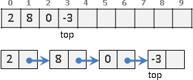

[Previous](Array.md) | 回到[目錄](SUMMARY.md) |本文來源: [演算法筆記](http://www.csie.ntnu.edu.tw/~u91029/Data.html#3) | [Next](Queue.md)
_____________________
# 大量Data資料結構：
#### Queue / Stack
_____________________
## Stack


繁中「堆疊」，簡中「栈」。像疊盤子，顛倒資料前後順序。



Array和List皆可實作。

插入、刪除需時**O(1)**。搜尋需時**O(N)**。

堆疊有反轉的性質、有括號對應的性質、有遞迴與疊代的性質。

可以直接使用STL的stack。

_____________________
UVa [[101](http://uva.onlinejudge.org/external/1/101.html)], UVa [[514](http://uva.onlinejudge.org/external/5/514.html)], UVa [[673](http://uva.onlinejudge.org/external/6/673.html)], UVa [[271](http://uva.onlinejudge.org/external/2/271.html)], UVa [[10152](http://uva.onlinejudge.org/external/101/10152.html)]
_____________________
# Stack
A stack is like an array but with limited functionality. You can only *push* to add a new element to the top of the stack, *pop* to remove the element from the top, and *peek* at the top element without popping it off.

Why would you want to do this? Well, in many algorithms you want to add objects to a temporary list at some point and then pull them off this list again at a later time. Often the order in which you add and remove these objects matters.

A stack gives you a LIFO or last-in first-out order. The element you pushed last is the first one to come off with the next pop. (A very similar data structure, the [queue](../Queue/), is FIFO or first-in first-out.)

For example, let's push a number on the stack:
``` swift
stack.push(10)
```
The stack is now `[10]`. Push the next number:
``` swift
stack.push(3)
```
The stack is now `[10, 3]`. Push one more number:
``` swift
stack.push(57)
```
The stack is now `[10, 3, 57]`. Let's pop the top number off the stack:
``` swift
stack.pop()
```
This returns `57`, because that was the most recent number we pushed. The stack is `[10, 3]` again.
``` swift
stack.pop()
```
This returns `3`, and so on. If the stack is empty, popping returns `nil` or in some implementations it gives an error message ("stack underflow").

A stack is easy to create in Swift. It's just a wrapper around an array that just lets you push, pop, and peek:

Last-in first-out stack (LIFO)
Push and pop are O(1) operations.
``` swift
public struct Stack<T> {
	private var array = [T]()
	
	public var isEmpty: Bool {
		return array.isEmpty
	}
	
	public var count: Int {
		return array.count
	}
	
	public mutating func push(element: T) {
		array.append(element)
	}
	
	public mutating func pop() -> T? {
		if isEmpty {
			return nil
		} else {
			return array.removeLast()
		}
	}
	
	public func peek() -> T? {
		return array.last
	}
}
```
Notice that a push puts the new element at the end of the array, not the beginning. Inserting at the beginning of an array is expensive, an **O(n)** operation, because it requires all existing array elements to be shifted in memory. Adding at the end is **O(1)**; it always takes the same amount of time, regardless of the size of the array.

Fun fact about stacks: each time you call a function or a method, the return address is placed on a stack by the CPU. When the function ends, the CPU uses that return address to jump back to the caller. That's why if you call too many functions -- for example in a recursive function that never ends -- you get a so-called "stack overflow" as the CPU stack is out of space.

Create a stack and put some elements on it already.
var stackOfNames = Stack(array: ["Carl", "Lisa", "Stephanie", "Jeff", "Wade"])

Add an element to the top of the stack.
``` swift
stackOfNames.push("Mike")
```
The stack is now ["Carl", "Lisa", "Stephanie", "Jeff", "Wade", "Mike"]
``` swift
print(stackOfNames.array)
```
Remove and return the first element from the stack. This returns "Mike".
``` swift
stackOfNames.pop()
```
Look at the first element from the stack. Returns "Wade" since "Mike" was popped on the previous line.
``` swift
stackOfNames.peek()
stackOfNames.pop()
``` 
Check to see if the stack is empty. Returns "false" since the stack still has elements in it.
``` swift
stackOfNames.isEmpty
``` 
_____________________
[Previous](Array.md) | 回到[目錄](SUMMARY.md) |本文來源: [演算法筆記](http://www.csie.ntnu.edu.tw/~u91029/Data.html#3) | [Next](Queue.md)
